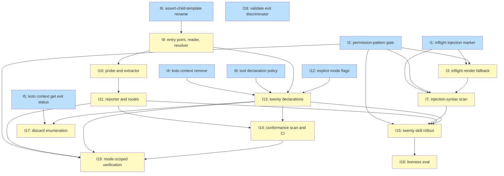

# PLAN: Skill preflight checks

## Status

Active

Single-pr, so no GitHub milestone and no issues exist. The twenty
outlines below are the decomposition `/work-on` drives on one shared
branch. `docs/designs/DESIGN-skill-preflight-checks.md` moves to
Planned when this PLAN lands; both are deleted by the cascade when
the PR flips to ready.

## Scope Summary

Give every shirabe skill a machine-checkable declaration of the host
tools it needs, check that declaration at skill load, and report an
unmet requirement as an instruction the reader can act on. Four live
defects ship first, because two of them are failures of the same
load-time injection mechanism this feature multiplies by twenty.

## Decomposition Strategy

**Horizontal.** The design's Implementation Approach is already
phased, and the phases cut by component rather than by vertical
slice: defects, then a gate, then the script, then the declarations,
then the rollout, then the two integrity workstreams. There is no
end-to-end flow to skeleton — the entry point either reads a
declaration or it doesn't, and a stub that reports nothing is
byte-identical to a working one that finds nothing, which is the
failure-open blind spot the design names at length. A walking
skeleton here would build the one artifact whose stub cannot be told
from its finished form.

The design's six phases map to twenty outlines, one of which (Issue 0)
was added after authoring. Three choices are
worth stating.

**The twenty declarations are one issue, not twenty.** Each
`requires.tsv` is at most fifteen lines and every one follows the
same policy file, so twenty issues would be twenty trivial edits with
no independent verification. The verification is cross-cutting and
only exists over the whole set: R1's "declares nothing" versus "was
never given a declaration" is a property of the set, the conformance
scan reads all twenty, and the flag-extraction parity check cannot
run on a subset. Splitting by skill would also invert the review — a
reviewer wants to read the policy once and twenty applications of it
together, not the same policy argument nineteen more times.

**The entry point is three issues, not one.** `skill-preflight.sh`
plus four helpers is a single script suite, but it carries three
separable mechanisms with three separable test suites: read and
resolve, probe, report. Two of the three implementation traps live in
the probe and one in the resolver, and each trap needs a test that
would not be written by someone thinking about the other two. Three
issues put each trap in front of the person writing its test.

**The permission-pattern validation is a gate, not a task.** It ships
no artifact. It exists to stop the rollout from proceeding on an
unproven pattern, and everything that touches SKILL.md frontmatter
depends on it.

### Value confirmation (step 3.5a)

One unit: the whole PR. Under single-pr the PR is the unit, so it
passes by construction, and the value it lands is stated for the
record rather than assumed. Landed alone, this PR gives a reader of
any skill a four-field file naming that skill's host surface, gives
an agent on an under-provisioned host a report naming which tool is
missing and one command that works there, and restores `/inflight`,
which has aborted on every host since db91dc6 (#226, 2026-07-07). No
outline below is a building block whose value waits on a second PR,
because there is no second PR.

## Issue Outlines

### Issue 0: fix(execute): replace the nonexistent `koto context set` call

**Goal**: Unblock `/execute` itself. `skills/execute/koto-templates/execute.md:330`
calls `koto context set`, a subcommand koto has never had (`koto context`
advertises `add`, `get`, `exists`, `list`). This is `shirabe#279`, and it sits in
`orchestrator_setup`, so the step reports success and children dispatch against a
branch that was never created.

**Acceptance Criteria**:
- [ ] No `koto context set` invocation remains anywhere under `skills/`.
- [ ] The settled-branch value is stored through a verb koto advertises, reading
      the value from stdin rather than an argument.
- [ ] A roundtrip storing and retrieving the value returns it byte-for-byte.
- [ ] The branch-name character-class guard immediately above the call is
      preserved.

**Dependencies**: None

**Complexity**: simple
**Type**: code
**Files**: `skills/execute/koto-templates/execute.md`

**Note**: This issue was added after the plan was authored. `#279` was cited
throughout the upstream chain as the motivating incident, but the call site was
not in the defect list the plan was built from — the list named lines 390 and 409
and missed line 330. It surfaced when `/execute` was about to run against this
plan and would have hit the defect the plan exists to prevent.

### Issue 1: fix(inflight): drop the injection marker from the documented track example

**Goal**: Restore `/inflight` on every host by presenting the
`work-summary track` line at `skills/inflight/SKILL.md:77` as a code
sample rather than a load-time injection.

**Acceptance Criteria**:
- [ ] `skills/inflight/SKILL.md:77` carries no leading `!` at column 0. The `<pr-url>` placeholder is shell redirection, so the line fails on every host and aborts the skill; presenting it as an ordinary sample is what it was always meant to be.
- [ ] Loading `/inflight` on a host with `shirabe` installed delivers the skill body and the `work-summary render` block, with no shell error in the captured output.
- [ ] The surrounding prose still presents `track` as the sanctioned recovery verb rather than reading as a disabled feature.
- [ ] No line in `skills/inflight/SKILL.md` carries a leading `!` at column 0 except the intended `render` injection at line 40.

**Dependencies**: None

**Complexity**: simple
**Type**: docs
**Files**: `skills/inflight/SKILL.md`

### Issue 2: chore(preflight): validate the injected-line permission pattern on a non-auto host

**Goal**: Establish on a host whose `permissions.defaultMode` is not
`auto` that the `allowed-tools` pattern pair admits the exact
injected body line, before twenty SKILL.md files depend on it.

This is a gate. It ships no artifact and blocks every outline that
touches SKILL.md frontmatter. A pattern mismatch does not degrade the
check — it deletes the skill silently, which is exactly how the
`/inflight:77` defect survived from July to now.

**Acceptance Criteria**:
- [ ] On a host whose `permissions.defaultMode` is a value other than `auto`, with no Bash allow-list in `.claude/settings.json` or any `settings.local.json`, a fixture skill carrying `allowed-tools: Bash(bash ${CLAUDE_PLUGIN_ROOT}/scripts/skill-preflight.sh *), Bash(true)` and the body line ``!`bash ${CLAUDE_PLUGIN_ROOT}/scripts/skill-preflight.sh <name> 2>&1 || true` `` loads, runs the command, and delivers its body to the model. No permission prompt and no silent deletion.
- [ ] The same fixture is loaded again with the script deliberately absent. The `|| true` guard keeps the skill alive and the body is still delivered, so the composition across `||` is confirmed admissible under the declared pair rather than assumed. Permission patterns do not compose across shell operators, which is why this half is tested separately.
- [ ] The evidence recorded in the PR body is the captured skill body from both loads plus the host's `defaultMode` value. A screenshot does not discharge the gate; the delivered body is the signal, because a deleted skill and a satisfied check both produce no visible output.
- [ ] If the pattern does not admit the line, the gate records the shape that does, and <<ISSUE:7>> and <<ISSUE:15>> are rewritten to that shape before any SKILL.md frontmatter is touched.
- [ ] The one existing `allowed-tools` entry in the repo, `skills/inflight/SKILL.md:14`'s `Bash(shirabe:*)`, uses the colon form rather than the prefix form being rolled out. The gate records whether both forms can coexist in one value, since `/inflight` will carry both.

**Dependencies**: None

**Complexity**: simple
**Type**: task

### Issue 3: fix(inflight): give the work-summary render injection a fallback branch

**Goal**: Stop a missing `shirabe` binary from killing `/inflight` at
load, by branching the injection at `skills/inflight/SKILL.md:40` to
an explanatory fallback and declaring the matching `allowed-tools`
entry.

**Acceptance Criteria**:
- [ ] The line at `skills/inflight/SKILL.md:40` carries a fallback branch. `/inflight` is a relay skill whose whole body assumes the block exists, so the fallback echoes an explanation rather than nothing.
- [ ] `allowed-tools` in the same file covers both halves of the composed command, in the shape <<ISSUE:2>> confirmed, alongside the existing `Bash(shirabe:*)` entry.
- [ ] With `PATH` scrubbed so `shirabe` does not resolve, loading `/inflight` delivers the skill body and the fallback text. Exit 127 does not reach the harness.
- [ ] With `shirabe` present, the output is byte-identical to the render block the skill produced before the change.

**Dependencies**: Blocked by <<ISSUE:1>>, <<ISSUE:2>>

**Complexity**: testable
**Files**: `skills/inflight/SKILL.md`

### Issue 4: fix(work-on): replace the unadvertised koto context remove call

**Goal**: Correct `skills/work-on/references/phases/phase-4a-scrutiny.md:45`,
which instructs a `koto context` subcommand koto has never
advertised.

**Acceptance Criteria**:
- [ ] `koto context --help` is captured from the installed binary and the advertised set recorded in the change: `add`, `get`, `exists`, `list`. The retry-loop step is rewritten against that set.
- [ ] The rewritten step still achieves what the stale instruction intended — a re-entering scrutiny phase must not read a stale `scrutiny_results.json`. Where no subcommand clears a key, the step says which mechanism replaces removal (overwrite via `context add`, or gate on the existing staleness check) rather than leaving the intent unstated.
- [ ] `grep -rn "koto context remove" skills/` returns nothing.
- [ ] The corrected call site is what `skills/work-on/requires.tsv` declares in <<ISSUE:13>>. The declaration follows the call site, not the reverse (R3).

**Dependencies**: None

**Complexity**: simple
**Type**: docs
**Files**: `skills/work-on/references/phases/phase-4a-scrutiny.md`

### Issue 5: fix(execute): branch on koto context get exit status instead of discarding its stderr

**Goal**: Stop the two `koto context get ... 2>/dev/null || echo`
sites in `skills/execute/koto-templates/execute.md` from routing an
error blob into `SETTLED_BRANCH` (R26).

`koto context get` writes its errors to stdout, so the `2>/dev/null`
is inert and koto's message lands inside the variable. The fix is to
branch on exit status. Removing the redirect alone changes nothing,
because the redirect was never the mechanism.

**Acceptance Criteria**:
- [ ] Both sites, currently lines 390 and 409, capture stdout and stderr separately and branch on exit status. Exit 3 (key or session absent) keeps the `impl/$PLAN_SLUG` fallback. Exits 2 and 127 surface the captured diagnostic and stop the step rather than substituting a fabricated branch name that flows onward as though the call succeeded.
- [ ] A test constructs the exit-2 case and asserts `SETTLED_BRANCH` is never assigned. A test that only checks the redirect is gone passes with the defect present.
- [ ] A test constructs the exit-3 case and asserts `SETTLED_BRANCH` equals `impl/<slug>` byte-for-byte, matching the fresh-path behaviour the R7 comment above the line promises.
- [ ] A test constructs the 127 case using the `skills/work-on/evals/fixtures/bin/koto` shim pattern and asserts the step stops with koto's own message visible to the agent.
- [ ] The `case "$SETTLED_BRANCH" in *[!A-Za-z0-9._/-]*|"")` sanitizer stays as defence in depth, with a comment recording that it is no longer load-bearing.
- [ ] Both sites drop out of the in-scope set <<ISSUE:17>> enumerates. R21b covers discards that are handled; these two were masked failures, which is what R26 distinguishes.

**Dependencies**: None

**Complexity**: testable
**Files**: `skills/execute/koto-templates/execute.md`

### Issue 6: refactor(execute): rename preflight.sh to assert-child-template.sh and drop the gh auth claim

**Goal**: Remove the name collision before a second, non-blocking
preflight script exists, and stop `skills/execute/SKILL.md` claiming
an auth check that was never implemented (R25).

Two scripts named "preflight" in one plugin with inverted blocking
semantics — one exits 1 to halt a run, the other must never refuse
anything — will be confused by readers and by agents.

**Acceptance Criteria**:
- [ ] `skills/execute/scripts/preflight.sh` becomes `assert-child-template.sh`, and `preflight_test.sh` becomes `assert-child-template_test.sh`. `git log --follow` resolves both.
- [ ] The renamed script keeps `set -euo pipefail` and its fail-closed exit 1, and its success path prints nothing. The `execute preflight OK: ...` line is gone.
- [ ] Every call site updated: `skills/execute/SKILL.md` at lines 129, 276, 681, 706; four references in `skills/execute/evals/evals.json`; three internal references in the renamed test at lines 18, 67, 68, including the `cp` into the fake plugin root; `.github/workflows/check-execute-scripts.yml` at line 29, which references the test file rather than the script.
- [ ] The workflow's `paths:` filter `skills/execute/scripts/**` still matches both renamed files. A commit touching only the renamed test triggers the workflow.
- [ ] `skills/execute/SKILL.md` no longer says the preflight confirms `gh` auth is live. No auth check is added: auth liveness is a credential state that can expire between load and the phase that needs it, and `gh auth status` is a network round trip on a path budgeted in milliseconds. `/execute`'s declaration covers `gh` presence.
- [ ] `grep -rn "scripts/preflight.sh" .` returns nothing.

**Dependencies**: None

**Complexity**: testable
**Files**: `skills/execute/SKILL.md`, `skills/execute/scripts/assert-child-template.sh`, `skills/execute/scripts/assert-child-template_test.sh`, `skills/execute/evals/evals.json`, `.github/workflows/check-execute-scripts.yml`

### Issue 7: feat(ci): enforce the injection-syntax invariant

**Goal**: Hold mechanically what <<ISSUE:1>> and <<ISSUE:3>> fixed by
hand, so the rollout lands into an already-enforced invariant rather
than creating twenty new chances to break it.

**Acceptance Criteria**:
- [ ] `scripts/check-skill-injection.sh` with a `_test.sh` sibling, following `scripts/check-template-interpolation.sh` and `scripts/check-sentinel.sh`.
- [ ] The scan fails on an injected line whose command is not covered by an `allowed-tools` entry in the same file, and on an injected line with no outer exit-0 guard.
- [ ] A fixture reproduces the `/inflight:77` shape — a `!`-prefixed line at column 0 documenting a command rather than running one — and the scan fails on it. The rule it encodes: injection syntax is for commands intended to execute at load, and a command shown to the reader as an example must never carry a leading `!` at column 0.
- [ ] `.github/workflows/check-skill-injection.yml`, path-filtered on `skills/**/SKILL.md` and the script, one `run:` step, ubuntu-latest, no matrix.
- [ ] Green against the tree as it stands after <<ISSUE:1>> and <<ISSUE:3>>.

**Dependencies**: Blocked by <<ISSUE:1>>, <<ISSUE:2>>, <<ISSUE:3>>

**Complexity**: testable
**Files**: `scripts/check-skill-injection.sh`, `.github/workflows/check-skill-injection.yml`

### Issue 8: docs(references): state the tool declaration policy

**Goal**: Write `references/tool-declaration-policy.md`, the rule the
twenty declarations follow (R4).

It lands before the declarations because it is what their authors
apply, and because the conformance scan's failure text names it so an
author who trips the split is sent to the rule rather than left to
infer it.

**Acceptance Criteria**:
- [ ] The file states the rule: a tool whose release cadence is coupled to shirabe's own gets subcommand-and-flag records; a tool with an independent cadence gets a tool-only record with `-` in fields two and three.
- [ ] It states the current membership — `shirabe` and `koto` first-party, `gh`, `jq`, `git`, and `python3` independent — and the rationale. `gh` has roughly ninety call sites, so declaring its subcommands would verify a surface shirabe neither controls nor tracks and a stale entry would be indistinguishable from a real finding. The cost side is measured: `gh --help` at 20 ms against `koto --help` at 2.5 to 3 ms.
- [ ] It states the change rule: moving a tool between the lists is an edit to this file, in the same PR as the declaration changes it forces.
- [ ] It follows `references/wip-hygiene.md` and `references/worktree-discipline.md` as normative prose no skill loads.
- [ ] No version number and no version floor appears anywhere in it (R9).

**Dependencies**: None

**Complexity**: simple
**Type**: docs
**Files**: `references/tool-declaration-policy.md`

### Issue 9: feat(preflight): entry point, TSV reader, and resolver

**Goal**: Land `scripts/skill-preflight.sh`,
`scripts/lib/preflight-read.sh`, `scripts/lib/preflight-resolve.sh`,
and the seed of `scripts/lib/tool-routes.tsv` — the parts that read a
declaration, validate every field before use, and decide whether a
tool is present, off PATH, absent, or resolution-refused (R6, R18,
R27, R28).

**Acceptance Criteria**:
- [ ] `#!/usr/bin/env bash`, no `set -e`, `set -u` throughout, an explicit `exit 0` at the end, and exit 0 on every path including an absent sidecar. No exit code from this subsystem can refuse a skill (R17).
- [ ] Plugin root resolves as `${CLAUDE_PLUGIN_ROOT:-$(cd "$(dirname "${BASH_SOURCE[0]}")/.." && pwd)}`. Before anything is sourced the root must be absolute and contain a readable `plugin.json`; sourcing is code execution, so this ordering is the control. Failing either test the script prints one line saying it could not locate the plugin root, sources nothing, and exits 0.
- [ ] The reader accepts exactly three line kinds: `#` comment, blank, record. The `#schema	skill-requires/v1` line is required, must be first, and its version token is compared literally — any other value is a hard error naming the skill, not a best-effort parse.
- [ ] Leading and trailing whitespace is stripped before the tab count; every record carries exactly three tabs. Fields are read with `IFS=$'\t' read -r tool sub flags when`, with `IFS` scoped to the `read` so it never leaks. Under the default `IFS` a two-word subcommand like `roadmap populate` splits and every multi-word record fails the four-field check.
- [ ] Every field is validated against the design's allowlist table before use, including the leading-`-` rejection in fields one and two. Field two is split into argv elements and appended before `--help`, so an unvalidated `--version` or `-x` would reach the probed tool as a flag.
- [ ] A record failing validation is skipped **and reported** with the skill name, the line number, the field, and what was expected. A silent drop would put a malformed record into the same zero-byte outcome as a satisfied one.
- [ ] Field one is rejected unless it appears as a tool in `scripts/lib/tool-routes.tsv`, so a record cannot introduce a new executable name without a reviewed edit to that file. The script enforces this, not only CI — a reviewer with the plugin root pointed at a PR checkout loads skills before CI has run.
- [ ] Resolution order is `command -v`, then `-x` against each `SHIRABE_PREFLIGHT_ROOTS` entry, then absent. Roots are only ever tested with `-x` and a root-resolved path is never executed.
- [ ] A `command -v` result that is relative, or absolute but under `$PWD`, is **resolution refused**: the binary is never executed and the report says the tool resolved inside the working directory and was not probed. The working directory at skill load may be a branch under review.
- [ ] **Empty-roots guard with a named test.** `IFS=: read -r -a PREFLIGHT_ROOTS <<<"$SHIRABE_PREFLIGHT_ROOTS"` on an empty value yields an empty array, and expanding `"${arr[@]}"` on an empty array aborts under `set -u` on bash 3.2. The test `preflight_empty_roots_does_not_abort` runs the entry point under `/bin/bash` with `SHIRABE_PREFLIGHT_ROOTS` set to the empty string and a declared tool that is absent, and asserts the absent-tool block is emitted. Asserting exit 0 is not sufficient: the script's own discipline and the injected line's `|| true` both swallow the abort, so the test must assert report content.
- [ ] `SHIRABE_PREFLIGHT_ROOTS` defaults to `~/.tsuku/tools/current:~/.shirabe/bin:~/.local/bin` when unset. A test points it at an `mktemp -d` tree containing an executable and asserts the off-PATH determination; another points it at `/nonexistent` and asserts absent. The override governs the distinction, which is what makes the `~/.tsuku/tools/current/` case testable on a host without tsuku (R28).
- [ ] Root entries echoed into report text pass the path allowlist — absolute, `[A-Za-z0-9._/-]+`, within 4096 bytes. A non-conforming entry is not rendered. `SHIRABE_PREFLIGHT_ROOTS` is input, not only a test affordance: anything that sets session environment can set it, including a repo's own `.claude/settings.json`.
- [ ] `scripts/lib/tool-routes.tsv` exists with the `tool-routes/v1` schema line and the six-field seed. Route *resolution* is <<ISSUE:11>>; this outline owns the file because the reader validates field one against its tool column.
- [ ] Every test in the suite passes under `/bin/bash` as well as the default bash.

**Dependencies**: Blocked by <<ISSUE:6>>

**Complexity**: critical
**Files**: `scripts/skill-preflight.sh`, `scripts/lib/preflight-read.sh`, `scripts/lib/preflight-resolve.sh`, `scripts/lib/tool-routes.tsv`

### Issue 10: feat(preflight): bounded probe, level memoization, and the surface extractor

**Goal**: Land `scripts/lib/preflight-probe.sh` — the part that runs
`--help` under a wall-clock budget and extracts the advertised
subcommand and flag lists (R7, R8).

**Acceptance Criteria**:
- [ ] Each probe runs with `</dev/null`, stdout and stderr captured separately, a 2-second wall-clock budget, and output truncated at 64 KiB. The timeout is implemented without `timeout(1)`, which macOS does not ship: the probe is backgrounded, a watchdog subshell sleeps the budget and sends `TERM` then `KILL`, and the parent waits.
- [ ] **The watchdog explicitly releases the capture file descriptors it inherits, and a named test catches the failure to.** A watchdog that inherits the parent's capture pipes holds them open for the full budget, so the parent's read never reaches EOF. Two things break at once: every probe costs the whole 2 seconds — measured at 2.014s against a 3 ms call, roughly 18s per `/work-on` load — and a genuinely hung binary is never killed, because the parent is already blocked before the watchdog can act. The test is `preflight_probe_returns_at_call_speed`: probe a real fast binary and assert wall-clock under 250 ms. A test that only asks whether a hung binary times out passes with the defect present, which is why it is named here.
- [ ] `preflight_probe_kills_a_hung_binary` uses a fixture that sleeps past the budget, asserts the report says inconclusive within roughly the budget rather than reporting a missing surface, and asserts no child process survives.
- [ ] A timeout or byte-cap hit is **inconclusive**, never a finding. The report names the tool, says the probe did not complete, and makes no claim about the surface. Treating it as a finding would let a slow binary fabricate a missing subcommand.
- [ ] The extractor keys on clap's layout rather than searching the text: option and command lines carry 2 to 6 leading spaces, and lines carrying 8 or more are wrapped descriptions that contribute nothing. Verified against both layouts — inline (`  -h, --help  Print help`) and wrapped-long-flag (`      --no-issues` with its description on the next line, as `shirabe roadmap populate` renders).
- [ ] The `Commands:` block is read by the same rule at the same depths: a subcommand name is the first whitespace-delimited token on a line carrying 2 to 6 leading spaces inside that section. R7 depends on this extractor as much as R8 depends on the `Options:` one, so it gets a stated rule rather than a grep.
- [ ] **Flag tokenization inside an option line is specified, with a named test.** The design leaves it unstated, and a literal first-token reading of `  -h, --help  Print help` yields `-h,` and drops `--help` — which contradicts the design's own missing-flag block, where `--help` appears in what a subcommand advertises. The rule: on an option line, every whitespace- or comma-delimited token matching `--?[A-Za-z0-9][A-Za-z0-9-]*` up to the first run of two or more spaces is a flag; everything after that run is description text. `preflight_probe_extracts_both_short_and_long` asserts `-h` and `--help` are both extracted from the inline layout and `--no-issues` from the wrapped one.
- [ ] Memoization uses two newline-delimited string variables, `PROBE_KEYS` and `PROBE_DATA`. No `declare -A`, which bash 3.2 lacks, and no temp files, because the check writes nothing to disk. Membership is a `case` glob against the key bracketed by newlines, which is an exact-line test; retrieval is a `while IFS=$'\t' read -r k v` loop. Keys are composed only of allowlisted fields, so no glob metacharacter can enter the pattern.
- [ ] A `/work-on`-shaped declaration costs 9 `--help` calls, not 10: one per subcommand level visited plus one per leaf carrying a declared flag, so `koto context add` resolves against `koto context --help`. Asserted by counting invocations against a counting shim.
- [ ] The probe only ever appends `--help` and reads stdout. It never runs a declared subcommand, and it never echoes raw stderr into the report. Both are invariants.
- [ ] A probe regression test asserts a known-present and a known-absent flag against fixtures captured from real help output in both clap layouts, so a help-rendering change fails loudly instead of under-reporting.
- [ ] Whole suite passes under `/bin/bash`.

**Dependencies**: Blocked by <<ISSUE:9>>

**Complexity**: critical
**Files**: `scripts/lib/preflight-probe.sh`

### Issue 11: feat(preflight): reporter, route resolution, and the four unsatisfied blocks

**Goal**: Land `scripts/lib/preflight-report.sh` and route resolution
over `scripts/lib/tool-routes.tsv` (R12 through R16, R19, R20).

**Acceptance Criteria**:
- [ ] Zero bytes on a fully satisfied declaration, asserted with `wc -c` over a combined stdout-and-stderr capture rather than by inspection. R12's rule is otherwise unfalsifiable, which is what R27 exists for.
- [ ] All four unsatisfied cases render distinctly and match the four verbatim blocks in the design: installed but off PATH, absent from the host, missing subcommand, missing flag on a present subcommand. A test collapsing either of R13's two splits fails.
- [ ] Off-PATH blocks sort first, open with "nothing needs installing", and close by saying so again. The failure this prevents is an agent that read only the remedy and reinstalled a tool it already has (R18).
- [ ] Exactly one command per block on its own indented line, or an explicit no-route statement enumerating every route checked with its reason. Never two commands, never a choice for the reader (R14, R15).
- [ ] Surface-gap blocks list what the level does advertise, and close with the bound: this check reads the installed binary's advertised surface and cannot say whether any released version has the missing surface. It reads weaker than a confident upgrade instruction and is held anyway, because `koto context remove` has never existed at any version and the confident version would send a reader to reinstall a binary that was never going to help (R19).
- [ ] Nothing in any block points at a second, more verbose run (R16).
- [ ] Nothing is emitted about `mode:` records at load — not deferred, not satisfied, not unsatisfied. Any byte about them implies an evaluation that did not happen; the deferral is visible in the declaration's fourth field instead (R10).
- [ ] Two outcomes outside R13's three postures also emit a block and both say explicitly that no surface claim is being made: resolution refused, and probe inconclusive.
- [ ] `scripts/lib/tool-routes.tsv` carries the seed including the `gh`-on-Linux `never` record citing `tsukumogami/tsuku#2245`. Field six is mandatory and non-`-` on any `never` record, enforced by the reader. An excluded route is a record rather than an absence so it appears in the no-route enumeration with its reason.
- [ ] The probe-field verb vocabulary is closed and lives in the reader: `tsuku tsuku-info` means `tsuku` resolves and `tsuku info <tool>` succeeds, `brew -` means `brew` resolves. Adding a driver is a code change, not a data change. A record naming an unknown verb is rejected rather than executed.
- [ ] The first record for a tool whose OS matches `uname -s` and whose probe succeeds wins, which is what makes "exactly one command" fall out of the data rather than out of reporter logic. Route availability is probed, never assumed.
- [ ] The tool-derived text filter is implemented as specified and tested with a fixture binary whose `--help` emits an ANSI escape sequence and an instruction-shaped token: strip ANSI CSI and all C0, C1, and DEL code points from the source line first, then allowlist each token, cap tokens at 64 bytes and lists at 24 items with a literal `and N more` overflow, and **drop** rather than sanitize a non-conforming token. Both hostile tokens are dropped.
- [ ] Advertised lists appear only after the fixed phrase `advertises:` and only on their own line, so a reader and a model both see where committed text stops and binary output starts.
- [ ] The resolved path is rendered only if absolute and matching `[A-Za-z0-9._/-]+` within 4096 bytes; otherwise the block says the path will not be rendered and continues.
- [ ] Whole suite passes under `/bin/bash`.

**Dependencies**: Blocked by <<ISSUE:10>>

**Complexity**: critical
**Files**: `scripts/lib/preflight-report.sh`

### Issue 12: fix(roadmap): pass mode-selecting flags explicitly at roadmap populate call sites

**Goal**: Make every call site that depends on a defaulted mode flag
state it, so a default flip behind a stable flag name cannot change
behaviour unobserved (R22a).

`roadmap populate` flipped the default of `--no-issues` in #264 while
the flag's name and presence were unchanged. No surface probe at any
depth detects that. Passing the flag is the mitigation available; the
check is not.

**Acceptance Criteria**:
- [ ] Every `shirabe roadmap populate` invocation under `skills/roadmap/` passes the mode-selecting flag explicitly. The known sites are `skills/roadmap/SKILL.md` (lines 418, 428), `skills/roadmap/references/roadmap-format.md` (line 196), and `skills/roadmap/references/phases/phase-4-validate.md` (lines 226, 276); the change re-derives the list rather than trusting these.
- [ ] Prose that names `/roadmap populate <path>` without a flag and describes what the flagless form picks is either given the flag or explicitly marked as describing the human-invoked default, so a reader cannot mistake documentation of the default for a compliant call site.
- [ ] Peer subcommands with the same shape — a defaulted flag governing behaviour — are enumerated and given the same treatment, or the search is recorded as having found none.
- [ ] The limit is stated rather than implied: a compliant call site is greppable, but nothing detects a default flip at a non-compliant one, at any probe depth.
- [ ] `skills/roadmap/requires.tsv` in <<ISSUE:13>> is written against the corrected sites: `--no-issues` always-required, the issue-creating flags `mode:issues`.

**Dependencies**: None

**Complexity**: simple
**Type**: docs
**Files**: `skills/roadmap/SKILL.md`, `skills/roadmap/references/roadmap-format.md`, `skills/roadmap/references/phases/phase-4-validate.md`

### Issue 13: feat(skills): author twenty requires.tsv declarations

**Goal**: Give every skill a declaration, five of them explicitly
empty, written against corrected call sites and the stated policy
(R1, R2, R3, R5, R23).

**Acceptance Criteria**:
- [ ] Twenty files exist, one per directory under `skills/`: brief, charter, comp, decision, design, execute, explore, inflight, plan, prd, private-content, public-content, release, review-plan, roadmap, scope, strategy, vision, work-on, writing-style.
- [ ] Each file's first line is `#schema	skill-requires/v1`. A file containing only that line is the explicit empty declaration; an absent file is undeclared and fails the conformance scan. Presenting both to the reader produces different results, which is R1's distinction and is decidable by `ls` (R23).
- [ ] Every record carries exactly four tab-separated fields with `-` as the explicit empty value. No field is left blank: a trailing empty field is invisible in a diff and vulnerable to an editor that trims whitespace, and an entry that forgets its mode marker must fail rather than silently become always-required.
- [ ] First-party tools carry subcommand-and-flag records; independent-cadence tools carry `-` in fields two and three, per `references/tool-declaration-policy.md` (R3).
- [ ] Field four is `always` or `mode:<name>`, and every mode name matches a mode string used in that skill's own phases. Mode names are an interface.
- [ ] For each skill, every flag appearing in a `shirabe` or `koto` command line in that skill's own phases also appears in that skill's declaration, verified by extraction rather than by reading.
- [ ] `skills/work-on/requires.tsv` does not name `koto context remove`: the corrected call site from <<ISSUE:4>> is the surface it declares. `/work-on` is the heaviest declaration in the corpus and is all-always, which the file records so a reader does not go looking for a mode declaration that correctly does not exist.
- [ ] `skills/roadmap/requires.tsv` declares `shirabe roadmap populate --no-issues` as always-required plus the `mode:issues` records, matching the explicit-flag call sites from <<ISSUE:12>>.
- [ ] `skills/decision/requires.tsv` is the schema line alone, and `/decision`'s SKILL.md is confirmed to contain no `shirabe`, `koto`, `gh`, `jq`, `git`, or `python3` call line.
- [ ] Running the entry point for all twenty on a fully provisioned host emits zero bytes combined.
- [ ] No version number and no version floor appears in any declaration (R9).

**Dependencies**: Blocked by <<ISSUE:4>>, <<ISSUE:8>>, <<ISSUE:9>>, <<ISSUE:12>>

**Complexity**: testable

### Issue 14: feat(ci): conformance scan and the preflight CI matrix

**Goal**: `scripts/check-skill-requires.sh` and
`.github/workflows/check-preflight-scripts.yml`, so the declarations
and the script suite are held on both platforms at the bash 3.2
floor.

**Acceptance Criteria**:
- [ ] The scan checks all six properties: twenty sidecars exist, every record has exactly four fields, every field matches its allowlist, every tool name appears in `tool-routes.tsv`, declared flags match flags extracted from the skill's own command lines, and declared mode names match the mode strings in the skill's own phases.
- [ ] The scan's failure text names `references/tool-declaration-policy.md` when a record trips the first-party or independent-cadence split.
- [ ] `.github/workflows/check-preflight-scripts.yml` clones `check-plan-scripts.yml` including the explicit `/bin/bash` macOS leg, and runs the `_test.sh` suites for the entry point and all four helpers alongside the conformance scan. Both legs run bash, which is the interpreter the injected line uses, so the matrix tests what production runs.
- [ ] A fixture whose tabs were converted to spaces fails the scan **and** fails the reader at load. Both copies are exercised. The reader is the load-bearing one: CI runs after the fact, and a reviewer with the plugin root pointed at a PR checkout loads that branch's declarations before CI has seen them.
- [ ] The bash 3.2 floor is checked by running the suite on the floor, not by grepping for banned constructs. A grep-based portability check has already missed a nameref that only the real interpreter caught.

**Dependencies**: Blocked by <<ISSUE:11>>, <<ISSUE:13>>

**Complexity**: testable
**Files**: `scripts/check-skill-requires.sh`, `.github/workflows/check-preflight-scripts.yml`

### Issue 15: feat(skills): roll out the injected line and retire the superseded prose

**Goal**: Add the body line and the `allowed-tools` entry to all
twenty SKILL.md files, and delete the prose the declaration
supersedes (R24).

**Acceptance Criteria**:
- [ ] Each of the twenty SKILL.md files carries, at column 0 near the top, exactly ``!`bash ${CLAUDE_PLUGIN_ROOT}/scripts/skill-preflight.sh <skill-name> 2>&1 || true` `` with the literal skill name and the path unquoted on both sides. Every element is load-bearing: `bash <path>` so the design does not depend on an executable bit surviving packaging, the literal name so a test can invoke the entry point for a named skill (R27), `2>&1` so the captured string and the string the model sees are the same, and `|| true` because a missing script or an unexpanded plugin root both give exit 127 and without the guard that kills every skill at once.
- [ ] Each of the twenty carries `allowed-tools: Bash(bash ${CLAUDE_PLUGIN_ROOT}/scripts/skill-preflight.sh *), Bash(true)` in the shape <<ISSUE:2>> confirmed. Nineteen gain the key; `skills/inflight/SKILL.md`'s existing entry is extended rather than replaced.
- [ ] `scripts/check-skill-injection.sh` is green over all twenty.
- [ ] Loading each of the twenty on a provisioned host delivers the skill body and zero preflight bytes. A skill that fails to load is the failure this rollout risks, so absence of output is checked together with presence of the body.
- [ ] `skills/work-on/SKILL.md`'s Prerequisites section is removed, including its `koto >= 0.3.3` floor and the curl-pipe-bash install line. No skill carries both a declaration and the prose it supersedes.
- [ ] `references/fixes/cli-version-preflight.md` is deleted and nothing references the path. Its `--help` grep technique retires into the check rather than being repudiated.
- [ ] Bash is documented as a plugin requirement, including the Windows-without-Git-Bash exposure, rather than platform neutrality being claimed. `install.sh` accepts only `linux` and `darwin`, so the exposure is narrow, but it is stated.

**Dependencies**: Blocked by <<ISSUE:2>>, <<ISSUE:7>>, <<ISSUE:11>>, <<ISSUE:13>>

**Complexity**: critical

### Issue 16: test(preflight): liveness eval for the injection path

**Goal**: The one test that exercises the injected line rather than
the script, answering the failure-open blind spot the design names.

A satisfied host and a subsystem that never ran produce byte-identical
output. Nothing else in this plan can tell them apart.

**Acceptance Criteria**:
- [ ] A fixture skill carries a deliberately unsatisfiable declaration — one record naming a tool that does not exist — and is loaded through the real injected line, not by calling the script.
- [ ] The eval asserts the report is non-empty. A satisfied fixture loaded the same way asserts zero bytes, so the pair distinguishes "the check ran and found nothing" from "the check never ran".
- [ ] The eval is wired into the existing eval runner and runs in CI on every PR.
- [ ] It costs the satisfied path nothing: no bytes and no extra subprocess at skill load.
- [ ] What it does not cover is recorded: a user's host has no equivalent signal, nothing short of emitting bytes on the satisfied path would give one, and R12 forbids that. The residual is named rather than left for a future reader to rediscover.

**Dependencies**: Blocked by <<ISSUE:15>>

**Complexity**: testable

### Issue 17: feat(ci): tool-diagnostic discard enumeration and scan

**Goal**: `references/tool-diagnostic-discards.md`,
`scripts/check-tool-diagnostic-discards.sh` with a `_test.sh`, its
workflow, and the CODEOWNERS entry (R21, R21b).

**Acceptance Criteria**:
- [ ] The enumeration carries policy prose plus a fenced tab-separated block with six fields: path, trimmed command, count, exit status, justification, citation. Field six is mandatory and never `-` — a discard with no incident behind it is an unexamined discard.
- [ ] Seeded with 23 entries in 22 records, two of them byte-identical lines in one file. The arithmetic is recorded: 27 in-scope under the acceptance criteria's three redirect shapes, 33 once `>/dev/null 2>&1` is included, 25 after the `command -v` carve-out, less the two <<ISSUE:5>> remediated. The fourth shape is in scope because R21's own text forbids redirection to `/dev/null` in any spelling; the criteria are under-specified against their requirement rather than a ceiling.
- [ ] `command -v <tool>` is carved out with the measurement recorded: zero bytes across both streams, exit 1, no diagnostic to discard, the declared tool never executed, and every such site already tests the status. Folding the eight in would dilute a list whose value is that a reader can scan it for genuine risk.
- [ ] The scan joins on path plus trimmed source line, never `path:lineno`. Line numbers drift whenever anything above a site is edited, which would break the build on unrelated changes. Keying on the trimmed line tolerates reindentation but breaks on an edit to the command itself, which is correct: changing what the command does should force the exemption back through review.
- [ ] The scan reports both directions — an unenumerated in-scope site fails, and a stale entry matching nothing fails — so the list cannot rot into a permanent allowlist.
- [ ] Tool names come from the declarations rather than a hardcoded list, so the scan's scope grows with them.
- [ ] Hits have `path:lineno:` stripped before the declared-tool test. A test asserts `skills/work-on/koto-templates/work-on.md:441`'s `go test ./... 2>/dev/null` is not charged to `koto` because `koto` appears in a directory name. Since the enumeration must cover `koto-templates/`, that false-positive class is guaranteed to recur.
- [ ] The unread-variable arm runs against `*.sh` only, with the reason recorded: in `.md` templates it false-positives on `skills/execute/koto-templates/execute.md:498`, where `CASCADE_STATUS` is never referenced in shell but the surrounding prose instructs the agent to submit it, so the consumer is an agent reading prose.
- [ ] `.github/workflows/check-tool-diagnostic-discards.yml` follows `check-no-duplicate-rule-list.yml`: ubuntu-latest, one `run:` step, path-filtered, no matrix, since the scan is pure text.
- [ ] `.github/CODEOWNERS` names an adjudicator for `references/tool-diagnostic-discards.md`. "It costs a reviewed edit" is a claim about a process, and a process with no owner is not a control.
- [ ] The file states the commit convention: a new entry may land in the same PR as the code it exempts, but must be its own commit so it is reviewable as a decision rather than buried in a diff about something else.

**Dependencies**: Blocked by <<ISSUE:5>>, <<ISSUE:13>>

**Complexity**: critical
**Files**: `references/tool-diagnostic-discards.md`, `scripts/check-tool-diagnostic-discards.sh`, `.github/workflows/check-tool-diagnostic-discards.yml`, `.github/CODEOWNERS`

### Issue 18: fix(shirabe): distinguish a CLI-surface failure from a validation verdict

**Goal**: Stop `shirabe validate`'s exit 2 meaning both "unrecognized
flag" and "document violations", and make both consumers correct
against every shirabe already installed (R22).

The producer change alone helps nobody: a stale binary is by
definition one that predates it, so the user with the problem still
gets exit 2 from their old binary. The consumer rule is the half that
works retroactively.

**Acceptance Criteria**:
- [ ] `crates/shirabe/src/main.rs:365` uses `Cli::try_parse()` rather than `Cli::parse()`, mapping `DisplayHelp` and `DisplayVersion` to exit 0 and every other error kind to exit 1. `ValidateOutcome::ToolError` already maps to 1 and already documents bad invocation; clap intercepts an unrecognized flag and exits 2 before `run_validate` is entered, so this is one existing contract a framework default bypasses.
- [ ] The three safety axes are re-verified rather than assumed: `main.rs:171` freezes annotation-format bytes and a usage error emits none; the three tests exercising clap usage errors assert `.failure()` rather than `.code(2)`; no CI job branches on validate's exit 2 specifically.
- [ ] `skills/scope/SKILL.md`'s Validator Pass-Through section gains an explicit precedence rule **ahead of** its branch list: on a `--format json` run, absence of a parseable `shirabe-validate/v1` envelope on stdout means the validator never reached a verdict, regardless of exit code.
- [ ] `skills/charter/references/phases/phase-finalization.md` step 4 gets the same rule at the same position. It currently lists "an envelope that does not parse" only inside the exit-1 bullet, where an exit-2 no-envelope run can never reach it. A change satisfying only `/scope` leaves `/charter` misdiagnosing a stale binary as a document defect.
- [ ] Both consumers capture stderr rather than discarding it. In the no-envelope case the stderr text is the entire diagnostic payload.
- [ ] `docs/guides/multi-consumer-cli-contract.md` states envelope-presence precedence.
- [ ] Tests: an unrecognized flag against the built binary exits 1 with no envelope; a violating document exits 2 with an envelope; a clean document exits 0 with an envelope. The consumer rule is exercised against a stub returning exit 2 with no envelope, proving it holds against versions that predate the producer change.

**Dependencies**: None

**Complexity**: testable
**Files**: `crates/shirabe/src/main.rs`, `skills/scope/SKILL.md`, `skills/charter/references/phases/phase-finalization.md`, `docs/guides/multi-consumer-cli-contract.md`

### Issue 19: feat(preflight): mode-scoped verification entry point

**Goal**: Verify `mode:<name>` records at the step that selects the
mode. R11 requires the verification, not merely a declaration that
marks it deferred — a requirement recorded and never checked is the
state this feature exists to end.

**Acceptance Criteria**:
- [ ] `scripts/skill-preflight.sh <name> --mode <mode>` evaluates the `mode:<mode>` records and only those. `always` records were evaluated at load and are not re-reported; repeating them would put a second copy of an already-seen block in front of the model.
- [ ] Zero bytes when every matching record is satisfied, asserted with `wc -c`, for the same dedup reason as the load-time report.
- [ ] The same block shapes, the same filter, and the same four unsatisfied cases as the load-time report. Always exits 0.
- [ ] An unknown mode name, or a mode with no matching records, emits nothing and exits 0 rather than erroring.
- [ ] The invocation is added at each mode-selecting step under the same guard as the load-time line. The guard is not optional here: every argument for it applies with more force mid-workflow, where aborting after phases have run and written state is worse than aborting at load.
- [ ] `/roadmap`'s issue-creating path is the first consumer and its `mode:issues` records are verified there.
- [ ] The conformance scan cross-checks every declared mode name against the mode strings in that skill's phases, so the interface cannot drift.
- [ ] `/plan`'s selection between its Phases 3 and 4 is the design's own example of why R10 defers. The change confirms explicitly whether `/plan` needs a mode record or correctly needs none, and records which. Silence there would leave the motivating case unclosed.

**Dependencies**: Blocked by <<ISSUE:2>>, <<ISSUE:11>>, <<ISSUE:13>>, <<ISSUE:14>>

**Complexity**: testable

## Dependency Graph

**Legend**: Green = done, Blue = ready, Yellow = blocked, Purple = needsDesign, Cyan = needsPrd, Red = needsSpike, Indigo = needsDecision, Orange = tracksDesign/tracksPlan

## Implementation Sequence

**Critical path**: I6 (rename) to I9 (entry point, reader, resolver)
to I10 (probe) to I11 (reporter) to I15 (rollout) to I16 (liveness
eval). Six levels, and the same first four feed I14 and I19, so
anything that slips in the script suite slips everything downstream
of it.

**Start here.** Eight outlines have no dependencies and can begin
immediately: I1, I2, I4, I5, I6, I8, I12, I18. Three of them are the
right first moves for different reasons. I1 is a one-character change
that resurrects a skill dead since 2026-07-07, so it lands value
before anything else is built. I2 is the gate and its evidence has to
be gathered on a different host than the one doing the work, so
starting it late means waiting on it late. I6 is the head of the
critical path.

**The defects go first, deliberately.** I1, I3, I4, I5 are the four
live defects, and two of them are failures of the load-time injection
mechanism in the only two places the repo already uses it.
Multiplying an unproven pattern by twenty before fixing the two
instances that are broken today is the wrong order of operations.
I3 is the one defect that waits, on I1 for the file and on I2 for the
pattern, because its fix composes a command across `||` — which is
the exact construct the gate exists to validate.

**Three joins carry the risk.** I13 joins four inputs, because a
declaration is written against corrected call sites (I4, I12) under a
stated policy (I8) in a schema the reader defines (I9). I15 joins
four, and it is the one that can delete twenty skills if the gate was
wrong. I19 joins four and is deliberately last: the mode-name
interface is easier to get right once twenty declarations exist to
check it against, and it has no load-time consumer to hold it up.

**What runs in parallel.** I18 shares no file with anything else and
can run at any point. I5 and I17 form their own chain and touch
nothing on the critical path until I17 picks up the declarations. I8
and I12 are both small and both feed only I13. The three script
outlines (I9, I10, I11) are serialized by construction — they edit
the same suite — which is why their acceptance criteria carry the
traps rather than a shared integration issue.

**Ordering hazard worth naming.** I17's seed count of 23 entries in
22 records assumes I5 has already remediated its two sites. Running
them out of order produces a 25-entry enumeration that the scan will
then reject once I5 lands, because the join key breaks when the
command text changes.
