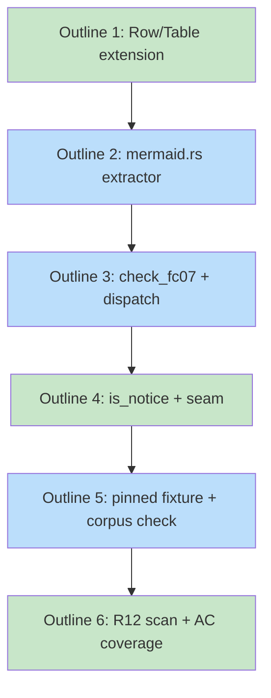

# PLAN: table-diagram-reconciliation

## Status

Draft

This PLAN sequences the FC07 implementation -- the table/diagram
reconciliation check the upstream DESIGN settled across six decisions
-- into six ordered atomic commits that land on a single branch and
merge in one PR. The PR closes the parent milestone's FC07 row. The
PLAN is ephemeral: it deletes itself when the PR merges, per the
single-pr lifecycle.

## Scope Summary

Decompose the FC07 implementation into ordered commits that extend
the existing `Table` carrier, add a line-oriented mermaid extractor,
add the three-dimension `check_fc07` function, wire FC07 into the
`is_notice` membership with a one-line promotion seam, pin a
pre-cleanup class-vs-Status regression fixture, and verify
public-cleanliness across every emitted notice. FC07 ships at notice
level; the actual promotion to error and the broader corpus
reconciliation are deferred to a later PR per the parent
PRD/DESIGN's notice-then-error contract.

## Decomposition Strategy

**Horizontal.** The DESIGN spells out four implementation increments
where each step consumes the prior step's interface: the `Table`
profile and terminality fields feed the reconciliation check; the
extractor produces the diagram views the check consumes; the check
function joins the existing dispatch; the notice-membership wiring
makes FC07 ship as a notice. Component boundaries inside the
`crates/shirabe-validate` crate are stable, and one increment is a
clean prerequisite for the next, so the layer-by-layer shape matches
the work. Walking-skeleton would force an end-to-end runtime path
before the carrier types compile, with no integration-risk payoff
for a single-crate refactor plus one new check.

## Issue Outlines

### Issue 1: Extend `Row` and `Table` with terminality, status, and profile

**Goal**: Add `terminal: bool` and `status: Option<String>` to `Row`,
add a `Profile { Plan, Roadmap }` enum plus a `profile: Profile`
field to `Table`, and populate them in the classifier without
changing the existing `RowKind` rule.

**Acceptance Criteria**:
- [ ] `Row` gains two new fields: `terminal: bool` (true when the
  row's original first cell is wrapped in `~~...~~` for the plan
  profile, or when the Status cell value is `Done` or `Closed`
  case-insensitive for the roadmap profile) and `status:
  Option<String>` (carries the raw Status cell value for roadmap
  rows; `None` for plan rows).
- [ ] `Table` gains a `profile: Profile` field where
  `Profile::Roadmap` is set when the columns end with a `Status`
  column on a 4-column shape; otherwise `Profile::Plan`.
- [ ] `classify_row` populates the new fields. The existing
  `RowKind` classification rule (Entity / Description / Child) is
  unchanged.
- [ ] Unit tests cover plan-profile strikethrough on and off,
  roadmap-profile Status values (`Done`, `Closed`, `In Progress`,
  `Not Started`, and a `needs-*` annotation which counts as open
  for v1), and profile detection from columns.
- [ ] Existing FC05 and FC06 tests pass unchanged (no consumer of
  the new fields yet).

**Dependencies**: None

**Type**: code
**Files**: `crates/shirabe-validate/src/table.rs`

### Issue 2: Add `crates/shirabe-validate/src/mermaid.rs` and the line-oriented extractor

**Goal**: Add the new module with `extract_diagram(lines: &[&str]) ->
Diagram` and `find_dependency_graph_block(doc: &Doc) ->
Option<BlockLocation>`, plus the carrier types (`Diagram`, `Node`,
`Edge`, `ClassAssignment`, `BlockLocation`, `Issue`). Stdlib-only
over the corpus subset the spike enumerated, no new external
dependency, total over arbitrary input.

**Acceptance Criteria**:
- [ ] The new module produces four parallel views: node set
  (`Vec<Node>` with id, label, line), edge set (`Vec<Edge>` with
  src, dst, line, expanded from chained `A --> B --> C` forms),
  class assignments (`Vec<ClassAssignment>` with id, name, inline
  flag, line, expanded across comma-separated id lists with
  whitespace tolerated), and the `classDef` set (`HashSet<String>`
  of declared class names; style content is not parsed).
- [ ] `find_dependency_graph_block` returns the first fenced
  mermaid block under `## Dependency Graph` using the existing
  `Doc.sections` IR. Mermaid blocks outside that section are
  ignored. When multiple blocks appear under the section, the
  first is used; later blocks are ignored.
- [ ] The `Issue` enum carries the malformations the spike
  enumerated: `UnterminatedFence`, `MissingBlock`, `HeaderFlowchart`,
  `HeaderUnrecognized`, `InlineClassSyntax`, `UndefinedClass`.
- [ ] Unit tests cover the spike's edge-case table line-by-line:
  unterminated fence (read to EOF, emit one Issue), empty body
  (header only), no diagram block, multiple blocks, `flowchart`
  header (Issue + best-effort body parse), ragged node declaration
  (line skipped), chained edges expanded into adjacent pairs,
  multi-key class statement with internal whitespace, inline
  `:::class` syntax (Issue + equivalent class assignment captured),
  `%%`-comment skip, `subgraph`/`end` skip.
- [ ] Bounded-iteration guarantee: very long lines, deeply nested
  punctuation, and arbitrary UTF-8 input produce a result without
  index panics; running time is linear in the number of lines.
- [ ] No new external dependency added; the module uses only the
  stdlib plus the `regex` crate the workspace already carries.

**Dependencies**: Blocked by <<ISSUE:1>>

**Type**: code
**Files**: `crates/shirabe-validate/src/mermaid.rs`, `crates/shirabe-validate/src/lib.rs`

### Issue 3: Add `check_fc07` and dispatch it in `validate_file`

**Goal**: Add the FC07 check function to `checks.rs` -- three
reconciliation passes (node-set bijection, edge agreement,
class-vs-Status) in a single pass over the parsed `Table` and the
extracted `Diagram`, with per-defect notices in the FC05/FC06 voice,
plus the doc-comment recording the blocker-left / dependent-right
edge-directionality convention. Wire FC07 into the `Plan` and
`Roadmap` arms of `validate_file` alongside FC05 and FC06.

**Acceptance Criteria**:
- [ ] A table key with no matching `^I[0-9]+$` diagram node emits
  one `[FC07]` notice naming the table key.
- [ ] A diagram node whose id matches `^I[0-9]+$` with no matching
  table key emits one notice naming the orphan node.
- [ ] A diagram node whose id does not match `^I[0-9]+$` (an `O<n>`
  or `K<n>` corpus shape) does not produce a node-set notice in
  either direction.
- [ ] A Dependencies cell entry whose corresponding diagram edge is
  missing emits one notice naming the missing edge (`src --> dst`).
- [ ] A diagram edge whose Dependencies counterpart is missing
  emits one notice naming the orphan edge.
- [ ] Edges involving a non-issue-keyed node id are excluded from
  both directions of the edge check.
- [ ] A node classed `done` whose table row is open emits one
  notice naming the node, the declared class, the observed state,
  and the expected class.
- [ ] A node classed `ready` whose table row is open but whose
  dependencies include at least one open row emits one notice in
  the four-field shape.
- [ ] A node classed `blocked` whose table row is in a terminal
  state emits one notice in the four-field shape.
- [ ] A node with no class assignment does not produce a
  class-mismatch notice.
- [ ] A node carrying a class in `{needsDesign, needsPrd,
  needsSpike, needsDecision, tracksDesign, tracksPlan, simple,
  testable, critical, koto}` does not produce a class-vs-Status
  notice.
- [ ] A class statement naming a class that no `classDef` in the
  same diagram defines emits one notice naming the undefined class.
- [ ] Every notice begins with the prefix `[FC07]` and names a
  specific node, table key, edge, or class name; the voice mirrors
  the existing FC05/FC06 form.
- [ ] FC07 is dispatched in the `Plan` and `Roadmap` arms of
  `validate_file`; it is not dispatched in any other format arm.
- [ ] A `///` doc comment on the FC07 check function records the
  blocker-left / dependent-right edge-directionality convention and
  points at `references/dependency-diagram.md` and the spike.
- [ ] The function returns an empty vec when the format has no
  `issues_table_columns` (the same no-op gate FC05 and FC06 use).
- [ ] All malformed-diagram cases the extractor surfaces are
  converted to per-issue notices before the per-dimension passes; a
  missing block short-circuits the per-node checks.

**Dependencies**: Blocked by <<ISSUE:2>>

**Type**: code
**Files**: `crates/shirabe-validate/src/checks.rs`, `crates/shirabe-validate/src/validate.rs`

### Issue 4: Add `"FC07"` to `is_notice` with the promotion-seam doc comment

**Goal**: Add the `"FC07"` arm to the `is_notice` match expression
in `validate.rs` and add a `///` doc comment that names the seam in
prose: a future cleanup PR removes the `"FC07"` arm to promote the
check from notice to error in a single-line diff. This issue and
Issue 3 land in the same commit -- without this change, the FC07
dispatch added in Issue 3 would surface as errors and fail CI on the
committed corpus.

**Acceptance Criteria**:
- [ ] `is_notice` matches `"SCHEMA" | "FC07"` instead of the
  literal-equal that exists today.
- [ ] The doc comment above `is_notice` names the function as the
  promotion seam in prose: "FC07 ships notice-level for v1; remove
  the FC07 arm from this match to promote the check to error in a
  single-line diff."
- [ ] Running `shirabe validate` against a doc whose Implementation
  Issues table and Dependency Graph disagree across any of the
  three dimensions surfaces the corresponding FC07 notices and
  exits 0.
- [ ] The existing `is_notice_only_schema` test is updated to
  reflect the new membership: `FC07` is now a notice, all of
  `FC01-FC06`, `R6`, `R7`, `R8`, `R9` remain errors.

**Dependencies**: Blocked by <<ISSUE:3>> (paired commit)

**Type**: code
**Files**: `crates/shirabe-validate/src/validate.rs`

### Issue 5: Pinned pre-cleanup regression fixture and corpus-surfacing self-check

**Goal**: Add the inline-string regression fixture that pins the
pre-PR state of `PLAN-roadmap-plan-standardization.md` where the
table row was terminal but the diagram classed the node `blocked`,
assert FC07 emits the four-field notice naming the node, the
declared class, the observed state, and the expected class. Run
`shirabe validate` over the committed `docs/plans/*.md` and
`docs/roadmaps/*.md` and confirm any FC01-FC06 errors that existed
before this PR are unchanged and that the only surfaced FC07 items
are notices.

**Acceptance Criteria**:
- [ ] The pinned pre-cleanup fixture lives in `mermaid.rs` or
  `checks.rs` as a Rust `&str` constant inside a `#[cfg(test)]`
  module. It is not a file under `tests/data/`.
- [ ] The fixture exercises the class-vs-Status defect that
  motivated the FC08 scope extension: a `~~...~~` terminal row in
  the plan profile paired with a `class IXXX blocked` diagram
  statement.
- [ ] The test asserts FC07 emits exactly one notice for that
  defect with the four-field shape (node, declared class, observed
  state, expected class).
- [ ] `./target/release/shirabe validate --visibility=public
  docs/plans/PLAN-*.md docs/roadmaps/*.md` exits 0 after this PR
  lands. FC07 notices surface on docs that carry pre-existing drift
  and are visible in the output; FC01-FC06 errors are unchanged
  relative to `origin/main`.

**Dependencies**: Blocked by <<ISSUE:4>>

**Type**: code
**Files**: `crates/shirabe-validate/src/checks.rs` (test module), `crates/shirabe-validate/src/mermaid.rs` (test module)

### Issue 6: Public-cleanliness scan and acceptance-criterion coverage sweep

**Goal**: Run the R12 public-cleanliness scan over every FC07 notice
body and every doc-comment the FC07 implementation introduced,
asserting none names a private repo, a private path, an external
issue number, or a pre-announcement feature. Verify each of the
26 PRD acceptance criteria has a corresponding test or assertion
landed by Issues 1-5; record the coverage matrix as comments in the
relevant test modules.

**Acceptance Criteria**:
- [ ] A `#[test]` (or an in-source assertion run from `cargo test`)
  walks every notice body FC07 can emit and confirms it contains
  no private-repo path, no `private/...` reference, no external
  issue number (e.g. no `#NNN` outside the diagram-node form), and
  no pre-announcement feature name.
- [ ] The R12 scan also walks the `///` doc comments on the FC07
  check function and on the `is_notice` promotion seam.
- [ ] Each PRD acceptance criterion (26 total across R2-R12) maps
  to a named test or assertion. The mapping is recorded as a single
  comment block in the FC07 test module (one `// AC-Rx: covered by
  test fn name` line per criterion).
- [ ] `cargo test -p shirabe-validate` runs to green at this commit
  with all FC07 tests included.

**Dependencies**: Blocked by <<ISSUE:5>>

**Type**: code
**Files**: `crates/shirabe-validate/src/checks.rs` (test module), `crates/shirabe-validate/src/mermaid.rs` (test module)

## Implementation Issues

_Single-pr execution mode: no GitHub issues are created from this
PLAN. The ordered work is decomposed into the Issue Outlines above
and lands in the same PR as this document. The parent milestone's
FC07 row is the one GitHub artifact that closes when the PR merges._

## Dependency Graph

**Legend**: Green = simple, Blue = testable. Outlines use `O<n>` ids
because no GitHub issues are created in single-pr mode; the
non-issue-keyed shape is the documented tolerated subset.

## Implementation Sequence

The critical path is linear: Outline 1 -> Outline 2 -> {Outline 3,
Outline 4 paired commit} -> Outline 5 -> Outline 6. No parallelism
applies at the issue level under single-pr; each commit must keep
`cargo test` green, and Outline 4 must land in the same commit as
Outline 3 so the `is_notice` membership tracks the new FC07
dispatch.

Order of commits, with the conventional-commit prefix the
implementer should use:

1. `feat(validate): extend Row/Table with terminality, status, profile`
2. `feat(validate): add mermaid extractor module`
3. `feat(validate): add check_fc07 and wire it in validate_file` (paired with `feat(validate): join FC07 to is_notice with promotion-seam doc-comment` in the same commit)
4. `test(validate): pin pre-cleanup class-vs-Status regression fixture`
5. `test(validate): R12 public-cleanliness scan and FC07 AC coverage sweep`

## Out of Scope

- **The actual promotion of FC07 to error-level.** The
  promotion-seam exists after Issue 4; the flip is a single-line
  membership change in a later cleanup PR per the parent design's
  notice-then-error rollout and the PRD's R7.
- **Corpus reconciliation.** The committed `docs/plans/*.md` and
  `docs/roadmaps/*.md` may surface FC07 notices once this PR lands.
  Surfacing the notices is the intended outcome of the staged
  rollout; the corpus cleanup PR is a separate piece of work.
- **A general mermaid parser.** The extractor stays line-oriented
  and shaped to the corpus subset the spike enumerated. Future
  callers needing more grammar coverage replace the extractor.
- **Reconciling `needs-*` Status annotations against
  `needsDesign`/`needsPrd`/`needsSpike`/`needsDecision`/`tracksDesign`/`tracksPlan`
  classes.** Recorded by the extractor but not reconciled; pipeline-
  position metadata that the Implementation Issues table does not
  carry today.

## References

- **Source DESIGN.** `docs/designs/DESIGN-table-diagram-reconciliation.md`
  (six decisions settled).
- **Source PRD.** `docs/prds/PRD-table-diagram-reconciliation.md`
  (12 requirements, 26 acceptance criteria).
- **Source BRIEF.** `docs/briefs/BRIEF-table-diagram-reconciliation.md`
  (four user journeys, scope boundary).
- **Feasibility spike.** `docs/spikes/SPIKE-mermaid-parser.md`
  (per-dimension strictness tables, edge-case behavior table).
- **Parent design.** `docs/designs/DESIGN-roadmap-plan-standardization.md`
  Decision 3 (the staged-reconciliation that this PLAN's increment
  closes).
- **Parent plan.** `docs/plans/PLAN-roadmap-plan-standardization.md`
  (the row this PR closes inside the existing milestone).
- **Canonical issues-table conventions.** `references/issues-table.md`.
- **Canonical dependency-diagram conventions.**
  `references/dependency-diagram.md`.
- **Validation precedents.**
  `crates/shirabe-validate/src/checks.rs` (FC05 and FC06 voice),
  `crates/shirabe-validate/src/validate.rs` (dispatcher and the
  `is_notice` membership FC07 joins),
  `crates/shirabe-validate/src/table.rs` (the parser this PLAN
  extends).
