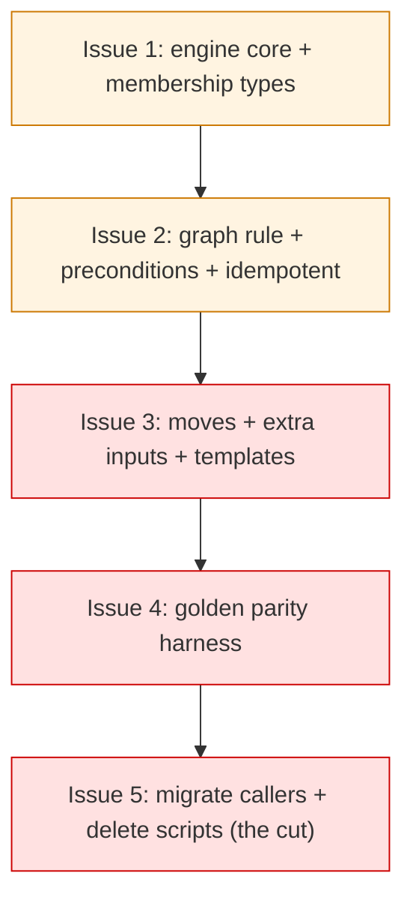

# PLAN: transition-script consolidation

## Status

Active

## Scope Summary

Implement the `shirabe transition <file> <status>` subcommand that consolidates
the seven per-skill `transition-status.sh` scripts, per
`DESIGN-transition-script-consolidation.md`. A declarative per-type spec table
interpreted by one engine reproduces each artifact type's validation, edits,
`git mv` moves, per-type JSON result, and 1/2/3 exit codes; a golden parity
harness pins the behavior; then every caller is migrated and the seven scripts
are deleted. (The original cutover covered six types; the comp artifact type,
whose `transition-status.sh` landed separately, was folded in afterward as a
seventh spec on the same engine and parity harness.)

## Decomposition Strategy

**Single-pr.** The work is one cohesive subcommand plus a full cutover, and the
cutover is not safely separable: the seven scripts cannot be deleted until the
subcommand reproduces their behavior *and* every caller is migrated, and a
half-migrated state (some skills on the subcommand, some on scripts, with the
parity harness incomplete) is strictly worse than either endpoint. So the issues
below are commits within one PR, sequenced so the tree builds and tests pass at
each step, with the irreversible deletion last and gated on a green parity
harness. The decomposition is horizontal: engine core, then rules, then the
move/extra-input surface, then the parity harness, then the cutover.

## Issue Outlines

### Issue 1: feat(transition): spec-table engine core + membership-only types

**Complexity:** testable
**Goal:** land the `transition` subcommand spine for the types with no graph,
no move, and no precondition (prd, roadmap, brief — base behavior).

**Work:**
- Add a `transition` module in `crates/shirabe-validate` with the
  `TransitionSpec` struct (statuses, rule, precondition, moves, extra_input,
  body_template, result_fields) and the seven-entry table (membership/graph rule
  and status sets filled for all; later issues fill the rest).
- Implement the engine core: `detect_format` reuse (error exit 1 on unknown
  type), current-status parse via the existing read-only parser, target-status
  membership check (exit 2), targeted frontmatter `status:` line rewrite, bare
  body `## Status` rewrite, per-type JSON result assembly to stdout, errors to
  stderr with a matching `code`, and the 1/2/3 exit-code mapping.
- Wire the clap `transition` subcommand (`<file> <status>`) in
  `crates/shirabe/src/main.rs` alongside `validate`.

**Acceptance criteria:**
- [ ] `shirabe transition <file> <status>` rewrites frontmatter + body status
  and emits the four-field result for prd, roadmap, and brief on a legal change.
- [ ] An unrecognized filename exits 1; an invalid status exits 2.
- [ ] `cargo test` and `cargo build --release` pass; `validate` is unchanged.

**Dependencies:** none.

### Issue 2: feat(transition): ordered-graph rule, preconditions, idempotent no-op

**Complexity:** testable
**Goal:** add the per-type transition graphs, content preconditions, and the
idempotent short-circuit, in the script-faithful order.

**Work:**
- Implement `Graph(edges)` evaluation with each type's exact edge list
  (vision/strategy/roadmap/brief), including strategy's `Accepted → Sunset` edge
  that vision lacks; illegal edge → exit 2.
- Implement preconditions: vision/strategy Open-Questions-resolved on
  Draft→Accepted, roadmap ≥2-features on Draft→Active; failure → exit 2.
- Implement the idempotent no-op (target == current → success, `moved: false`,
  no edits, graph/preconditions skipped) — placed *after* the extra-input gate
  introduced in Issue 3, so re-runs still validate required inputs.

**Acceptance criteria:**
- [ ] Each graph type rejects an out-of-order transition (e.g. roadmap
  Draft→Done) with exit 2; legal edges succeed.
- [ ] vision/strategy block Draft→Accepted with unresolved Open Questions;
  roadmap blocks Draft→Active with <2 features.
- [ ] Re-requesting the current status (including a terminal status) is a no-op
  with exit 0 and `moved: false`.

**Dependencies:** Issue 1.

### Issue 3: feat(transition): directory moves, extra inputs, per-type templates

**Complexity:** critical
**Goal:** the full per-type surface — moves, the `--superseded-by`/`--reason`
flags, sanitization, per-type body templates and extra frontmatter fields, and
the per-type missing-input exit codes.

**Work:**
- Implement `git mv` (work-tree detection, `mv` fallback, `mkdir -p` target,
  staged-not-committed, target-exists → exit 3) for design (Current, Superseded)
  and vision/strategy (Sunset) into their target directories.
- Add `--superseded-by <path>` (required for design Superseded → missing is
  exit 1; optional for vision Sunset) and `--reason <text>` (required for
  strategy Sunset → missing is exit 2), with strategy's reason sanitization
  (reject newlines, `\ / & ---`, exit 2). The extra-input gate runs before the
  idempotent short-circuit.
- Implement the per-type body templates (design `Superseded by [..](..)`,
  vision `Sunset: superseded by [..](..)`, strategy `Sunset: <reason>`, prd's
  full-status-line rewrite for `In Progress`) and extra frontmatter fields
  (`superseded_by`, `sunset_reason`).
- Validate `<file>` / `--superseded-by` resolve inside the repo work tree
  (additive hardening per the design's Security section).

**Acceptance criteria:**
- [ ] Superseding a design records `superseded_by`, writes the body line, and
  `git mv`s into `docs/designs/archive/`; missing `--superseded-by` exits 1.
- [ ] strategy Sunset requires `--reason`, sanitizes it (unsafe → exit 2), writes
  `sunset_reason` and the body line, and moves into `docs/strategies/sunset/`.
- [ ] prd transitions into and out of `In Progress` with the full status line
  rewritten correctly.

**Dependencies:** Issue 2.

### Issue 4: test(transition): golden parity harness across all seven types

**Complexity:** critical
**Goal:** pin byte/structural + exit-code parity against the scripts before any
deletion.

**Work:**
- Build a golden corpus: one document per type per representative case, with the
  current script's resulting frontmatter, body, JSON result, and exact exit code
  captured as the baseline.
- Cover per type, where applicable: a legal move; a rejected move (graph types)
  and a rejected invalid status (membership types); each precondition block; an
  idempotent re-run at a terminal status; an idempotent re-run that still fails
  the extra-input gate (design → exit 1, strategy → exit 2); prd into/out of
  `In Progress`; and the move/extra-field cases.
- Add `transition` parity to the test suite (and the reusable parity workflow if
  applicable), asserting structural result equality + exact exit code.

**Acceptance criteria:**
- [ ] The harness passes for all seven types across the cases above.
- [ ] A deliberately introduced behavior change in the engine fails the harness
  (the harness actually discriminates).

**Dependencies:** Issue 3.

### Issue 5: refactor(transition): migrate callers and delete the scripts

**Complexity:** critical
**Goal:** the cutover — every caller on the subcommand, the seven scripts gone.

**Work:** migrate the full reference surface (confirmed by `git grep
transition-status`), then delete the scripts:
- **Live invocations** → `shirabe transition`: each skill's `SKILL.md` (brief,
  prd, roadmap, strategy, vision, design, comp);
  `skills/work-on/scripts/run-cascade.sh` (and `run-cascade_test.sh`); the prd
  skill's direct call to the brief script; the eval harnesses
  `skills/brief/evals/test-cli.sh`, `skills/strategy/evals/test-cli.sh`, and
  `skills/comp/evals/test-cli.sh`.
- **CI**: `.github/workflows/check-brief-scripts.yml` and
  `check-comp-scripts.yml` run the brief and comp script tests — retire those
  jobs (they die when the scripts are deleted).
- **Evals**: update the `expected_output`/invocation strings in
  `skills/{brief,prd,roadmap,strategy,vision,comp,work-on}/evals/evals.json` (and
  re-run the affected evals per the repo's eval discipline).
- **Instructional docs**: update the reference/phase docs that tell authors to
  run the script — `skills/brief/references/{brief-format.md,phases/phase-5-finalize.md}`,
  `skills/design/references/lifecycle.md`,
  `skills/plan/references/phases/phase-7-creation.md`,
  `skills/roadmap/references/phases/phase-4-validate.md`,
  `skills/strategy/references/{strategy-format.md,phases/phase-5-finalize.md}`,
  `skills/vision/references/vision-format.md`,
  `skills/comp/references/phases/{phase-0-setup.md,phase-5-finalize.md}`.
- **Delete** the seven `skills/<skill>/scripts/transition-status.sh` and the
  per-script `transition-status_test.sh`, then `git grep transition-status`
  shows no live reference. Exclude the frozen `validate` golden corpus
  (`crates/shirabe/tests/fixtures/golden/corpus/`) — those are point-in-time doc
  snapshots, not live references, and editing them would break validate parity.

**Acceptance criteria:**
- [ ] No `transition-status.sh` script remains; `git grep transition-status`
  outside the frozen golden corpus shows only descriptive prose, no live
  invocation.
- [ ] `run-cascade_test.sh`, the eval `test-cli.sh` harnesses, and the affected
  `evals.json` pass against the subcommand.
- [ ] `check-brief-scripts.yml` and `check-comp-scripts.yml` are retired (CI does
  not reference a deleted script).
- [ ] `cargo test`, doc-validation CI, and the parity harness are green.

**Dependencies:** Issue 4.

## Implementation Issues

Single-pr: these are commits within one PR, not separately-merged GitHub issues
(no milestone is created). The identifiers map to the Issue Outlines above.

| Issue | Dependencies | Complexity |
|-------|--------------|------------|
| Issue 1 | None | testable |
| _Spec-table engine core plus the membership-only / no-move types (prd, roadmap, brief)._ | | |
| Issue 2 | Issue 1 | testable |
| _Ordered-graph rule, content preconditions, and the idempotent no-op._ | | |
| Issue 3 | Issue 2 | critical |
| _Directory moves, `--superseded-by`/`--reason`, sanitization, per-type templates._ | | |
| Issue 4 | Issue 3 | critical |
| _Golden parity harness across all seven types._ | | |
| Issue 5 | Issue 4 | critical |
| _Migrate every caller and delete the seven scripts (the irreversible cut)._ | | |

## Dependency Graph

Strictly linear: each step builds on the previous, and the irreversible
deletion (Issue 5) is gated on the parity harness (Issue 4) being green.

## Implementation Sequence

**Critical path:** I1 → I2 → I3 → I4 → I5 — the whole plan; none parallelizes,
since each layer consumes the previous. The tree builds and `cargo test` passes
at every commit, so the PR is reviewable commit-by-commit, with the
scripts-deletion commit (I5) small and obvious in `git log -p`.

**Parity is the gate.** Issue 4 must be green before Issue 5 deletes anything;
the deletion is the only irreversible step and it lands last.
