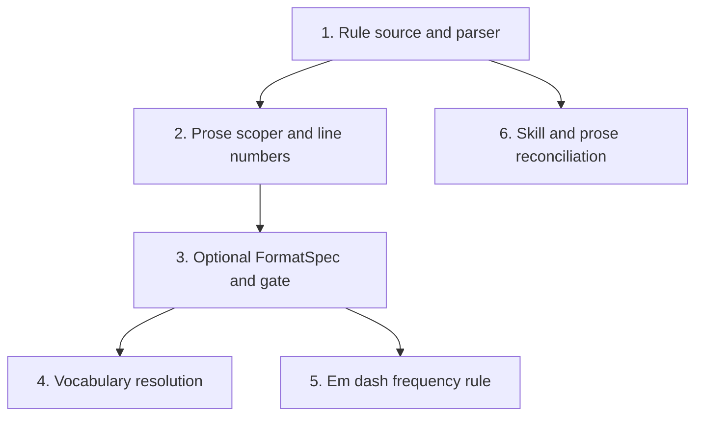

## Status

Active

Single-pr mode, so no GitHub milestone or issues exist. The outlines below are
the unit of work; `/execute` drives them on one branch.

## Scope Summary

Consolidate shirabe's writing-style rules into one file the validator reads at
enforcement time, add markdown-aware prose scoping and a document-level
frequency rule, extend checking to instruction files, and let a repository
declare terms of art the rules must not fire on.

## Decomposition Strategy

Horizontal. The components have a hard ordering: the rule source must parse
before anything reads it, the scoper must exist before a frequency rule can
measure scoped prose, and the dispatch change must land before instruction
files can be checked. Walking skeleton addresses integration risk between
components; here the integration is a function call inside one crate, and the
risk is concentrated in the scoper's correctness, which no thin slice surfaces
earlier.

The design's six phases already form a horizontal decomposition constructed so
each leaves the tree green. This plan adopts them.

## Issue Outlines

### 1. Rule source and parser

**Complexity**: testable

**Goal**: Move the writing-style rules into `skills/writing-style/rules.yaml`
and make the existing check read them at enforcement time instead of from the
`FC10_BANNED_WORDS` constant. Behavior-preserving: the seven current words move
first; the other 40 arrive in a later step.

**Resolution**: Implement the four-position lookup the design specifies: a
`--rules` flag, a `SHIRABE_RULES` env var, then an ancestor walk, in that
precedence. The `cargo test` position needs the env var because the parity
harness sets cwd to `tests/fixtures/golden/corpus`, where a walk escapes the
crate.

**Acceptance Criteria**:
- `rules.yaml` exists and parses with `saphyr`; no new crate is added.
- The check reads the file at enforcement time. Appending a sentinel term and
  re-running without rebuilding produces a finding for it.
- A missing or unparseable rules file is a tool error, exit 1, naming the
  resolved path. It never proceeds over an empty rule set.
- The existing FC10 test suite passes unchanged, or its assertions move to the
  YAML with the same expectations.
- The resolved path can never lie inside a repository under check.

**Dependencies**: None.

### 2. Prose scoper and line numbers

**Complexity**: testable

**Goal**: Add the markdown-aware scoper and carry the body start line into
`Doc` so findings report the line an author sees.

**Resolution**: Prose spans exclude fenced code, inline code, URLs, table rows,
and frontmatter; headings are included. Normalize CRLF to LF once at entry, because
`split_lines` retains `\r`, which breaks fence close-matching and silently
collapses a per-paragraph denominator to the document. Cap emission at 50
findings per rule per file plus one summarizing finding; a 10 MB document
currently produces 1.5 million findings at 875 MB resident.

**Acceptance Criteria**:
- A banned word inside a fenced code block, an inline code span, a URL, and
  frontmatter produces no finding; the same word in prose produces one.
- Under `--format json`, a finding's `line` equals the line in the file. Today
  a 24-line-frontmatter document reports 38 for an occurrence at 62.
- The scoper is total over arbitrary input: no panic on unterminated fences,
  nested fences, a fence opened in frontmatter, a single 10 MB line, CRLF, or
  non-UTF8 bytes. Follow the totality-test convention
  `check_fc08_extract_legend_total_over_arbitrary_input` establishes.
- Emission is bounded, verified with a generated large document.
- Scoper output is diffed against the reference measurement on the real corpus
  and the disagreement set is recorded, not asserted away.

**Dependencies**: `<<ISSUE:1>>`.

### 3. Optional FormatSpec and the file-selection gate

**Complexity**: critical

**Goal**: Make prose checks reach instruction files while making it impossible
for a structural check to fire on a file with no schema, and fix the two
silent-success defects in the same gate.

**Resolution**: `validate_file` takes `Option<&FormatSpec>`. Structural checks
run only on the `Some` arm, which makes the invariant a type error rather than
a convention. Prose checks run on both arms, above the schema gate. The `None`
arm admits a path only when its extension is `.md`. A frontmatter parse failure
on the `None` arm is not a tool error: the prose family falls back to raw-line
scanning. Directories are rejected as a tool error rather than walked.

**Acceptance Criteria**:
- For a fixture SKILL.md, CLAUDE.md, AGENTS.md, and README.md each containing a
  known violation, the validator reports a prose finding. All four return "All
  checks passed" at exit 0 today.
- `skills/writing-style/SKILL.md` and `skills/review-plan/SKILL.md` are pinned
  fixtures. Both fail `saphyr` frontmatter parsing today; both must produce
  prose findings rather than a tool error.
- A structural check cannot be reached with `None`. Verified by signature, not
  by test alone; every caller of `validate_file` and `validate_doc` is audited.
- `shirabe validate -- docs` exits non-zero naming the directory, rather than
  reporting success having read nothing.
- A CLAUDE.md missing a required convention header produces an FC-CONVENTIONS
  finding. It returns "All checks passed" today.
- An artifact-prefixed file produces the finding set it produced before this
  change, except for prose findings newly in scope.
- The three golden fixtures that move are handled in this commit:
  `corpus/real/DESIGN-gha-doc-validation.md` gains prose findings alongside its
  SCHEMA notice, and `corpus/synthetic/README-unrecognized-format.md` has its
  prose rewritten because it currently documents the defect as intended
  behavior. The frozen parity contract is amended explicitly, by migration or
  documented exemption, not re-baselined silently.
- A decision is recorded for what a submodule directory does when passed.

**Dependencies**: `<<ISSUE:2>>`.

### 4. Vocabulary resolution

**Complexity**: testable

**Goal**: Let a repository declare terms of art through a
`## Prose Vocabulary:` CLAUDE.md header, and declare shirabe's own.

**Resolution**: Generalize `resolve_doc_visibility` into
`resolve_claude_md_header(path, key)`. The walk canonicalizes first, prefers
`CLAUDE.local.md`, treats header-less files as transparent, takes the first
hit, and stops at the first directory containing `.git`. Matching is
case-insensitive whole-term and does not extend to morphological variants.
Unknown declared terms are ignored silently.

**Acceptance Criteria**:
- A repository declaring `tier` receives no `tier` findings, still receives
  findings for every other rule, and still receives `tiered` findings.
- In one invocation spanning files from two repositories, a term declared in
  one suppresses it there and not in the other.
- A declaration above a repository root does not suppress findings inside it;
  the walk stops at `.git`. This corrects a demonstrated bypass in the shipped
  visibility resolver.
- A CLAUDE.md carrying the header resolves its own header when it is itself the
  file being checked.
- An absent header suppresses nothing.
- A declared term naming a word not on the rule list is not an error.
- Adopter input is never compiled as a regex, and the value is size-capped
  following the `--custom-statuses` precedent.
- `resolve_doc_visibility` behavior is unchanged, verified by its existing
  tests.

**Dependencies**: `<<ISSUE:3>>`.

### 5. Em dash frequency rule

**Complexity**: testable

**Goal**: Add the first rule that evaluates a rate against a threshold.

**Resolution**: Denominator is words of scoped prose per the scoper. Reporting
unit is one finding per document. Threshold is 10 per thousand words. The
finding carries the line of the first occurrence. All four are fields in
`rules.yaml`, so changing them is a data edit.

**Acceptance Criteria**:
- The four values are recorded in
  `docs/guides/multi-consumer-cli-contract.md`.
- A fixture above the threshold produces exactly one finding; one below
  produces none. The test reads the threshold from the recorded value rather
  than hardcoding it.
- The finding's line is the first occurrence, verified on a fixture whose first
  occurrence is not line 1.
- The code appears in both `is_known_check_code` and `is_intrinsic_notice` and
  resolves to `Severity::Notice` under both postures. A test asserts this.
  Omission from `is_intrinsic_notice` ships the rule at error level to three
  adopters pinned at `@main`.
- Running the full check over shirabe, koto, niwa, and tsuku at the shipped
  severity exits 0 in all four.
- A tracked issue exists with a numeric promotion condition, referenced from
  the contract doc, before this merges.
- The golden fixtures whose em dash counts cross the threshold are handled:
  `corpus/real/BRIEF-shirabe-strategy-skill.md` at 8 occurrences, and
  `PRD-roadmap-skill.md` and `ROADMAP-strategic-pipeline.md` at 3 each, whose
  outcome depends on their word counts and must be recomputed rather than
  assumed.

**Dependencies**: `<<ISSUE:3>>`.

### 6. Skill and prose reconciliation

**Complexity**: simple

**Goal**: Collapse the remaining rule copies and correct the stale prose.

**Resolution**: Reduce `skills/writing-style/SKILL.md` to application guidance
plus a pointer at the rule source. Delete the inline word list in
`skills/brief/references/phases/phase-4-validate.md`. Repoint the 12
repo-relative references to the writing-style SKILL.md that other skills carry.
Correct the two prose copies naming `FC01`-`FC13` against a registry of
`FC01`-`FC16`, in `crates/shirabe/src/main.rs` help text and
`docs/guides/multi-consumer-cli-contract.md`.

**Acceptance Criteria**:
- Exactly one file contains the rule list. A CI check fails when a
  word-list-shaped literal, three or more entries drawn from the rule source,
  appears under `crates/**` or `skills/**` outside the rule source and its
  evals.
- The check-code ranges in the help text and the contract doc agree with
  `is_known_check_code`.
- A test asserts every code `is_known_check_code` accepts appears in each
  registration list that gates it.
- `skills/writing-style/evals/evals.json` is updated and the evals run, per
  CLAUDE.md's requirement that evals accompany a skill change. The rule
  propagation criterion for the drafting consumer is one of these evals.
- Documentation states that a repository with no vocabulary declaration
  receives everything, and names writing a declaration as the first adopter
  action.

**Dependencies**: `<<ISSUE:1>>`.

## Dependency Graph

## Implementation Sequence

**Critical path:** 1 → 2 → 3, then 4 and 5 in either order. Issue 3 is the
critical-complexity step and the one most likely to need rework: it changes the
crate's central dispatch signature, moves three frozen parity fixtures, and
depends on a frontmatter fallback that shirabe's own files exercise.

**Parallelizable:** 6 depends only on 1, so it can run alongside 2 and 3. 4 and
5 are independent of each other once 3 lands.

**Recorded split trigger.** If the diff proves unreviewable, the seam is
between 3 and 4: everything through the gate change is one deliverable, and
vocabulary plus the frequency rule is the second. Nothing else about the plan
changes if that split fires.
