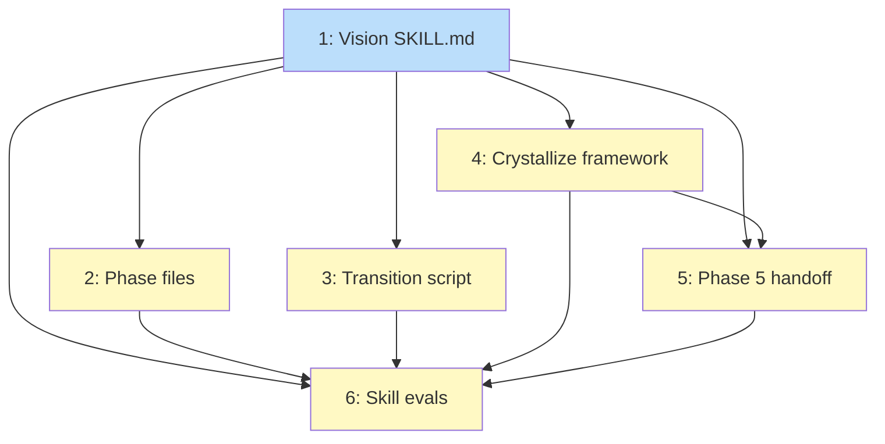

# PLAN: Vision Artifact Type

## Status

Draft

## Scope Summary

Add VISION as the sixth supported crystallize type with a dedicated /vision
creation skill, lifecycle transition script, crystallize framework integration,
/explore Phase 5 handoff, and evals.

## Decomposition Strategy

**Horizontal.** All deliverables are markdown skill files and a bash script
with no runtime integration. The foundation (SKILL.md) comes first, then
components that reference it. Evals come last.

## Issue Outlines

### 1. feat(vision): add vision reference skill with format spec and creation workflow

**Goal:** Create the core SKILL.md that defines VISION format, frontmatter
schema (status, thesis, scope, upstream), section matrix (7 required + 2
visibility-gated + 2 optional), lifecycle states (Draft, Accepted, Active,
Sunset), validation rules, quality guidance per section, content boundaries
vs PRD/Roadmap/Design Doc, and the creation workflow structure (setup,
scope, discover, draft, validate). Also handles standalone entry and
/explore handoff detection.

**Acceptance Criteria:**
- [ ] `skills/vision/SKILL.md` exists with all sections from the design's
      Decision 1 (template structure)
- [ ] Frontmatter schema documents `status`, `thesis`, `scope` (org|project),
      `upstream` (optional)
- [ ] Section matrix covers Public/Private and Org/Project dimensions
- [ ] Content boundaries list what VISION does NOT contain (features,
      sequencing, architecture, tasks, full competitive analysis)
- [ ] Creation workflow phases documented (0-4) with resume logic
- [ ] Standalone entry mode detects existing handoff artifact
- [ ] Quality guidance for each required section (Thesis as hypothesis,
      Audience as situation, Value Prop as category, etc.)

**Dependencies:** None

---

### 2. feat(vision): add creation workflow phase files

**Goal:** Create the 4 phase reference files that /vision loads during
execution. Phase 1 (scope) adapts /prd's conversational scoping for
vision-specific coverage areas (thesis clarity, audience definition, org
fit evidence). Phase 2 (discover) sends agents for audience validation,
value proposition clarity, org fit evidence, competitive landscape
(private only), success criteria measurability. Phase 3 (draft) produces
the VISION document from findings. Phase 4 (validate) runs a jury
review focused on vision-specific quality (thesis is hypothesis not
problem statement, success criteria avoid feature-level metrics, org fit
explains why HERE, non-goals are identity not scope).

**Acceptance Criteria:**
- [ ] `skills/vision/references/phases/phase-1-scope.md` exists with
      vision-specific coverage tracking areas
- [ ] `skills/vision/references/phases/phase-2-discover.md` exists with
      agent role definitions adapted for vision research
- [ ] `skills/vision/references/phases/phase-3-draft.md` exists with
      template population from findings
- [ ] `skills/vision/references/phases/phase-4-validate.md` exists with
      vision-specific jury review criteria
- [ ] Each phase file follows the structure of /prd's phase files
      (resume check, steps, quality checklist, artifact state, next phase)

**Dependencies:** <<ISSUE:1>>

---

### 3. feat(vision): add lifecycle transition script

**Goal:** Create `transition-status.sh` that handles all VISION lifecycle
transitions deterministically. Validates preconditions (Open Questions
resolved for Draft->Accepted, downstream artifact exists for
Accepted->Active, reason provided for Active->Sunset). Updates status in
both frontmatter and body. Moves Sunset docs to `docs/visions/sunset/`
via `git mv`. Adds `superseded_by` field when a successor is provided.
Rejects forbidden transitions with error codes. Outputs JSON for
programmatic consumption.

**Acceptance Criteria:**
- [ ] `skills/vision/scripts/transition-status.sh` exists and is executable
- [ ] Handles: Draft->Accepted, Accepted->Active, Active->Sunset
- [ ] Rejects: Draft->Active, Draft->Sunset, Active->Draft,
      Active->Accepted, Sunset->any
- [ ] Draft->Accepted validates Open Questions section is empty/removed
- [ ] Active->Sunset moves file to `docs/visions/sunset/` via `git mv`
- [ ] Sunset with superseding doc adds `superseded_by` frontmatter field
      and body link
- [ ] JSON output matches design doc transition script format
      (success, doc_path, old_status, new_status, new_path, moved)
- [ ] Exit codes: 0=success, 1=invalid args, 2=invalid transition,
      3=file operation failed

**Dependencies:** <<ISSUE:1>>

---

### 4. feat(explore): add VISION to crystallize framework

**Goal:** Add VISION as the sixth supported type in
`crystallize-framework.md`. Add the signal/anti-signal table (8 signals,
7 anti-signals including tactical scope), 4 tiebreaker rules (vs PRD,
Roadmap, Rejection Record, No Artifact), and 1 disambiguation rule
(strategic justification + requirements -> VISION first). Update Step 1
to score six types. Clean up the stale Deferred Types section: promote
Roadmap, Spike Report, Decision Record, and Competitive Analysis to
supported (they already have working produce handlers); only Prototype
remains deferred.

**Acceptance Criteria:**
- [ ] VISION appears in the Supported Types section with signal/anti-signal
      table matching Decision 2 from the design
- [ ] Step 1 text references six supported types (not five)
- [ ] Step 3 has 4 new tiebreaker entries (VISION vs PRD, Roadmap,
      Rejection Record, No Artifact)
- [ ] Disambiguation Rules section has the "strategic justification AND
      feature requirements" entry
- [ ] Deferred Types section lists only Prototype
- [ ] Roadmap, Spike Report, Decision Record, Competitive Analysis moved
      to Supported Types with their existing signal tables

**Dependencies:** <<ISSUE:1>>

---

### 5. feat(explore): add Phase 5 VISION handoff handler

**Goal:** Create `phase-5-produce-vision.md` that writes
`wip/vision_<topic>_scope.md` (synthesized from exploration findings and
decisions) and auto-invokes /vision. The handoff artifact contains:
problem statement, initial scope (in/out), research leads for /vision's
Phase 2, coverage notes, and decisions from exploration. Update
`phase-5-produce.md` routing table to add VISION as auto-continue
(same row pattern as PRD and Design Doc).

**Acceptance Criteria:**
- [ ] `skills/explore/references/phases/phase-5-produce-vision.md` exists
- [ ] Handoff artifact format matches the pattern in
      `phase-5-produce-prd.md` (scope file with problem, scope, leads,
      coverage, decisions sections)
- [ ] Handler synthesizes content from exploration findings (not raw copy)
- [ ] `phase-5-produce.md` routing table has VISION row with
      "Auto-continues into /vision" handoff description
- [ ] VISION row is positioned between Decision Record and the deferred
      types in the routing table

**Dependencies:** <<ISSUE:1>>, <<ISSUE:4>>

---

### 6. test(vision): add skill evals

**Goal:** Create eval scenarios for the vision skill. Scenarios should
cover: standalone /vision creation flow, /explore handoff detection and
resume, visibility gating (public omits Competitive Positioning and
Resource Implications), lifecycle transition validation (allowed and
forbidden), crystallize signal discrimination (VISION vs PRD boundary
on project existence).

**Acceptance Criteria:**
- [ ] `skills/vision/evals/evals.json` exists with scenario definitions
- [ ] Scenarios cover: standalone creation, /explore handoff, visibility
      gating, lifecycle transitions, crystallize discrimination
- [ ] Each scenario has assertions that can be graded by the eval runner
- [ ] Evals pass when run via `scripts/run-evals.sh vision`

**Dependencies:** <<ISSUE:1>>, <<ISSUE:2>>, <<ISSUE:3>>, <<ISSUE:4>>,
<<ISSUE:5>>

## Dependency Graph



**Legend**: Blue = ready, Yellow = blocked

## Implementation Sequence

**Critical path:** Issue 1 -> Issue 4 -> Issue 5 -> Issue 6

**Parallelization:** After Issue 1, Issues 2, 3, and 4 can proceed in
parallel. Issue 5 depends on both 1 and 4. Issue 6 waits for everything.

```
Issue 1 (SKILL.md)
  |
  +---> Issue 2 (phase files)     --+
  |                                 |
  +---> Issue 3 (transition script)-+
  |                                 |
  +---> Issue 4 (crystallize)      -+---> Issue 5 (handoff) ---> Issue 6 (evals)
```
