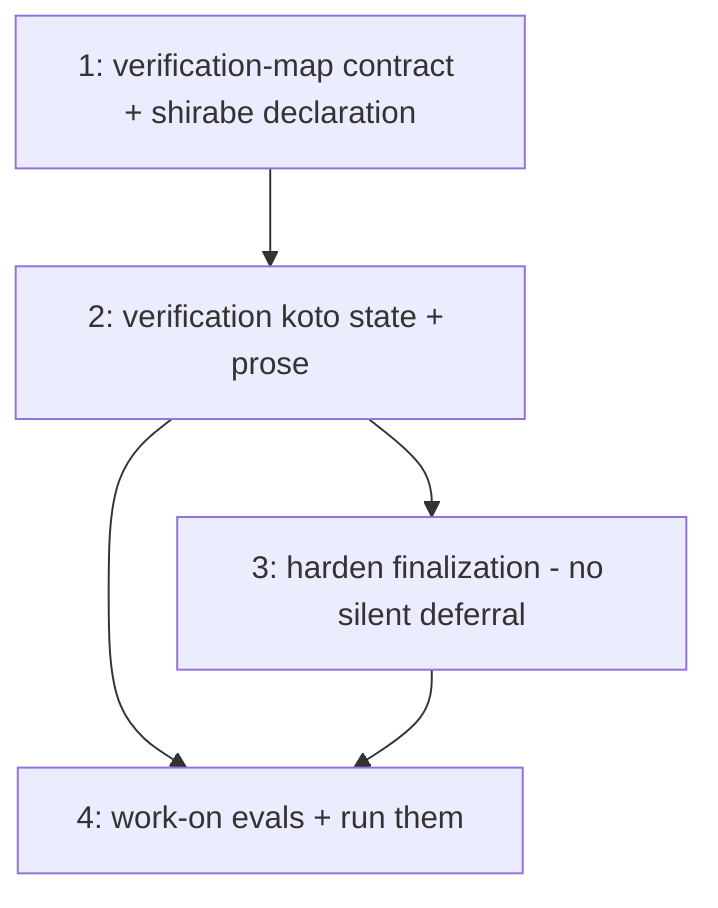

# PLAN: work-on Definition of Done

## Status

Active

Single-pr: the four outlines below land in one shirabe PR (no GitHub milestone or issues).
Issue 1 is the integration spine (the verification-map contract + shirabe's own declaration);
each later issue thickens one layer against it.

## Scope Summary

Implement the single-issue definition-of-done designed in DESIGN-work-on-definition-of-done:
a project-declared verification-map contract in the `/work-on` extension (with shirabe's own
declaration), a `verification` koto state that runs the mapped verification for what an issue
touched and requires pass, a hardened `finalization` that removes the silent deferral terminal
and routes deferral to a blocking human gate, and work-on evals that exercise the gate (run,
not just authored). No new CLI surface.

## Decomposition Strategy

**Walking skeleton.** Issue 1 establishes the verification-map contract and shirabe's
declaration — the thin slice the rest binds to. Issue 2 adds the `verification` state that
consumes the map; Issue 3 hardens `finalization` to require its evidence and block silent
deferral; Issue 4 adds and runs the evals. The order surfaces the generic/project split first
(the central design tension), then the gate, then enforcement, then verification of the
verification.

**Execution mode: single-pr.** One cohesive single-repo capability in `/work-on`'s skill +
koto template + shirabe's extension; the pieces are building blocks of one usable unit, not
independently shippable increments, and nothing forces a cross-repo or hard-ordering split.

## Issue Outlines

### Issue 1: Verification-map extension contract + shirabe's declaration
**Complexity**: testable
**Goal**: Document the verification-map schema in the `/work-on` project-extension contract
(`.claude/shirabe-extensions/work-on.md`): a list of `path-glob → verification command(s)`
entries plus an optional default test command, generic and project-agnostic (PRD R7, R8).
Ship shirabe's own `.claude/shirabe-extensions/work-on.md` declaring `skills/** →
scripts/run-evals.sh <skill>` (evals must run and pass) and the repo default test command
(`cargo test --workspace` plus the bash harnesses) (PRD R9, DESIGN Decision F).
**Acceptance Criteria**:
- The extension contract documents the map schema (glob → command(s), optional default),
  with no project-specific commands in the generic skill (R7).
- shirabe's `.claude/shirabe-extensions/work-on.md` declares the `skills/**` eval-gate entry
  and the repo default test command (R9).
- The declaration is consumable: a documented shape `/work-on` can read and classify against.
**Dependencies**: None

### Issue 2: `verification` koto state + SKILL.md prose
**Complexity**: critical
**Goal**: Add a `verification` state to the single-issue `/work-on` koto template between
`qa_validation` and `finalization`, with SKILL.md prose: read the project's verification map,
classify the issue's `git diff` against the map globs (DESIGN Decision C), run each matched
command (defaulting to the repo test command per Decision D), capture pass/fail evidence,
fail closed to the human gate on cannot-verify, and announce what ran (PRD R1, R2, R3, R11,
R12, R13). Existence never substitutes for execution.
**Acceptance Criteria**:
- The `verification` state runs the mapped verification for what the issue touched and
  requires pass to advance; an authored-but-unrun verification does not pass (R2).
- No map match runs the repo default; neither match nor default ⇒ cannot-verify, routed to
  the human gate, never silent-pass (R3, R11).
- The state runs existing tooling only and announces the commands it ran (R12, R13).
**Dependencies**: <<ISSUE:1>>

### Issue 3: Harden `finalization` — no silent deferral
**Complexity**: critical
**Goal**: Change the single-issue `finalization` state so `ready_for_pr` requires the
`verification` evidence and the silent `deferred_items_noted` terminal is removed: any unmet
acceptance criterion, failed verification, or cannot-verify routes to a blocking
human-approval gate (approve-and-record a deferral, or report `blocked`). Record approved
deferrals via `koto decisions record` and in the PR body; disallow unapproved caveat language
via the finalization checklist (PRD R1, R4, R5, R6, DESIGN Decision E).
**Acceptance Criteria**:
- `finalization` reports done only with verification evidence present; it cannot reach a clean
  terminal with an unmet/deferred criterion (R1, R4).
- A deferral requires explicit human approval, recorded as the human's decision; without it
  the outcome is `blocked` (R5).
- Unapproved caveat/hedge language is disallowed; a caveat is legitimate only where it records
  an approved deferral (R6).
**Dependencies**: <<ISSUE:2>>

### Issue 4: work-on evals for the gate + run them
**Complexity**: testable
**Goal**: Add `skills/work-on/evals/evals.json` scenarios for the gate behaviors —
verified-by-execution (authored-but-unrun does not pass), fail-closed on cannot-verify, and
no-silent-deferral (deferral requires human approval) — and run them via the `/skill-creator`
harness, fixing any failing assertions. The feature enforces the run-not-just-author rule, so
it applies it to itself.
**Acceptance Criteria**:
- Eval scenarios exist for verified-by-execution, fail-closed, and no-silent-deferral.
- The evals are executed (not merely authored) and pass.
**Dependencies**: <<ISSUE:2>>, <<ISSUE:3>>

## Implementation Sequence

- **Build order within the PR:** 1 → 2 → 3 → 4. Issue 1 lands first as the contract spine.

