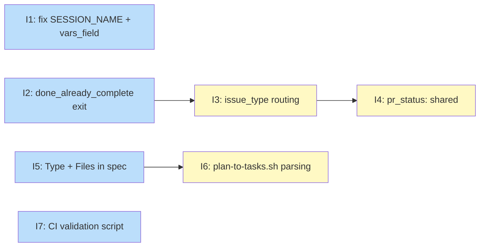

# PLAN: Work-on Orchestrator Efficiency

## Status

Draft

## Scope Summary

Reduce operational overhead in the work-on plan orchestrator by adding complexity-based
routing (docs/task fast path), a clean exit for pre-implemented work, correct plan-backed
PR handling, parallel file conflict prevention, and CI template consistency enforcement.
All changes are confined to the shirabe repo; koto v0.8.2 provides the necessary engine
support.

## Decomposition Strategy

**Horizontal decomposition.** The design consists of enhancements to existing templates
and scripts with clear component boundaries. Each issue builds one component fully:
`work-on-plan.md` bug fixes, new `work-on.md` routing paths, `plan-doc-structure.md`
spec additions, `plan-to-tasks.sh` parser updates, and a new CI script. No new
end-to-end pipeline needs to be integrated early, so a walking skeleton would add
structure without benefit. Issues 1, 2, 5, and 7 have no dependencies and can start
immediately in parallel.

## Issue Outlines

### Issue 1: fix(work-on-plan): replace hardcoded workflow name and add vars_field

**Goal**: Fix the hardcoded workflow name bug and add `vars_field: vars` to
`materialize_children` in `work-on-plan.md` so the orchestrator works correctly under
any session name and passes task variables to child workflows automatically.

**Acceptance Criteria**:
- [ ] Both tick scripts in the `spawn_and_await` directive use `koto next {{SESSION_NAME}}` instead of `koto next work-on-plan`
- [ ] All `koto context get work-on-plan` calls in `pr_finalization` and `escalate` directives are replaced with `koto context get {{SESSION_NAME}}`
- [ ] The `materialize_children` block in `spawn_and_await` includes `vars_field: vars`
- [ ] Each of the `scrutiny`, `review`, and `qa_validation` directives includes a comment stating "The gate name is `<name>`; the context key is `<name>.json`."
- [ ] No other logic, states, or transitions in `work-on-plan.md` are changed

**Dependencies**: None

---

### Issue 2: feat(work-on): add done_already_complete exit path from analysis

**Goal**: Add a `done_already_complete` non-failure terminal state to `work-on.md` so
analysis agents can exit cleanly when all acceptance criteria are already satisfied by
prior commits.

**Acceptance Criteria**:
- [ ] `analysis.accepts.plan_outcome.values` includes `already_complete` in `skills/work-on/koto-templates/work-on.md`
- [ ] A transition `when: plan_outcome: already_complete` routes from `analysis` to `done_already_complete` in `work-on.md`
- [ ] `done_already_complete` is defined as a state with `terminal: true` and no `failure: true` flag in `work-on.md`
- [ ] `analysis.accepts` includes an optional `issue_type` field (no required constraint) in `work-on.md`
- [ ] The `analysis` directive in `work-on.md` explains when to submit `already_complete` (all acceptance criteria satisfied by prior commits) and what evidence to include
- [ ] `skills/work-on/references/phases/phase-3-analysis.md` includes guidance on detecting pre-implemented work and submitting `already_complete`, plus classification confirmation/override instructions for `issue_type`
- [ ] `skills/work-on/references/agent-instructions/phase-3-analysis.md` includes the same guidance as the phases reference file

**Dependencies**: None

---

### Issue 3: feat(work-on): add issue_type routing for docs and task issues

**Goal**: Add `issue_type` routing to `work-on.md` so that `docs` and `task` issues skip
the scrutiny/review/QA panel states and go directly to `finalization`.

**Acceptance Criteria**:
- [ ] `work-on.md` frontmatter declares `ISSUE_TYPE` as a template variable with `required: false` and `default: code`
- [ ] `implementation.accepts` includes an optional `issue_type` field with three transitions: `complete + code` → `scrutiny`, `complete + docs` → `finalization`, `complete + task` → `finalization`
- [ ] The `implementation` directive instructs the agent to re-submit `issue_type` (as confirmed during analysis) for routing
- [ ] SKILL.md documents the `issue_type` classification responsibility: analysis agent confirms or overrides `{{ISSUE_TYPE}}`; implementation agent re-submits the confirmed type
- [ ] Workflows that do not pass `ISSUE_TYPE` at init continue to default to `code` behavior, preserving existing single-issue workflow behavior
- [ ] The `analysis.accepts` optional `issue_type` field (added in Issue 2) is present and the `implementation` directive references it correctly

**Dependencies**: Blocked by <<ISSUE:2>>

---

### Issue 4: feat(work-on): add pr_status: shared for plan-backed children

**Goal**: Add `pr_status: shared` to the `work-on.md` template so plan-backed children
skip PR creation and go directly to `done`.

**Acceptance Criteria**:
- [ ] `shared` is added to `pr_creation.accepts.pr_status.values` in `skills/work-on/koto-templates/work-on.md`
- [ ] A transition `when: pr_status: shared → done` is present in `pr_creation`, skipping `ci_monitor`
- [ ] The `pr_creation` directive instructs agents running with `SHARED_BRANCH` set to submit `pr_status: shared` instead of creating a PR
- [ ] SKILL.md documents the `pr_status: shared` convention and the `SHARED_BRANCH` signal

**Dependencies**: Blocked by <<ISSUE:3>>

---

### Issue 5: docs(plan): add Type and Files optional fields to issue outline spec

**Goal**: Add `**Type**:` and `**Files**:` as optional fields to the Issue Outline format
in `plan-doc-structure.md` so downstream tooling and agents have a canonical spec to
reference.

**Acceptance Criteria**:
- [ ] `skills/plan/references/quality/plan-doc-structure.md` includes `**Type**:` as an optional field in the Issue Outline section
- [ ] The `**Type**:` entry documents valid values (`code | docs | task`), default (`code`), and clarifies it is a hint for the analysis agent, not a binding declaration
- [ ] `skills/plan/references/quality/plan-doc-structure.md` includes `**Files**:` as an optional field in the Issue Outline section
- [ ] The `**Files**:` entry documents the backtick-quoted comma-separated file path format and its purpose (write targets for conflict detection by `plan-to-tasks.sh`)
- [ ] The updated spec includes the example block showing both fields in context with the existing `**Goal**`, `**Acceptance Criteria**`, and `**Dependencies**` fields

**Dependencies**: None

---

### Issue 6: feat(plan-to-tasks): parse Type and Files issue outline annotations

**Goal**: Update `plan-to-tasks.sh` to parse `**Type**:` and `**Files**:` Issue Outline
annotations, populating `vars.issue_type` and auto-adding `waits_on` edges for outlines
that share a file.

**Acceptance Criteria**:
- [ ] `plan-to-tasks.sh` parses `**Type**:` lines and sets `vars.issue_type` on the corresponding task JSON entry
- [ ] `plan-to-tasks.sh` parses `**Files**:` lines, extracting only backtick-quoted tokens (not plain text)
- [ ] When two outlines share a backtick-quoted file path, a `waits_on` edge is auto-added from the later outline to the earlier one
- [ ] When no outlines share a file, no extra `waits_on` edges are generated
- [ ] Outlines missing `**Type**:` produce no `vars.issue_type` field (defaulting to `code` is handled downstream by the template variable default)
- [ ] Eval scenarios in `skills/plan/evals/evals.json` cover: `**Type**:` parsed into `vars.issue_type`, shared files generating correct `waits_on` edges, non-shared files generating no extra edges, and missing `**Type**:` defaulting correctly

**Dependencies**: Blocked by <<ISSUE:5>>

---

### Issue 7: ci(work-on): add template consistency validation script and workflow

**Goal**: Add a `validate-template-mermaid.sh` script and a matching CI workflow that
catches mermaid/YAML drift, broken `default_template` references, and hardcoded workflow
names in koto template files.

**Acceptance Criteria**:
- [ ] `scripts/validate-template-mermaid.sh` exists and is executable
- [ ] Check 1: script extracts state names from YAML frontmatter (awk between `states:` and `---`) and from mermaid `-->` transition lines, sorts and diffs both sets, and exits non-zero if any state appears in one set but not the other
- [ ] Check 2: script reads each `default_template:` field in a template file and exits non-zero if the named file does not exist in the same directory
- [ ] Check 3: script extracts the `name:` value from frontmatter, greps directive prose for `koto next <name>` patterns, and exits non-zero if a `koto next` call references a name other than the frontmatter value
- [ ] Templates without a companion `*.mermaid.md` file are skipped (no failure on missing diagram)
- [ ] `.github/workflows/check-template-consistency.yml` exists and triggers on changes to `skills/*/koto-templates/**`
- [ ] The workflow runs `scripts/validate-template-mermaid.sh` and fails the job on a non-zero exit
- [ ] Test coverage exists for the script (eval scenarios or shell tests covering at least one passing and one failing case per check)
- [ ] The script passes against all current templates in the repository without false positives

**Dependencies**: None

---

## Dependency Graph

**Legend**: Green = done, Blue = ready, Yellow = blocked, Purple = needs-design, Orange = tracks-design/tracks-plan

## Implementation Sequence

**Critical path**: Issue 2 → Issue 3 → Issue 4 (3 issues deep)

**Immediate start** (no dependencies, fully parallel):
- Issue 1: `fix(work-on-plan)` — one-line bug fixes to `work-on-plan.md`
- Issue 2: `feat(work-on): done_already_complete` — new terminal state
- Issue 5: `docs(plan)` — spec doc additions only
- Issue 7: `ci(work-on)` — new script and workflow, fully independent

**After Issue 2 completes**:
- Issue 3: `feat(work-on): issue_type routing` — builds on the `analysis.accepts.issue_type` field added in Issue 2

**After Issue 3 completes**:
- Issue 4: `feat(work-on): pr_status: shared` — adds the `pr_creation` path once implementation routing is in place

**After Issue 5 completes**:
- Issue 6: `feat(plan-to-tasks)` — implements the parser against the spec established in Issue 5

Recommended approach: start Issues 1, 2, 5, and 7 in parallel. Issues 3 and 6 can begin as soon as their respective blockers are done. Issue 4 follows Issue 3.
