# PLAN: Work-on Friction Fixes

## Status

Draft — pending issue creation. When this PR merges, a follow-up runs the
batch-creation script, substitutes the `<<ISSUE:N>>` placeholders in the
Implementation Issues table for real issue links, and transitions status
to Active.

## Scope Summary

Ten open items from an external agent's `/shirabe:work-on` friction-log
run that remain after the initial skill-hardening PR. Seven are design
questions (#1-7) that each warrant a standalone DESIGN doc because the
right shape of the fix is contested; three are implementation
follow-ups (#8-10) surfaced during the first-pass implementation whose
scope is already clear enough to go straight to `/work-on`.

The seven ready-to-implement items from the same triage already landed
in the PR that introduced this PLAN, so they're not in the outline list.

## Decomposition Strategy

**Horizontal, mixed issue kinds.** Each item maps 1:1 to a GitHub
issue. Items 1-7 are `docs(design): …` planning issues carrying
`needs-design`; they produce a DESIGN doc and spawn their own
downstream implementation plan via `/plan`. Items 8-10 are direct
implementation issues (complexity `simple`) that `/work-on` can handle
without an intermediate design step. All ten share the `Work-on
Friction Fixes` milestone.

Dependencies are minimal. Only #6 (context findings cache) waits on #1
(remote DESIGN doc resolution): the cache key scheme can't be chosen
without first deciding how the resolver finds documents. Items 8-10
are independent and can run in any order once this PR merges.

## Issue Outlines

### Issue 1: docs(design): extract-context DESIGN doc resolution across branches and repos

**Goal**: Decide how `extract-context.sh` should resolve a DESIGN doc
when it lives on a remote branch or in a sibling repo. Options:
scan `origin/*` refs, use a workspace manifest (niwa), require an
explicit `Design:` path + repo annotation on issues, or leave as-is.

**Acceptance Criteria**:
- [ ] `docs/designs/DESIGN-extract-context-remote-resolution.md` exists
  at status Accepted with alternatives section
- [ ] Decision is concrete enough to spawn implementation issues via
  `/plan`

**Dependencies**: None

**Type**: docs

### Issue 2: docs(design): staleness_check gate portability in shirabe

**Goal**: Decide how the `staleness_check` gate (which currently calls
`check-staleness.sh`, a script that does not ship with shirabe) should
work on a shirabe-only install. Options: port the script into shirabe,
make the gate conditional on script availability, move staleness into
koto, or drop the gate.

**Acceptance Criteria**:
- [ ] `docs/designs/DESIGN-staleness-check-portability.md` exists at
  status Accepted with alternatives section
- [ ] Decision is concrete enough to spawn implementation issues

**Dependencies**: None

**Type**: docs

### Issue 3: docs(design): pre-existing baseline failure envelope

**Goal**: Decide how the setup phase captures and routes baseline
failures that exist before the current change. Options: new evidence
value `baseline_status: broken_preexisting`, a dedicated gate, or a
documented human-in-the-loop escape.

**Acceptance Criteria**:
- [ ] `docs/designs/DESIGN-preexisting-baseline-failures.md` exists at
  status Accepted with alternatives section
- [ ] Decision names what baseline.md captures, how subsequent gates
  avoid misattributing the failure, and how `--auto` mode behaves

**Dependencies**: None

**Type**: docs

### Issue 4: docs(design): pre-push confirmation gate with --auto mode

**Goal**: Decide how `phase-6` and the `pr_creation` state should pause
for user confirmation before `git push` and `gh pr create`, while still
behaving correctly in `--auto` mode (decision protocol or silent
proceed).

**Acceptance Criteria**:
- [ ] `docs/designs/DESIGN-pre-push-confirmation.md` exists at status
  Accepted with alternatives section
- [ ] Design addresses interactive vs `--auto` behaviour explicitly
- [ ] Decision is concrete enough to spawn implementation issues

**Dependencies**: None

**Type**: docs

### Issue 5: docs(design): multi-issue bundling as a first-class /work-on flow

**Goal**: Decide how `/work-on` should handle the "bundle another issue
onto an existing branch and PR" flow. Options: a new invocation
(`/work-on --bundle #N`), a dedicated state, a helper script, or a
PR-body template. Highest-impact friction-log item; explicit design
warranted.

**Acceptance Criteria**:
- [ ] `docs/designs/DESIGN-multi-issue-bundling.md` exists at status
  Accepted with alternatives section
- [ ] Design covers: invocation, branch reuse, PR-body convention,
  summary artifact semantics, koto state machine implications
- [ ] Decision is concrete enough to spawn implementation issues

**Dependencies**: None

**Type**: docs

### Issue 6: docs(design): per-branch context findings cache

**Goal**: Decide the cache key scheme and storage location for
`extract-context.sh` findings so sibling issues on the same branch skip
redundant remote-branch lookups. Options: koto context key, tmp file,
or git-branch-scoped state.

**Acceptance Criteria**:
- [ ] `docs/designs/DESIGN-extract-context-cache.md` exists at status
  Accepted with alternatives section
- [ ] Design builds on the resolution strategy from #1
- [ ] Cache invalidation policy is spelled out

**Dependencies**: Blocked by <<ISSUE:1>>

**Type**: docs

### Issue 7: docs(design): monorepo-aware baseline scoping

**Goal**: Decide how the setup phase detects monorepo structure and
scopes baseline tests to touched packages. Includes deciding whether
scoping lives in work-on itself or in a future language skill.

**Acceptance Criteria**:
- [ ] `docs/designs/DESIGN-monorepo-baseline-scoping.md` exists at
  status Accepted with alternatives section
- [ ] Design names the detection signals (workspaces, turbo config, go
  modules, Cargo workspaces) and the ownership question
- [ ] Decision is concrete enough to spawn implementation issues

**Dependencies**: None

**Type**: docs

### Issue 8: task(work-on): re-run work-on evals after CLAUDE_PLUGIN_ROOT change

**Goal**: Confirm that the env-var standardization that landed with
this PLAN's parent PR doesn't regress any eval assertion that still
checks for `CLAUDE_SKILL_DIR` in skill output.

**Acceptance Criteria**:
- [ ] `scripts/run-evals.sh work-on` runs end-to-end
- [ ] All current work-on eval assertions pass
- [ ] If any fail, fix the assertions (or the skill if the failure
  reveals a real regression) in a follow-up PR

**Dependencies**: None

**Type**: task

### Issue 9: docs(work-on): rewrite phase-3 agent-instructions for dual consumption

**Goal**: Update `skills/work-on/references/agent-instructions/phase-3-analysis.md`
so it reads naturally whether consumed by the main agent (simplified
plans, inline) or a subagent (full plans, delegated). The current
"You will receive…" framing assumes a fresh subagent.

Options: (a) split into `phase-3-fullplan-agent.md` +
`phase-3-simplified-inline.md`; (b) rewrite the single file in
agent-neutral voice with sections for each path.

**Acceptance Criteria**:
- [ ] Main-agent inline consumption and subagent delegated consumption
  both read cleanly
- [ ] `phase-3-analysis.md` (the phase reference, not the agent
  instructions) links to whatever shape the chosen option produces

**Dependencies**: None

**Type**: docs

### Issue 10: docs(work-on): consolidate `/tmp/koto-<WF>/` tmp-path convention

**Goal**: Create `skills/work-on/references/tmp-path-convention.md`
that owns the `/tmp/koto-<WF>/` convention, and replace the inline
convention explanations in `phase-1-setup.md`,
`agent-instructions/phase-3-analysis.md`, and `phase-5-finalization.md`
with one-line references to the new file. Prevents drift when someone
updates the convention.

**Acceptance Criteria**:
- [ ] `skills/work-on/references/tmp-path-convention.md` exists and is
  the single authoritative description
- [ ] The three phase files reference it rather than duplicating the
  text
- [ ] Existing work-on evals pass

**Dependencies**: None

**Type**: docs

## Implementation Issues

_Table populated after GitHub issues are created. Until then, see Issue
Outlines above for the canonical list._

### Milestone: _(pending creation)_

| Issue | Dependencies | Complexity |
|-------|--------------|------------|
| <<ISSUE:1>> | None | simple |
| _Decide how `extract-context.sh` resolves a DESIGN doc living on a remote branch or in a sibling repo. Enables #6's cache design._ | | |
| <<ISSUE:2>> | None | simple |
| _Decide how the `staleness_check` gate should work on a shirabe-only install, given `check-staleness.sh` currently ships only with the private tsukumogami plugin._ | | |
| <<ISSUE:3>> | None | simple |
| _Decide how the setup phase captures and routes baseline failures that predate the current change, so later gates don't misattribute them._ | | |
| <<ISSUE:4>> | None | simple |
| _Decide how phase-6 pauses for user confirmation before `git push` / `gh pr create` while remaining correct in `--auto` mode._ | | |
| <<ISSUE:5>> | None | simple |
| _Decide how `/work-on` supports bundling multiple issues onto one branch and PR as a first-class flow. Highest-impact item; several viable approaches._ | | |
| <<ISSUE:6>> | <<ISSUE:1>> | simple |
| _Decide the cache key scheme for `extract-context.sh` so sibling issues on one branch don't re-investigate the same design-doc dead ends._ | | |
| <<ISSUE:7>> | None | simple |
| _Decide how setup detects monorepo structure and scopes baseline tests to touched packages. Also decides whether scoping belongs in work-on or a future language skill._ | | |
| <<ISSUE:8>> | None | simple |
| _Re-run work-on evals after the `CLAUDE_PLUGIN_ROOT` standardization merges, to catch any assertion that still expects the old env-var string._ | | |
| <<ISSUE:9>> | None | simple |
| _Rewrite or split `agent-instructions/phase-3-analysis.md` so it reads cleanly for both main-agent (simplified plans, inline) and subagent (full plans, delegated) consumption._ | | |
| <<ISSUE:10>> | None | simple |
| _Consolidate the `/tmp/koto-<WF>/` convention into a single reference file, and collapse the inline explanations in phase-1, phase-3 agent-instructions, and phase-5 into one-line references._ | | |

## Dependency Graph

```mermaid
graph TD
  I1["#1 docs(design): extract-context remote resolution"]
  I2["#2 docs(design): staleness_check portability"]
  I3["#3 docs(design): pre-existing baseline failures"]
  I4["#4 docs(design): pre-push confirmation"]
  I5["#5 docs(design): multi-issue bundling"]
  I6["#6 docs(design): context findings cache"]
  I7["#7 docs(design): monorepo baseline scoping"]
  I8["#8 task(work-on): re-run evals after env-var change"]
  I9["#9 docs(work-on): rewrite phase-3 agent-instructions"]
  I10["#10 docs(work-on): consolidate tmp-path convention"]

  I1 --> I6

  classDef done fill:#86efac,stroke:#16a34a,color:#000
  classDef ready fill:#93c5fd,stroke:#2563eb,color:#000
  classDef blocked fill:#fde047,stroke:#ca8a04,color:#000
  classDef needsDesign fill:#d8b4fe,stroke:#7c3aed,color:#000
  classDef needsPrd fill:#fdba74,stroke:#ea580c,color:#000
  classDef needsSpike fill:#f9a8d4,stroke:#db2777,color:#000
  classDef needsDecision fill:#a5f3fc,stroke:#0891b2,color:#000
  classDef tracksDesign fill:#e9d5ff,stroke:#7c3aed,color:#000
  classDef tracksPlan fill:#bfdbfe,stroke:#3b82f6,color:#000

  class I1,I2,I3,I4,I5,I7 needsDesign
  class I6 blocked
  class I8,I9,I10 ready
```

**Legend**: Purple = needs-design, Yellow = blocked on a prerequisite
design, Blue = ready to implement, Green = done.

## Implementation Sequence

Nine of the ten can start in parallel once this PR merges: #1-#5, #7
on the design track; #8-#10 on the implementation track. Only #6
waits — on #1 being Accepted, because its cache key scheme depends on
the resolution strategy.

**Priority signal**: #5 (multi-issue bundling) was the highest-impact
single item in the source triage. Starting its DESIGN doc first keeps
the downstream implementation plan unblocked the earliest. Among the
implementation items, #8 (eval re-run) should go first since it
verifies that no assertion regressed against the env-var change.

**Per-design-doc follow-up**: each of #1-7 spawns its own
implementation plan via `/plan` once the design is Accepted. Items
#8-10 close directly via `/work-on`. This PLAN closes when all
downstream plans have reached Done and #8-10 are closed (or an item
is explicitly dropped).
