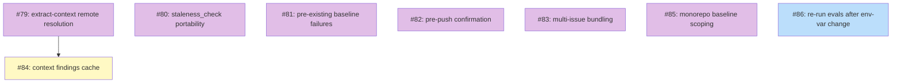

# PLAN: Work-on Friction Fixes

## Status

Active — issues created and tracked under the
[Work-on Friction Fixes](https://github.com/tsukumogami/shirabe/milestone/4)
milestone (#79 through #86). The PLAN closes when each design (#79,
#80, #81, #82, #83, #84, #85) reaches Accepted and its downstream
implementation plan reaches Done, plus #86 (eval re-run) is closed.

## Scope Summary

Eight open items from a triage of `/work-on` friction observations
that remain after the initial skill-hardening PR. Seven are design
questions (#79, #80, #81, #82, #83, #84, #85) that each warrant a
standalone DESIGN doc because the right shape of the fix is
contested; one is a verification task (#86) that confirms a recent
env-var change doesn't regress any work-on eval assertion.

The seven ready-to-implement items from the same triage landed
directly in the PR that introduced this PLAN, along with two further
implementation follow-ups surfaced during that first-pass work
(phase-3 agent-instructions agent-neutral rewrite; consolidating the
koto-context ingestion convention into a single reference file). They
are not in the outline list.

## Decomposition Strategy

**Horizontal, mixed issue kinds.** Each item maps 1:1 to a GitHub
issue. The seven design issues (#79, #80, #81, #82, #83, #84, #85)
are `docs(design): …` planning issues carrying `needs-design`; they
produce a DESIGN doc and spawn their own downstream implementation
plan via `/plan`. #86 is a verification task (complexity `simple`,
no design step). All eight share the `Work-on Friction Fixes`
milestone.

Dependencies are minimal. Only #84 (context findings cache) waits on
#79 (remote DESIGN doc resolution): the cache key scheme can't be
chosen without first deciding how the resolver finds documents. #86
is independent and can run any time.

## Issue Outlines

_Empty in multi-pr mode per the PLAN format spec. Issue content is
owned by the GitHub issues linked in the Implementation Issues table
below._

## Implementation Issues

### Milestone: [Work-on Friction Fixes](https://github.com/tsukumogami/shirabe/milestone/4)

| Issue | Dependencies | Complexity |
|-------|--------------|------------|
| [#79: docs(design): extract-context DESIGN doc resolution across branches and repos](https://github.com/tsukumogami/shirabe/issues/79) | None | simple |
| _Decide how `extract-context.sh` resolves a DESIGN doc living on a remote branch or in a sibling repo. Enables #84's cache design._ | | |
| [#80: docs(design): staleness_check gate portability in shirabe](https://github.com/tsukumogami/shirabe/issues/80) | None | simple |
| _Decide how the `staleness_check` gate should work on a shirabe-only install, given `check-staleness.sh` currently ships only with the private tsukumogami plugin._ | | |
| [#81: docs(design): pre-existing baseline failure envelope](https://github.com/tsukumogami/shirabe/issues/81) | None | simple |
| _Decide how the setup phase captures and routes baseline failures that predate the current change, so later gates don't misattribute them._ | | |
| [#82: docs(design): pre-push confirmation gate with --auto mode](https://github.com/tsukumogami/shirabe/issues/82) | None | simple |
| _Decide how phase-6 pauses for user confirmation before `git push` / `gh pr create` while remaining correct in `--auto` mode._ | | |
| [#83: docs(design): multi-issue bundling as a first-class /work-on flow](https://github.com/tsukumogami/shirabe/issues/83) | None | simple |
| _Decide how `/work-on` supports bundling multiple issues onto one branch and PR as a first-class flow. Highest-impact item; several viable approaches._ | | |
| [#84: docs(design): per-branch context findings cache](https://github.com/tsukumogami/shirabe/issues/84) | [#79](https://github.com/tsukumogami/shirabe/issues/79) | simple |
| _Decide the cache key scheme for `extract-context.sh` so sibling issues on one branch don't re-investigate the same design-doc dead ends._ | | |
| [#85: docs(design): monorepo-aware baseline scoping](https://github.com/tsukumogami/shirabe/issues/85) | None | simple |
| _Decide how setup detects monorepo structure and scopes baseline tests to touched packages. Also decides whether scoping belongs in work-on or a future language skill._ | | |
| [#86: task(work-on): re-run work-on evals after CLAUDE_PLUGIN_ROOT change](https://github.com/tsukumogami/shirabe/issues/86) | None | simple |
| _Re-run work-on evals after the `CLAUDE_PLUGIN_ROOT` standardization merges, to catch any assertion that still expects the old env-var string._ | | |

## Dependency Graph

**Legend**: Purple = needs-design, Yellow = blocked on a prerequisite
design, Blue = ready to implement, Green = done.

## Implementation Sequence

Seven of the eight can start in parallel once this PR merges: #79,
#80, #81, #82, #83, #85 on the design track, plus #86 (eval re-run)
on the implementation track. Only #84 waits — on #79 being Accepted,
because its cache key scheme depends on the resolution strategy.

**Priority signal**: #83 (multi-issue bundling) was the highest-impact
single item in the source triage. Starting its DESIGN doc first keeps
the downstream implementation plan unblocked the earliest. #86 (eval
re-run) is cheap to run and worth doing early since it verifies that
no assertion regressed against the env-var change.

**Per-design-doc follow-up**: each design issue (#79, #80, #81, #82,
#83, #84, #85) spawns its own implementation plan via `/plan` once
the design is Accepted. #86 closes directly via `/work-on`. This PLAN
closes when all downstream plans have reached Done and #86 is closed
(or an item is explicitly dropped).
