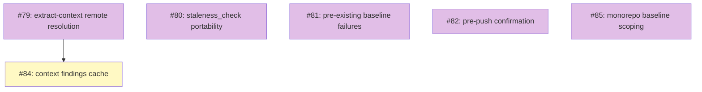

# PLAN: Work-on Friction Fixes

## Status

Active

Issues created and tracked under the
[Work-on Friction Fixes](https://github.com/tsukumogami/shirabe/milestone/4)
milestone. The PLAN closes when each remaining design (#79, #80, #81,
#82, #84, #85) reaches Accepted and its downstream implementation
plan reaches Done.

**Triage update (2026-06)**: two of the original eight issues were
closed during a triage pass after the standardization milestone
landed. #83 (multi-issue bundling) was superseded by plan-backed
mode (`SHARED_BRANCH` / `setup_plan_backed` / `pr_status: shared`)
that arrived through the cascade-refactor work. #86 (re-run evals
after `CLAUDE_PLUGIN_ROOT` change) was obsoleted by intervening CI
runs across the standardization PRs; no assertion regressions
surfaced and the verification window is past. The remaining six
issues stay open; #81 and #85 carry status-update comments
indicating partial address. The `issue_count` and the table /
diagram below drop the two closed issues.

## Scope Summary

Six remaining items from a triage of `/work-on` friction observations
that remain after the initial skill-hardening PR. All six are design
questions (#79, #80, #81, #82, #84, #85) that each warrant a
standalone DESIGN doc because the right shape of the fix is
contested.

The seven ready-to-implement items from the same triage landed
directly in the PR that introduced this PLAN, along with two further
implementation follow-ups surfaced during that first-pass work
(phase-3 agent-instructions agent-neutral rewrite; consolidating the
koto-context ingestion convention into a single reference file). They
are not in the outline list.

## Decomposition Strategy

**Horizontal, design-only.** Each item maps 1:1 to a GitHub
issue. All six are `docs(design): …` planning issues carrying
`needs-design`; they produce a DESIGN doc and spawn their own
downstream implementation plan via `/plan`. All six share the
`Work-on Friction Fixes` milestone.

Dependencies are minimal. Only #84 (context findings cache) waits on
#79 (remote DESIGN doc resolution): the cache key scheme can't be
chosen without first deciding how the resolver finds documents.

## Issue Outlines

_Empty in multi-pr mode per the PLAN format spec. Issue content is
owned by the GitHub issues linked in the Implementation Issues table
below._

## Implementation Issues

### Milestone: [Work-on Friction Fixes](https://github.com/tsukumogami/shirabe/milestone/4)

| Issue | Dependencies | Complexity |
|-------|--------------|------------|
| [#79: docs(design): extract-context DESIGN doc resolution across branches and repos](https://github.com/tsukumogami/shirabe/issues/79) | None | simple |
| _Decide how `extract-context.sh` resolves a DESIGN doc living on a remote branch or in a sibling repo. Enables #84's cache design._ | | |
| [#80: docs(design): staleness_check gate portability in shirabe](https://github.com/tsukumogami/shirabe/issues/80) | None | simple |
| _Decide how the `staleness_check` gate should work on a shirabe-only install, given `check-staleness.sh` currently ships only with the private tsukumogami plugin._ | | |
| [#81: docs(design): pre-existing baseline failure envelope](https://github.com/tsukumogami/shirabe/issues/81) | None | simple |
| _Decide how the setup phase captures and routes baseline failures that predate the current change, so later gates don't misattribute them._ | | |
| [#82: docs(design): pre-push confirmation gate with --auto mode](https://github.com/tsukumogami/shirabe/issues/82) | None | simple |
| _Decide how phase-6 pauses for user confirmation before `git push` / `gh pr create` while remaining correct in `--auto` mode._ | | |
| [#84: docs(design): per-branch context findings cache](https://github.com/tsukumogami/shirabe/issues/84) | [#79](https://github.com/tsukumogami/shirabe/issues/79) | simple |
| _Decide the cache key scheme for `extract-context.sh` so sibling issues on one branch don't re-investigate the same design-doc dead ends._ | | |
| [#85: docs(design): monorepo-aware baseline scoping](https://github.com/tsukumogami/shirabe/issues/85) | None | simple |
| _Decide how setup detects monorepo structure and scopes baseline tests to touched packages. The routing decision (per-language-skill ownership) is settled; the remaining design work is the per-skill scoping logic._ | | |

## Dependency Graph

**Legend**: Purple = needs-design, Yellow = blocked on a prerequisite
design, Blue = ready to implement, Green = done.

## Implementation Sequence

Five of the six can start in parallel: #79, #80, #81, #82, #85 on
the design track. Only #84 waits — on #79 being Accepted, because
its cache key scheme depends on the resolution strategy.

**Priority signal**: #79 (extract-context remote resolution) is now
the highest-impact starting point because it unblocks #84.
Starting its DESIGN doc first keeps the downstream cache work
(#84) unblocked at the earliest opportunity.

**Per-design-doc follow-up**: each design issue (#79, #80, #81,
#82, #84, #85) spawns its own implementation plan via `/plan` once
the design is Accepted. This PLAN closes when all downstream plans
have reached Done (or an item is explicitly dropped).
