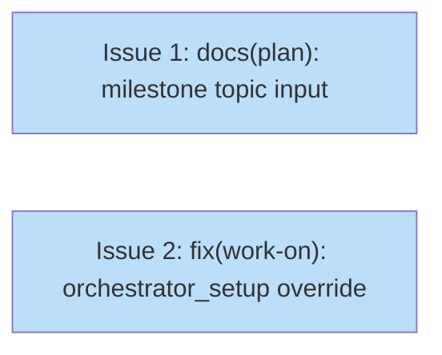

# PLAN: Work-on Friction Fixes

## Status

Draft

## Scope Summary

Fix two gaps found during the work-on-hardening execution: a missing topic-input row in the milestone derivation phase reference, and the absence of an override path in the plan orchestrator's setup state for agents that already have an appropriate branch.

## Decomposition Strategy

Horizontal decomposition. Both issues address independent gaps with no shared code or ordering constraint. Each is a contained change to one or two files.

## Issue Outlines

### Issue 1: docs(plan): add topic input guidance to milestone derivation phase

**Goal**

Add a `topic` row to the milestone derivation table in `skills/plan/references/phases/phase-2-milestone.md` so agents know what to use as the milestone title when there is no source document and no `#` heading to extract from.

**Acceptance Criteria**

- [ ] `phase-2-milestone.md` includes a `topic` input type entry in the derivation table or an equivalent dedicated section covering the topic case
- [ ] The guidance specifies that the topic string itself (converted to title case) is used as the milestone title when no source document exists
- [ ] The `milestone` field description format table covers the topic case (no source document path to reference, so an appropriate placeholder or omission is documented)
- [ ] A reader following only `phase-2-milestone.md` for a topic-input plan run can complete Phase 2 without ambiguity

**Dependencies**: None

---

### Issue 2: fix(work-on): add override path to orchestrator_setup for existing branches

**Goal**

Add `status: override` as a valid evidence value in the `orchestrator_setup` state of `skills/work-on/koto-templates/work-on-plan.md`, with a transition directly to `spawn_and_await` that skips branch and PR creation. Document the override path in `skills/work-on/SKILL.md` so agents running the plan orchestrator on an already-appropriate branch (e.g. the current session branch) can opt out of creating a redundant `impl/<slug>` branch.

**Acceptance Criteria**

- [ ] `work-on-plan.md` koto template `orchestrator_setup` state accepts `status: override` and routes to `spawn_and_await`
- [ ] `work-on-plan.mermaid.md` is updated to include the `orchestrator_setup --> spawn_and_await : status: override` edge
- [ ] `skills/work-on/SKILL.md` Shared Branch and Draft PR section documents when to submit `status: override` (agent is already on an appropriate branch and a PR already exists or should not be created automatically)
- [ ] The existing `status: completed` and `status: blocked` paths are unchanged
- [ ] The override path does not set `SHARED_BRANCH` — children infer the branch from the current checkout or from an existing variable

**Dependencies**: None

## Dependency Graph

**Legend**: Green = done, Blue = ready, Yellow = blocked

## Implementation Sequence

**Critical path**: none — both issues are independent and can be worked in either order or in parallel.

**Recommended order**:
1. Issue 1 (docs only, zero risk, quick to verify)
2. Issue 2 (template + docs, needs koto template verification)
