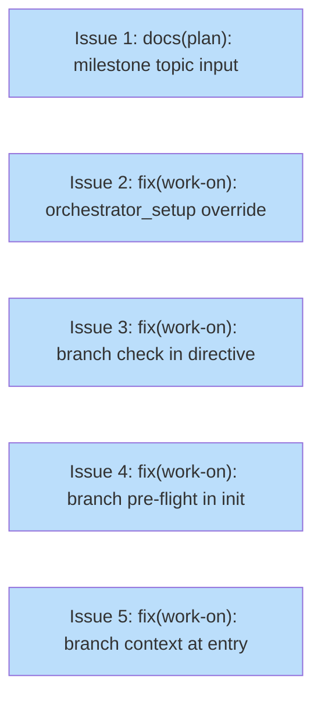

# PLAN: Work-on Friction Fixes

## Status

Draft

## Scope Summary

Fix gaps found during the work-on-hardening execution: a missing topic-input row in the milestone derivation phase reference, the absence of an override path in the plan orchestrator's setup state for existing branches, and three workflow gaps that caused agents to blindly create new branches instead of reasoning about the user's intent.

## Decomposition Strategy

Horizontal decomposition. All issues address independent gaps with no shared code or ordering constraint. Each is a contained change to one or two files.

## Issue Outlines

### Issue 1: docs(plan): add topic input guidance to milestone derivation phase

**Goal**

Add a `topic` row to the milestone derivation table in `skills/plan/references/phases/phase-2-milestone.md` so agents know what to use as the milestone title when there is no source document and no `#` heading to extract from.

**Acceptance Criteria**

- [ ] `phase-2-milestone.md` includes a `topic` input type entry in the derivation table or an equivalent dedicated section covering the topic case
- [ ] The guidance specifies that the topic string itself (converted to title case) is used as the milestone title when no source document exists
- [ ] The `milestone` field description format table covers the topic case (no source document path to reference, so an appropriate placeholder or omission is documented)
- [ ] A reader following only `phase-2-milestone.md` for a topic-input plan run can complete Phase 2 without ambiguity

**Dependencies**: None

---

### Issue 2: fix(work-on): add override path to orchestrator_setup for existing branches

**Goal**

Add `status: override` as a valid evidence value in the `orchestrator_setup` state of `skills/work-on/koto-templates/work-on-plan.md`, with a transition directly to `spawn_and_await` that skips branch and PR creation. Document the override path in `skills/work-on/SKILL.md` so agents running the plan orchestrator on an already-appropriate branch (e.g. the current session branch) can opt out of creating a redundant `impl/<slug>` branch.

**Acceptance Criteria**

- [ ] `work-on-plan.md` koto template `orchestrator_setup` state accepts `status: override` and routes to `spawn_and_await`
- [ ] `work-on-plan.mermaid.md` is updated to include the `orchestrator_setup --> spawn_and_await : status: override` edge
- [ ] `skills/work-on/SKILL.md` Shared Branch and Draft PR section documents when to submit `status: override` (agent is already on an appropriate branch and a PR already exists or should not be created automatically)
- [ ] The existing `status: completed` and `status: blocked` paths are unchanged
- [ ] The override path does not set `SHARED_BRANCH` — children infer the branch from the current checkout or from an existing variable

**Dependencies**: None

---

### Issue 3: fix(work-on): add branch context check to orchestrator_setup directive

**Goal**

Add a short context-evaluation step to the `orchestrator_setup` directive in `skills/work-on/koto-templates/work-on-plan.md` so agents are prompted to assess whether they are already on an appropriate branch before running the branch-creation script.

**Acceptance Criteria**

- [ ] The `orchestrator_setup` directive instructs the agent to check the current branch and any existing open PR for the plan slug before creating a new branch
- [ ] The directive explicitly states: if the current branch is non-main and an open PR already covers this work, submit `status: override` rather than running the creation script
- [ ] The existing script block and `status: completed` / `status: blocked` instructions are unchanged

**Dependencies**: None

---

### Issue 4: fix(work-on): add branch intent pre-flight to plan orchestrator initialization

**Goal**

Add a pre-flight step to the plan orchestrator initialization section of `skills/work-on/SKILL.md` so agents are prompted to surface the user's branch intent before calling `koto init` — not after they're already inside `orchestrator_setup`.

**Acceptance Criteria**

- [ ] The plan orchestrator initialization section in SKILL.md includes a step before `koto init`: check whether the user has specified a branch to work on or whether the agent is already on a non-default branch that should be reused
- [ ] The step instructs the agent to note the intended shared branch so it can submit `status: override` in `orchestrator_setup` rather than creating a new branch
- [ ] The step is placed before the `koto init` invocation, not inside the state-execution loop

**Dependencies**: None

---

### Issue 5: fix(work-on): prompt branch context evaluation at plan orchestrator entry

**Goal**

Add an entry-point check to the plan orchestrator section of `skills/work-on/SKILL.md` that prompts the agent to evaluate branch context as the very first step of plan mode — before any koto operations — so that "work on this plan in this same branch" type instructions are honored rather than overridden by the template's default behavior.

**Acceptance Criteria**

- [ ] The Plan Mode section of SKILL.md opens with a branch context evaluation step listing the signals an agent should check: current branch name, open PRs on that branch, any explicit branch instruction from the user
- [ ] The step maps each signal to an action: existing `impl/<slug>` branch with open PR → `status: override`; explicit user branch instruction → `status: override`; no applicable branch → create new with `status: completed`
- [ ] This step appears before Mode Detection and before Initialization

**Dependencies**: None

## Dependency Graph

**Legend**: Green = done, Blue = ready, Yellow = blocked

## Implementation Sequence

**Critical path**: none — all issues are independent and can be worked in any order or in parallel.

**Recommended order**:
1. Issues 1 & 2 (already implemented)
2. Issue 5 (entry-point check catches the problem earliest)
3. Issues 3 & 4 (reinforce the fix deeper in the flow)
