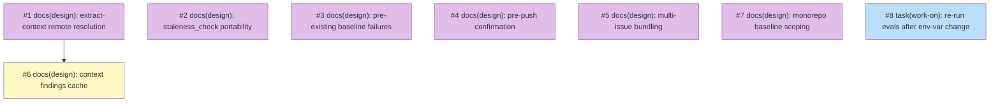

# PLAN: Work-on Friction Fixes

## Status

Draft — pending issue creation. When this PR merges, a follow-up runs the
batch-creation script, substitutes the `<<ISSUE:N>>` placeholders in the
Implementation Issues table for real issue links, and transitions status
to Active.

## Scope Summary

Eight open items from an external agent's `/shirabe:work-on`
friction-log run that remain after the initial skill-hardening PR.
Seven are design questions (#1-7) that each warrant a standalone
DESIGN doc because the right shape of the fix is contested; one is a
verification task (#8) that confirms a recent env-var change doesn't
regress any work-on eval assertion.

The seven ready-to-implement items from the same triage landed
directly in the PR that introduced this PLAN, along with two further
implementation follow-ups surfaced during that first-pass work
(phase-3 agent-instructions agent-neutral rewrite; consolidating the
koto-context ingestion convention into a single reference file). They
are not in the outline list.

## Decomposition Strategy

**Horizontal, mixed issue kinds.** Each item maps 1:1 to a GitHub
issue. Items 1-7 are `docs(design): …` planning issues carrying
`needs-design`; they produce a DESIGN doc and spawn their own
downstream implementation plan via `/plan`. Item 8 is a verification
task (complexity `simple`, no design step). All eight share the
`Work-on Friction Fixes` milestone.

Dependencies are minimal. Only #6 (context findings cache) waits on #1
(remote DESIGN doc resolution): the cache key scheme can't be chosen
without first deciding how the resolver finds documents. Item 8 is
independent and can run any time after this PR merges.

## Issue Outlines

_Empty in multi-pr mode per the PLAN format spec. Per-issue body files
exist at `wip/plan_work-on-friction-fixes_issue_<N>_body.md` for
N ∈ {1..8} during PR review and feed the batch issue-creation script
that runs after merge. Once GitHub issues exist, the body content is
owned by GitHub and those wip/ files are removed; this section stays
empty._

## Implementation Issues

_Table populated after GitHub issues are created. Until then, the
canonical issue content lives in the per-issue body files described
above; the rows below carry the dependency graph and short
descriptions only._

### Milestone: _(pending creation)_

| Issue | Dependencies | Complexity |
|-------|--------------|------------|
| <<ISSUE:1>> | None | simple |
| _Decide how `extract-context.sh` resolves a DESIGN doc living on a remote branch or in a sibling repo. Enables #6's cache design._ | | |
| <<ISSUE:2>> | None | simple |
| _Decide how the `staleness_check` gate should work on a shirabe-only install, given `check-staleness.sh` currently ships only with the private tsukumogami plugin._ | | |
| <<ISSUE:3>> | None | simple |
| _Decide how the setup phase captures and routes baseline failures that predate the current change, so later gates don't misattribute them._ | | |
| <<ISSUE:4>> | None | simple |
| _Decide how phase-6 pauses for user confirmation before `git push` / `gh pr create` while remaining correct in `--auto` mode._ | | |
| <<ISSUE:5>> | None | simple |
| _Decide how `/work-on` supports bundling multiple issues onto one branch and PR as a first-class flow. Highest-impact item; several viable approaches._ | | |
| <<ISSUE:6>> | <<ISSUE:1>> | simple |
| _Decide the cache key scheme for `extract-context.sh` so sibling issues on one branch don't re-investigate the same design-doc dead ends._ | | |
| <<ISSUE:7>> | None | simple |
| _Decide how setup detects monorepo structure and scopes baseline tests to touched packages. Also decides whether scoping belongs in work-on or a future language skill._ | | |
| <<ISSUE:8>> | None | simple |
| _Re-run work-on evals after the `CLAUDE_PLUGIN_ROOT` standardization merges, to catch any assertion that still expects the old env-var string._ | | |

## Dependency Graph

**Legend**: Purple = needs-design, Yellow = blocked on a prerequisite
design, Blue = ready to implement, Green = done.

## Implementation Sequence

Seven of the eight can start in parallel once this PR merges: #1-#5,
#7 on the design track, plus #8 (eval re-run) on the implementation
track. Only #6 waits — on #1 being Accepted, because its cache key
scheme depends on the resolution strategy.

**Priority signal**: #5 (multi-issue bundling) was the highest-impact
single item in the source triage. Starting its DESIGN doc first keeps
the downstream implementation plan unblocked the earliest. #8 (eval
re-run) is cheap to run and worth doing early since it verifies that
no assertion regressed against the env-var change.

**Per-design-doc follow-up**: each of #1-7 spawns its own
implementation plan via `/plan` once the design is Accepted. Item #8
closes directly via `/work-on`. This PLAN closes when all downstream
plans have reached Done and #8 is closed (or an item is explicitly
dropped).
