# PLAN: Work-on Friction Fixes

## Status

Draft — pending issue creation. On merge of this PR, a follow-up commit
populates the Implementation Issues table with real GitHub links and
transitions status to Active.

## Scope Summary

Fourteen triaged improvement opportunities in the `/shirabe:work-on`
skill, surfaced by an external agent's five-issue friction-log run. Seven
items are ready to implement directly; seven need a design doc before
implementation and are filed as planning issues with `needs-design`.

## Decomposition Strategy

**Horizontal.** Each item targets a different phase of one skill
(context-injection, setup, analysis, implementation, finalization,
pr-creation) or a cross-cutting concern (env vars, tmp paths, AC
scripts). There is no end-to-end flow to skeleton first; each item ships
independently.

Dependency ordering is minimal: Issue 1 (env-var standardization) lands
first so Issue 9's design can reference the standardized path;
Issue 8's design informs Issue 13's cache-key scheme.

## Issue Outlines

### Issue 1: chore(work-on): standardize on CLAUDE_PLUGIN_ROOT env var

**Goal**: Replace all `${CLAUDE_SKILL_DIR}` references in
`skills/work-on/SKILL.md` and
`skills/work-on/references/phases/phase-0-context-injection.md` with
`${CLAUDE_PLUGIN_ROOT}/skills/work-on` so the skill loads consistently
under Claude Code's plugin convention.

**Acceptance Criteria**:
- [ ] No occurrences of `CLAUDE_SKILL_DIR` remain under `skills/work-on/`
- [ ] All remaining env-var references use `CLAUDE_PLUGIN_ROOT`
- [ ] Existing work-on evals pass

**Dependencies**: None

**Type**: docs
**Files**: `skills/work-on/SKILL.md`, `skills/work-on/references/phases/phase-0-context-injection.md`

### Issue 2: chore(work-on): add `validation:simple` to phase-5 auto-skip list

**Goal**: Extend the default skip list in
`skills/work-on/references/phases/phase-5-finalization.md` so
`validation:simple`-labeled issues don't generate a redundant summary
artifact.

**Acceptance Criteria**:
- [ ] `phase-5-finalization.md` Auto-Skip section lists
  `validation:simple` alongside `docs`, `config`, `chore`
- [ ] Existing work-on evals pass

**Dependencies**: None

**Type**: docs
**Files**: `skills/work-on/references/phases/phase-5-finalization.md`

### Issue 3: docs(work-on): note that AC validation scripts are advisory

**Goal**: Add a short paragraph to
`skills/work-on/references/phases/phase-4-implementation.md` explicitly
stating that shell validation scripts supplied in issue bodies are
advisory — agents verify AC intent, not literal script pass.

**Acceptance Criteria**:
- [ ] Phase-4 reference file contains the advisory note
- [ ] Existing work-on evals pass

**Dependencies**: None

**Type**: docs
**Files**: `skills/work-on/references/phases/phase-4-implementation.md`

### Issue 4: feat(work-on): make subagent delegation opt-out for simplified-plan issues

**Goal**: Modify `skills/work-on/references/phases/phase-3-analysis.md`
so simplified-plan issues (labels `docs`, `config`, `chore`,
`validation:simple`) write the plan inline rather than forcing subagent
delegation. Full-plan issues continue to delegate.

**Acceptance Criteria**:
- [ ] phase-3-analysis.md describes an "inline for simplified-plan"
  branch alongside the existing subagent delegation path
- [ ] An eval scenario exercises the inline branch for a `chore`-labeled
  issue and verifies no subagent spawn happens
- [ ] Existing work-on evals pass

**Dependencies**: None

**Type**: code
**Files**: `skills/work-on/references/phases/phase-3-analysis.md`, `skills/work-on/evals/evals.json`

### Issue 5: feat(work-on): prescribe per-session tmp paths

**Goal**: Update `phase-1-setup.md` and `phase-3-analysis.md` (agent
instructions) to write local artifacts under `/tmp/koto-<WF>/` rather
than bare `/tmp/`. Eliminates collisions across concurrent workflows.

**Acceptance Criteria**:
- [ ] Both phase files prescribe `/tmp/koto-<WF>/baseline.md`,
  `/tmp/koto-<WF>/plan.md`, `/tmp/koto-<WF>/summary.md`
- [ ] phase-5-finalization.md uses the same convention for summary artifacts
- [ ] An eval scenario verifies the directive text mentions the
  per-session tmp path

**Dependencies**: None

**Type**: docs
**Files**: `skills/work-on/references/phases/phase-1-setup.md`, `skills/work-on/references/phases/phase-3-analysis.md`, `skills/work-on/references/agent-instructions/phase-3-analysis.md`, `skills/work-on/references/phases/phase-5-finalization.md`

### Issue 6: feat(work-on): accept scope_expanded_retry transition from implementation to analysis

**Goal**: Add an `implementation_status: scope_expanded_retry` enum
value in `skills/work-on/koto-templates/work-on.md` with a transition
back to `analysis`. Lets agents re-plan without `koto rewind` when scope
expands mid-implementation.

**Acceptance Criteria**:
- [ ] `implementation.accepts.implementation_status.values` includes
  `scope_expanded_retry`
- [ ] A transition `implementation_status: scope_expanded_retry →
  analysis` exists
- [ ] `koto template export` regenerates `work-on.mermaid.md`
- [ ] An eval scenario exercises the new transition
- [ ] Existing work-on evals pass

**Dependencies**: None

**Type**: code
**Files**: `skills/work-on/koto-templates/work-on.md`, `skills/work-on/koto-templates/work-on.mermaid.md`, `skills/work-on/evals/evals.json`

### Issue 7: feat(work-on): add mid-implementation AC re-confirmation step

**Goal**: Add an explicit "re-read acceptance criteria against current
implementation" step to
`skills/work-on/references/phases/phase-4-implementation.md`, positioned
between Implementation Cycle and Implementation Review. Empirically
prevents AC drift in medium-to-complex implementations.

**Acceptance Criteria**:
- [ ] phase-4-implementation.md contains the re-read step with concrete
  guidance (what to re-read, what to look for)
- [ ] Existing work-on evals pass

**Dependencies**: None

**Type**: docs
**Files**: `skills/work-on/references/phases/phase-4-implementation.md`

### Issue 8: docs(design): extract-context DESIGN doc resolution across branches and repos

**Goal**: Produce a DESIGN doc deciding how `extract-context.sh` should
resolve a DESIGN doc that lives on a remote branch or in a sibling repo.
Options to evaluate: scan `origin/*` refs, use a workspace manifest
(niwa), require explicit `Design:` path + repo annotation on issues, or
leave as-is.

**Acceptance Criteria**:
- [ ] `docs/designs/DESIGN-extract-context-remote-resolution.md` exists
  at status Accepted with alternatives section
- [ ] Decision is concrete enough to spawn implementation issues via
  `/plan`

**Dependencies**: None

**Type**: docs

### Issue 9: docs(design): staleness_check gate portability in shirabe

**Goal**: Produce a DESIGN doc deciding how the `staleness_check` gate
(which currently calls `check-staleness.sh`, a script that does not ship
with shirabe) should work on a shirabe-only install. Options: port the
script, make the gate conditional on script availability, move staleness
into koto, or drop the gate.

**Acceptance Criteria**:
- [ ] `docs/designs/DESIGN-staleness-check-portability.md` exists at
  status Accepted with alternatives section
- [ ] Design references the standardized env-var path (see #1)
- [ ] Decision is concrete enough to spawn implementation issues

**Dependencies**: Blocked by <<ISSUE:1>>

**Type**: docs

### Issue 10: docs(design): pre-existing baseline failure envelope

**Goal**: Produce a DESIGN doc deciding how the setup phase captures and
routes baseline failures that exist before the current change. Options:
new evidence value `baseline_status: broken_preexisting`, a dedicated
gate, or a documented human-in-the-loop escape.

**Acceptance Criteria**:
- [ ] `docs/designs/DESIGN-preexisting-baseline-failures.md` exists at
  status Accepted with alternatives section
- [ ] Decision names what baseline.md captures, how subsequent gates
  avoid misattributing the failure, and how `--auto` mode behaves

**Dependencies**: None

**Type**: docs

### Issue 11: docs(design): pre-push confirmation gate with --auto mode

**Goal**: Produce a DESIGN doc deciding how `phase-6` and the
`pr_creation` state should pause for user confirmation before `git push`
and `gh pr create`, while still behaving correctly in `--auto` mode
(decision protocol or silent proceed).

**Acceptance Criteria**:
- [ ] `docs/designs/DESIGN-pre-push-confirmation.md` exists at status
  Accepted with alternatives section
- [ ] Design addresses interactive vs --auto behaviour explicitly
- [ ] Decision is concrete enough to spawn implementation issues

**Dependencies**: None

**Type**: docs

### Issue 12: docs(design): multi-issue bundling as a first-class /work-on flow

**Goal**: Produce a DESIGN doc deciding how `/work-on` should handle the
"bundle another issue onto an existing branch and PR" flow. Options: a
new invocation (`/work-on --bundle #N`), a dedicated state, a helper
script, or a PR-body template. Highest-impact friction-log item;
explicit design warranted.

**Acceptance Criteria**:
- [ ] `docs/designs/DESIGN-multi-issue-bundling.md` exists at status
  Accepted with alternatives section
- [ ] Design covers: invocation, branch reuse, PR-body convention,
  summary artifact semantics, koto state machine implications
- [ ] Decision is concrete enough to spawn implementation issues

**Dependencies**: None

**Type**: docs

### Issue 13: docs(design): per-branch context findings cache

**Goal**: Produce a DESIGN doc deciding the cache key scheme and storage
location for `extract-context.sh` findings so sibling issues on the same
branch skip redundant remote-branch lookups. Options: koto context key,
tmp file, or git-branch-scoped state.

**Acceptance Criteria**:
- [ ] `docs/designs/DESIGN-extract-context-cache.md` exists at status
  Accepted with alternatives section
- [ ] Design builds on the resolution strategy from #8
- [ ] Cache invalidation policy is spelled out

**Dependencies**: Blocked by <<ISSUE:8>>

**Type**: docs

### Issue 14: docs(design): monorepo-aware baseline scoping

**Goal**: Produce a DESIGN doc deciding how the setup phase detects
monorepo structure and scopes baseline tests to touched packages.
Includes deciding whether scoping lives in work-on itself or in a future
language skill.

**Acceptance Criteria**:
- [ ] `docs/designs/DESIGN-monorepo-baseline-scoping.md` exists at
  status Accepted with alternatives section
- [ ] Design names the detection signals (workspaces, turbo config, go
  modules, Cargo workspaces) and the ownership question
- [ ] Decision is concrete enough to spawn implementation issues

**Dependencies**: None

**Type**: docs

## Implementation Issues

_Table populated after GitHub issues are created. Until then, see Issue
Outlines above for the canonical list._

### Milestone: _(pending creation)_

| Issue | Dependencies | Complexity |
|-------|--------------|------------|
| <<ISSUE:1>> | None | simple |
| _Replace `${CLAUDE_SKILL_DIR}` with `${CLAUDE_PLUGIN_ROOT}/skills/work-on` so the skill loads under Claude Code's plugin convention._ | | |
| <<ISSUE:2>> | None | simple |
| _Add `validation:simple` to the phase-5 Auto-Skip default so that class of labels stops generating redundant summary artifacts._ | | |
| <<ISSUE:3>> | None | simple |
| _Document that author-supplied AC validation scripts are advisory — agents verify AC intent, not literal script pass._ | | |
| <<ISSUE:4>> | None | testable |
| _Allow simplified-plan issues (chore, docs, config, validation:simple) to write the plan inline without spawning a subagent._ | | |
| <<ISSUE:5>> | None | testable |
| _Prescribe `/tmp/koto-<WF>/` per-session paths for baseline/plan/summary artifacts so concurrent workflows don't overwrite each other._ | | |
| <<ISSUE:6>> | None | testable |
| _Add a `scope_expanded_retry` transition from `implementation` back to `analysis` so agents can re-plan without `koto rewind` when scope grows._ | | |
| <<ISSUE:7>> | None | testable |
| _Add an explicit mid-implementation AC re-confirmation step before Implementation Review; catches AC drift that self-review at the end misses._ | | |
| <<ISSUE:8>> | None | simple |
| _Decide how `extract-context.sh` resolves a DESIGN doc living on a remote branch or in a sibling repo. Enables #13's cache design._ | | |
| <<ISSUE:9>> | <<ISSUE:1>> | simple |
| _Decide how the `staleness_check` gate should work on a shirabe-only install, given `check-staleness.sh` currently ships only with the private tsukumogami plugin._ | | |
| <<ISSUE:10>> | None | simple |
| _Decide how the setup phase captures and routes baseline failures that predate the current change, so later gates don't misattribute them._ | | |
| <<ISSUE:11>> | None | simple |
| _Decide how phase-6 pauses for user confirmation before `git push` / `gh pr create` while remaining correct in `--auto` mode._ | | |
| <<ISSUE:12>> | None | simple |
| _Decide how `/work-on` supports bundling multiple issues onto one branch and PR as a first-class flow. Highest-impact item; several viable approaches._ | | |
| <<ISSUE:13>> | <<ISSUE:8>> | simple |
| _Decide the cache key scheme for `extract-context.sh` so sibling issues on one branch don't re-investigate the same design-doc dead ends._ | | |
| <<ISSUE:14>> | None | simple |
| _Decide how setup detects monorepo structure and scopes baseline tests to touched packages. Also decides whether scoping belongs in work-on or a future language skill._ | | |

## Dependency Graph

```mermaid
graph TD
  I1["#1 chore(work-on): CLAUDE_PLUGIN_ROOT env var"]
  I2["#2 chore(work-on): validation:simple skip list"]
  I3["#3 docs(work-on): AC scripts advisory"]
  I4["#4 feat(work-on): opt-out subagent delegation"]
  I5["#5 feat(work-on): per-session tmp paths"]
  I6["#6 feat(work-on): scope_expanded_retry"]
  I7["#7 feat(work-on): mid-impl AC re-confirmation"]
  I8["#8 docs(design): extract-context remote resolution"]
  I9["#9 docs(design): staleness_check portability"]
  I10["#10 docs(design): pre-existing baseline failures"]
  I11["#11 docs(design): pre-push confirmation"]
  I12["#12 docs(design): multi-issue bundling"]
  I13["#13 docs(design): context findings cache"]
  I14["#14 docs(design): monorepo baseline scoping"]

  I1 --> I9
  I8 --> I13

  classDef done fill:#86efac,stroke:#16a34a,color:#000
  classDef ready fill:#93c5fd,stroke:#2563eb,color:#000
  classDef blocked fill:#fde047,stroke:#ca8a04,color:#000
  classDef needsDesign fill:#d8b4fe,stroke:#7c3aed,color:#000
  classDef needsPrd fill:#fdba74,stroke:#ea580c,color:#000
  classDef needsSpike fill:#f9a8d4,stroke:#db2777,color:#000
  classDef needsDecision fill:#a5f3fc,stroke:#0891b2,color:#000
  classDef tracksDesign fill:#e9d5ff,stroke:#7c3aed,color:#000
  classDef tracksPlan fill:#bfdbfe,stroke:#3b82f6,color:#000

  class I1,I2,I3,I4,I5,I6,I7 ready
  class I8,I10,I11,I12,I14 needsDesign
  class I9,I13 blocked
```

**Legend**: Blue = ready, Yellow = blocked, Purple = needs-design,
Green = done.

## Implementation Sequence

**Wave 1 (parallel, no blockers):**
- All seven ready items: #1, #2, #3, #4, #5, #6, #7
- Five design items that have no internal dependencies: #8, #10, #11,
  #12, #14

**Wave 2 (unblocked by Wave 1):**
- #9 (needs #1 merged so its design can reference the standardized
  env-var path)
- #13 (needs #8 accepted so its cache key scheme builds on the
  resolution strategy)

**Critical path**: #12 (multi-issue bundling) is the highest-impact
single item. Prioritise accepting its design early so implementation
issues can be planned sooner; the seven Wave-1 ready items can merge in
parallel while that design work proceeds.

**Per-design-doc follow-up**: each of #8–#14 spawns its own
implementation plan via `/plan` once the design is Accepted. This PLAN
closes when those seven downstream plans have each reached Done (or the
design is explicitly dropped).
