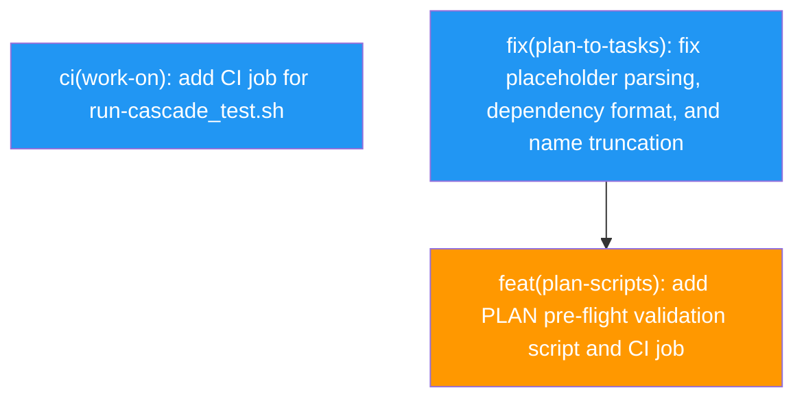

# PLAN: Work-on Hardening

## Status

Draft

## Scope Summary

Close the robustness gaps in the work-on skill identified during validation: a missing CI job for the cascade test harness, three parsing bugs in plan-to-tasks.sh that cause silent dependency loss, and the absence of a pre-flight PLAN document validator.

## Decomposition Strategy

Horizontal decomposition. Each issue addresses one self-contained gap. Issue 2 (plan-to-tasks.sh parsing) is a prerequisite for Issue 3 (pre-flight validator) because the validator's format contract depends on the post-fix parsing behaviour. Issue 1 (CI for cascade tests) is fully independent.

## Issue Outlines

### Issue 1: ci(work-on): add CI job for run-cascade_test.sh

**Goal**

Create a GitHub Actions workflow that runs `run-cascade_test.sh` on every PR touching `skills/work-on/scripts/**`, so cascade regressions are caught in CI rather than discovered manually.

**Acceptance Criteria**

- [ ] `.github/workflows/check-work-on-scripts.yml` exists and triggers on `skills/work-on/scripts/**` path changes
- [ ] The job installs `jq` and `git` (or verifies they are available) and runs `bash skills/work-on/scripts/run-cascade_test.sh`
- [ ] A PR that introduces a failing scenario in `run-cascade_test.sh` causes the job to fail
- [ ] CI green on this branch with the new workflow present

**Dependencies**: None

---

### Issue 2: fix(plan-to-tasks): fix placeholder parsing, dependency format, and name truncation

**Goal**

Fix three silent failure modes in `plan-to-tasks.sh`: unrecognised `<<ISSUE:N>>` placeholders silently drop dependency edges, section-header dependency format (`### Dependencies`) is ignored rather than parsed, and long issue titles exceed koto's name length limit with no useful error message.

**Acceptance Criteria**

- [ ] `<<ISSUE:N>>` in a **Dependencies** field is resolved to the corresponding task name in `waits_on`; a PLAN produced by `/plan` in single-pr mode spawns children in correct dependency order
- [ ] A `### Dependencies` section header (listing `Issue N` entries) is parsed equivalently to the inline `**Dependencies**: Issue N` format
- [ ] Task names derived from long issue titles are truncated to koto's maximum name length (determined empirically or from koto source); the script emits a warning when truncation occurs
- [ ] `plan-to-tasks_test.sh` includes cases for `<<ISSUE:N>>` placeholders, section-header dependency format, and a title that would exceed the length limit
- [ ] All existing tests still pass
- [ ] CI green (`check-plan-scripts.yml` passes)

**Dependencies**: None

---

### Issue 3: feat(plan-scripts): add PLAN pre-flight validation script and CI job

**Goal**

Write `validate-plan.sh` that checks a PLAN doc's frontmatter and upstream chain before plan-to-tasks.sh or the cascade consume it, and add a CI job that runs it automatically on PRs that touch PLAN docs.

**Acceptance Criteria**

- [ ] `skills/plan/scripts/validate-plan.sh <path>` exits 0 for a valid PLAN doc and exits non-zero with a specific error message for each of:
  - Missing or wrong `schema` field (not `plan/v1`)
  - Missing `execution_mode` field
  - Missing `issue_count` field
  - `upstream` field present but referencing a file that does not exist or is not tracked by git
  - `upstream` file present but with a status that is not valid for cascade input (`Planned`, `Current`, `Done` are all wrong; expected `Accepted` for DESIGNs/PRDs)
- [ ] `.github/workflows/check-plan-docs.yml` triggers on `docs/plans/PLAN-*.md` changes and runs `validate-plan.sh` on every changed PLAN file
- [ ] A PLAN doc with a broken upstream reference fails CI with a clear, actionable error
- [ ] A valid PLAN doc passes CI
- [ ] The script exits 0 when no `upstream` field is present (upstream is optional)

**Dependencies**: <<ISSUE:2>>

## Dependency Graph

Legend: Blue = ready to start, Orange = blocked

## Implementation Sequence

**Critical path**: Issue 2 → Issue 3

**Parallelization**: Issue 1 is fully independent and can land before, during, or after Issues 2–3.

**Recommended order**:
1. Start Issue 1 (no dependencies, quick win, immediately reduces CI risk)
2. Start Issue 2 (parser fixes; the format contract Issue 3 depends on)
3. Start Issue 3 after Issue 2 merges
