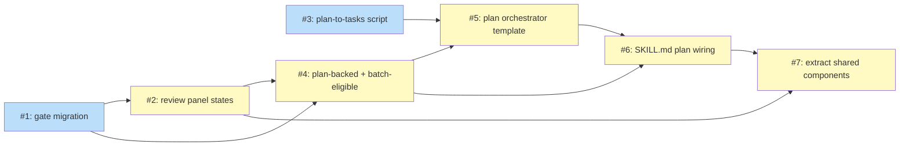

# PLAN: work-on-koto-unification

## Status

Draft

## Scope Summary

Unify /work-on and the private /implement workflow into a single koto-backed
skill. Migrate all gates to v0.6.0 strict output, add review panel states,
introduce a plan orchestrator template that drives multi-issue execution via
koto v0.8.0's batch child spawning, and add a /plan-owned parser script that
transforms PLAN.md into koto's tasks evidence.

## Decomposition Strategy

**Horizontal.** The design's Implementation Approach structures the work as
seven phases with clean sequencing and stable interfaces between them. Each
phase maps to one atomic issue. Phases 1 and 2 are explicitly independently
shippable per the design; Phase 4b is a prerequisite for Phase 4; Phase 5
integrates 4 and 4b; Phase 6 extracts shared pieces after panel states and
plan orchestration land.

Walking skeleton would force a premature end-to-end stub of plan-backed
execution that in single-pr mode ships as one commit anyway, so there's no
early-integration benefit to pay the skeleton's coordination cost for. The
phases already compose left-to-right without skeleton scaffolding.

## Issue Outlines

### Issue 1: feat(work-on): migrate gates to koto v0.6.0 strict mode

**Complexity**: testable

**Goal**: Migrate the 8 gates in `skills/work-on/koto-templates/work-on.md`
from legacy boolean blocking to koto v0.6.0's structured gate output, and
compile the template in strict mode (no `--allow-legacy-gates`).

**Acceptance Criteria**:
- [ ] All 4 context-exists gates (`context_artifact`, `baseline_exists`,
      `introspection_artifact`, `plan_artifact`) use
      `gates.NAME.exists: true` in their consuming transitions' when clauses
- [ ] Both simple command gates (`on_feature_branch`, `staleness_fresh`)
      use `gates.NAME.exit_code: 0` in consuming transitions
- [ ] `code_committed` is replaced by three atomic gates on the
      implementation state: `on_feature_branch_impl`, `has_commits`,
      `tests_passing`, each with `gates.NAME.exit_code: 0` routing
- [ ] `ci_passing` remains compound; transitions use
      `gates.ci_passing.exit_code: 0`
- [ ] Mixed routing on all gated states: when clauses combine `gates.*`
      conditions with existing agent evidence fields
- [ ] `koto template compile` succeeds in strict mode
- [ ] Negative-path verification: at least one eval scenario exercises
      a gate-failure path -- e.g., an implementation state with
      `has_commits` returning non-zero exit must not transition to
      `scrutiny` and must route to the expected retry/blocked state
- [ ] Existing evals (`skills/work-on/evals/evals.json`) still pass
- [ ] CI green

**Dependencies**: None.

---

### Issue 2: feat(work-on): add review panel states

**Complexity**: testable

**Goal**: Add three review panel states (`scrutiny`, `review`,
`qa_validation`) to `skills/work-on/koto-templates/work-on.md` between
`implementation` and `finalization`, using the gate-plus-evidence
pattern. Panel orchestration instructions land in SKILL.md phase
references.

**Acceptance Criteria**:
- [ ] New states `scrutiny`, `review`, `qa_validation` added between
      `implementation` and `finalization`, each with a `context-exists`
      gate keyed to its result artifact (`scrutiny_results.json`,
      `review_results.json`, `qa_results.json`)
- [ ] Each state's `accepts` declares an evidence enum
      (`passed | blocking_retry | blocking_escalate`); transitions
      route to the next review state on `passed`, back to
      `implementation` on `blocking_retry`, and to `done_blocked` on
      `blocking_escalate`
- [ ] `blocking_escalate` paths write `failure_reason` to context via
      `context_assignments` (W5 pre-compliance)
- [ ] Panel orchestration instructions authored in SKILL.md phase
      references
- [ ] Override defaults declared for the review gates so formal
      skipping is auditable via `koto overrides list`
- [ ] Strict-mode `koto template compile` passes
- [ ] Existing evals still pass; new evals cover the three review states
- [ ] CI green

**Dependencies**: Blocked by Issue 1.

---

### Issue 3: feat(plan): add plan-to-tasks parser script

**Complexity**: testable

**Goal**: Author `skills/plan/scripts/plan-to-tasks.sh` (bash + jq) that
reads a PLAN.md path and emits koto task-entry JSON on stdout. Pin the
cross-skill contract in /plan's SKILL.md reference table and write a
contract reference document.

**Acceptance Criteria**:
- [ ] `skills/plan/scripts/plan-to-tasks.sh` exists, is executable, and
      accepts a PLAN.md path as its first argument
- [ ] On valid input, emits a JSON array on stdout matching koto's
      task-entry schema: `[{name, vars, waits_on}]` with `template`
      omitted
- [ ] Handles multi-pr mode (reads Implementation Issues table; sets
      `ISSUE_SOURCE=github`, `ISSUE_NUMBER=<N>`)
- [ ] Handles single-pr mode (reads Issue Outlines; sets
      `ISSUE_SOURCE=plan_outline`, name `outline-<slug>` with collision
      suffixes)
- [ ] All emitted task names satisfy koto's R9 regex; the script fails
      with exit code 2 on inputs it cannot sanitize
- [ ] Exit codes: 0 success, 1 malformed input, 2 PLAN schema mismatch
- [ ] `skills/plan/scripts/plan-to-tasks_test.sh` exercises three
      starter fixtures (one multi-pr, one single-pr, one diamond
      dependency graph)
- [ ] `skills/plan/SKILL.md` reference table lists `plan-to-tasks.sh`
      as a stable sub-operation with full path via
      `${CLAUDE_PLUGIN_ROOT}`
- [ ] `skills/plan/references/plan-to-tasks-contract.md` documents the
      CLI signature, JSON output schema, and name-sanitization rules
- [ ] CI green

**Dependencies**: None.

---

### Issue 4: feat(work-on): add plan-backed mode and batch-eligibility to per-issue template

**Complexity**: testable

**Goal**: Extend `skills/work-on/koto-templates/work-on.md` with
`plan_backed` mode routing and apply the three koto v0.8.0
batch-eligibility additions (`failure: true` on `done_blocked`, new
`skipped_marker: true` terminal, `failure_reason` context writes).
Template must compile in strict mode with no F5 or W5 warnings.

**Acceptance Criteria**:
- [ ] Entry state's `mode` enum accepts `[issue_backed, free_form,
      plan_backed]`; transitions route each mode to its pre-analysis state
- [ ] New states: `plan_context_injection` (branches on `ISSUE_SOURCE`),
      `plan_validation`, `setup_plan_backed`, converging at `analysis`
- [ ] `ISSUE_SOURCE` accepted as an enum `[github, plan_outline]` at
      entry submission for plan-backed mode
- [ ] `done_blocked` terminal declares `failure: true`
- [ ] New terminal `skipped_due_to_dep_failure` with
      `skipped_marker: true`, reachable from the initial state via a
      scheduler-writable transition (koto F5 compliance)
- [ ] Every state that can transition to `done_blocked` writes
      `failure_reason` to context via `context_assignments`
- [ ] Strict-mode `koto template compile` passes with no F5 or W5
      warnings
- [ ] CI assertion: `done_blocked.failure == true` in the compiled
      template
- [ ] Evals extend to cover plan-backed mode on an issue-backed and an
      outline-only item
- [ ] CI green

**Dependencies**: Blocked by Issue 1, Issue 2.

---

### Issue 5: feat(work-on): add plan orchestrator template

**Complexity**: testable

**Goal**: Author `skills/work-on/koto-templates/work-on-plan.md` -- a
4-state koto template that spawns and coordinates batch children via
koto v0.8.0's `materialize_children` hook over a `tasks`-typed evidence
field. Template compiles in strict mode and honors E10, W4, and related
invariants.

**Acceptance Criteria**:
- [ ] `skills/work-on/koto-templates/work-on-plan.md` exists with 4
      states: `spawn_and_await` (initial), `pr_coordination`,
      `escalate`, `done` / `done_blocked`
- [ ] `spawn_and_await` declares `accepts: tasks` (required),
      `materialize_children` with `from_field: tasks`,
      `failure_policy: skip_dependents`,
      `default_template: work-on.md`, and a `children-complete` gate
      named `batch_done` -- all co-located per E10
- [ ] Transitions on `gates.batch_done.all_success: true` (to
      `pr_coordination`) and `gates.batch_done.needs_attention: true`
      (to `escalate`) pass W4 at compile time
- [ ] `spawn_and_await` directive references
      `${CLAUDE_PLUGIN_ROOT}/skills/plan/scripts/plan-to-tasks.sh`
      with the pipe-to-koto invocation and the `mktemp` fallback
- [ ] `escalate` directive: agent inspects `batch_final_view`, writes
      `failure_reason` summary, transitions to `done_blocked`. No
      `retry_failed` path in v1.
- [ ] `pr_coordination` directive assembles PR description from
      `batch_final_view`'s per-child fields (name, outcome, reason,
      reason_source, skipped_because_chain)
- [ ] Strict-mode `koto template compile` passes
- [ ] Template-level evals: at least one fixture exercising a diamond
      batch (4 tasks with a diamond dep graph) reaching `all_success`
- [ ] CI green

**Dependencies**: Blocked by Issue 3, Issue 4.

---

### Issue 6: feat(work-on): wire plan orchestration in SKILL.md

**Complexity**: testable

**Goal**: Wire plan-mode orchestration into `skills/work-on/SKILL.md`:
mode detection from input, parent workflow init, script-to-koto pipe at
first tick, cross-issue context assembly, escalate handling, and PR
description rendering from `batch_final_view`.

**Acceptance Criteria**:
- [ ] SKILL.md gains a "Plan mode" section
- [ ] Mode detection: PLAN.md path -> plan mode; issue reference ->
      issue-backed; task description -> free-form
- [ ] Plan-mode init: `koto init <plan-WF> --template
      ${CLAUDE_PLUGIN_ROOT}/skills/work-on/koto-templates/work-on-plan.md
      --var PLAN_DOC=<path>`
- [ ] First-tick handling: invoke `plan-to-tasks.sh` and pipe to koto
      via `--with-data @-` (with `mktemp` sandwich fallback)
- [ ] Cross-issue context assembly: before each child dispatch,
      SKILL.md reads summaries from all completed children via
      `koto context get` and writes combined `current-context.md` to
      the dispatched child's context
- [ ] Escalate-state handling in SKILL.md prose: agent inspects
      `batch_final_view`, writes `failure_reason`, transitions to
      `done_blocked`
- [ ] PR description rendering: `pr_coordination` directive consumes
      the listed `batch_final_view` fields
- [ ] `skills/work-on/evals/evals.json` extended with plan-mode
      scenarios covering at least one multi-issue plan and one
      escalate-path recovery
- [ ] Existing issue-backed and free-form modes remain functionally
      unchanged
- [ ] CI green

**Dependencies**: Blocked by Issue 4, Issue 5.

---

### Issue 7: refactor(work-on): extract shared components

**Complexity**: simple

**Goal**: Move review panel orchestration instructions, cross-issue
context assembly helpers, and common phase references out of SKILL.md
and per-mode prose into shared files under `skills/work-on/references/`.
Pure extraction; no behavior change.

**Acceptance Criteria**:
- [ ] Review panel orchestration instructions extracted to a shared
      reference file
- [ ] Cross-issue context assembly helpers extracted to a shared
      reference file
- [ ] Common phase reference prose used identically across two or more
      modes extracted to shared files
- [ ] SKILL.md and per-mode sections reference the shared files rather
      than carrying duplicated prose
- [ ] No behavior change: existing evals still pass without
      modification
- [ ] CI green

**Dependencies**: Blocked by Issue 2, Issue 6.

## Dependency Graph



**Legend**: Blue = ready, Yellow = blocked.

## Implementation Sequence

**Critical path (6 steps):**
```
Issue 1 -> Issue 2 -> Issue 4 -> Issue 5 -> Issue 6 -> Issue 7
```

**Initial parallel roots**: Issues 1 and 3 have no dependencies and can be
authored simultaneously at the start of implementation. Issue 3 must land
before Issue 5 begins; Issues 1 and 2 must land before Issue 4 begins.

**Recommended order:**

1. **Issue 1** (gate migration) -- smallest, most mechanical refactor.
   De-risks strict-mode compile against the existing template before any
   new states are added. Independently shippable per the design.
2. **Issue 2** (review panel states) -- builds on the migrated template.
   Independently shippable (useful in single-issue and free-form modes
   even before plan mode lands).
3. **Issue 3** (parser script) -- can be authored in parallel with Issues
   1-2 since it touches /plan rather than /work-on.
4. **Issue 4** (plan-backed + batch-eligibility) -- extends the
   now-paneled per-issue template with the third entry mode and the
   three koto v0.8.0 compile-time requirements.
5. **Issue 5** (plan orchestrator template) -- requires both the parser
   script (Issue 3) and the batch-eligible child template (Issue 4).
6. **Issue 6** (SKILL.md plan wiring) -- integrates the orchestrator
   template and the now-complete per-issue template into the skill's
   prose.
7. **Issue 7** (shared component extraction) -- runs last, after panel
   states (2) and plan orchestration (6) have landed, so the extracted
   shapes reflect actual cross-mode usage.

In single-pr mode, all seven issues ship together on one branch with one
PR. The sequencing above minimizes per-commit compile risk: each step
leaves the template compilable in strict mode.
