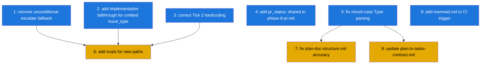

# PLAN: Work-on Panel Fixes

## Status

Draft

## Scope Summary

Fix nine correctness bugs, spec inaccuracies, and eval gaps surfaced by a 10-agent
panel review of the `docs/work-on-koto-unification` branch. All changes are confined
to the shirabe repo on the existing branch, targeting PR #67.

## Decomposition Strategy

**Horizontal decomposition.** Each issue addresses one independent component (a koto
template state, a script regex, a reference doc, a CI trigger). No new end-to-end
pipeline needs integration, so a walking skeleton would add ceremony with no benefit.
Issues 1-5 and 9 are fully parallel; Issues 6-8 follow their direct prerequisites.

## Issue Outlines

### Issue 1: fix(work-on-plan): remove unconditional escalate fallback from spawn_and_await

**Goal**: Remove the bare `- target: escalate` default transition that fires before
any children are spawned, causing every orchestrator run to terminate in done_blocked.

**Acceptance Criteria**:
- `spawn_and_await` in `work-on-plan.md` has no unconditional `- target: escalate`
  transition (bare transition with no `when:` guard)
- The two guarded transitions remain: `batch_outcome: all_success → pr_finalization`
  and `batch_outcome: needs_attention → escalate`
- Template consistency CI passes (`validate-templates` and `check-template-consistency`
  workflows green)
- Orchestrator initialized and driven through Tick 1 does not auto-advance to
  done_blocked before Tick 2 is submitted

**Dependencies**: None

---

### Issue 2: fix(work-on): add fallthrough transition for omitted issue_type at implementation

**Goal**: Add a bare `implementation_status: complete → scrutiny` transition so a
workflow doesn't silently stall when an agent submits complete without specifying
issue_type.

**Acceptance Criteria**:
- `implementation` state in `work-on.md` has a fourth transition: bare
  `implementation_status: complete` (no `issue_type` guard) routing to `scrutiny`
- The three existing explicit transitions (issue_type: docs → finalization,
  issue_type: task → finalization, issue_type: code → scrutiny) remain and fire
  correctly when issue_type is present
- koto mutual exclusivity check passes (the bare fallthrough must not conflict with
  the explicit code → scrutiny transition; explicit takes precedence)
- Mermaid diagram updated to show the fallthrough edge
- Template consistency CI passes

**Dependencies**: None

---

### Issue 3: fix(work-on-plan): correct Tick 2 hardcoded batch_outcome and literal workflow name

**Goal**: Replace the hardcoded `batch_outcome: all_success` in the Tick 2 example
with conditional logic, and replace the remaining literal `koto status work-on-plan`
call with `{{SESSION_NAME}}`.

**Acceptance Criteria**:
- Tick 2 directive/example shows conditional batch_outcome: `all_success` when all
  children succeeded, `needs_attention` when any child reached a failure terminal
- No literal string `work-on-plan` appears in any koto command within the template
  (grep confirms zero matches for `koto.*work-on-plan`)
- Template consistency CI passes

**Dependencies**: None

---

### Issue 4: docs(work-on): add pr_status: shared to phase-6-pr.md reference

**Goal**: Document pr_status: shared in the PR phase reference file so plan-backed
children have a clear evidence option without reading the koto template directive.

**Acceptance Criteria**:
- `phase-6-pr.md` evidence section lists `pr_status: shared` as a valid value
- Description explains: use `shared` when running as a plan-backed child (SHARED_BRANCH
  is set), routes directly to done without creating or monitoring a PR
- Description explains the failure mode of using `created` instead (enters ci_monitor
  and monitors the orchestrator's PR)
- No existing content removed or reordered

**Dependencies**: None

---

### Issue 5: fix(plan-to-tasks): correct mixed-case Type annotation parsing

**Goal**: Fix the Type annotation regex to capture mixed-case values and normalize to
lowercase, preventing silent type misclassification when authors write `Code` or `Docs`.

**Acceptance Criteria**:
- `**Type**: Code` produces `ISSUE_TYPE=code` in the emitted task vars
- `**Type**: Docs` produces `ISSUE_TYPE=docs`
- `**Type**: Task` produces `ISSUE_TYPE=task`
- `**Type**: code` (existing lowercase) still works
- Test suite extended with at least one mixed-case input per valid type value
- No change to behavior when `**Type**:` annotation is absent (ISSUE_TYPE still omitted)

**Dependencies**: None

---

### Issue 6: test(work-on): add evals for done_already_complete, issue_type routing, and pr_status: shared

**Goal**: Add eval scenarios for the three new template paths introduced on this branch
that currently have zero coverage.

**Acceptance Criteria**:
- Eval scenario: agent submits `plan_outcome: already_complete` from `analysis`, reaches
  `done_already_complete` terminal state (non-failure); assertion confirms state is
  terminal and `failure: false`
- Eval scenarios: agent submits `implementation_status: complete` with `issue_type: docs`
  (and separately `issue_type: task`) from `implementation`; workflow reaches
  `finalization` without visiting `scrutiny`, `review`, or `qa_validation`
- Eval scenario: agent submits `pr_status: shared` from `pr_creation`; workflow reaches
  `done` without visiting `ci_monitor`
- All new scenarios follow existing fixture structure in `evals/fixtures/scenarios/`
- All existing eval scenarios still pass (`scripts/run-evals.sh work-on` exits 0)

**Dependencies**: <<ISSUE:1>>, <<ISSUE:2>>, <<ISSUE:3>>

---

### Issue 7: docs(plan): fix plan-doc-structure.md accuracy for Type and Files annotations

**Goal**: Correct two inaccurate claims about the Type and Files annotations so the
spec matches what plan-to-tasks.sh actually does.

**Acceptance Criteria**:
- Type annotation description states the field is omitted from task vars when the
  annotation is absent (not "defaults to code")
- Files annotation description accurately describes the star topology: the first
  outline to declare a file becomes the owner; all later outlines that share the file
  wait on the owner — but two non-owner outlines sharing the same file do not wait on
  each other
- No other spec claims changed
- validate-plan CI passes

**Dependencies**: <<ISSUE:5>>

---

### Issue 8: docs(plan): update plan-to-tasks-contract.md for new fields and behaviors

**Goal**: Bring the plan-to-tasks contract document up to date with behaviors
introduced on this branch that are currently undocumented.

**Acceptance Criteria**:
- Single-pr vars table includes `ISSUE_TYPE` field with description ("value of the
  **Type**: annotation, omitted if annotation is absent")
- A note documents the 64-character koto name limit and truncation behavior (names
  are truncated with a warning; no crash)
- Dependencies section documents `<<ISSUE:N>>` as a supported placeholder format
  alongside any existing formats
- No existing documented behavior changed

**Dependencies**: <<ISSUE:5>>

---

### Issue 9: ci(work-on): add *.mermaid.md to check-template-consistency trigger

**Goal**: Ensure PRs that only edit mermaid diagram files trigger the template
consistency check, preventing state-set drift from going undetected.

**Acceptance Criteria**:
- `check-template-consistency.yml` paths trigger includes
  `skills/*/koto-templates/*.mermaid.md`
- A PR touching only a mermaid file would trigger the workflow (verifiable by
  inspecting the paths filter)
- Existing trigger paths are not removed or changed

**Dependencies**: None

---

## Dependency Graph

Legend: Blue = ready to start, Yellow = blocked by dependency

## Implementation Sequence

**Wave 1 (fully parallel)**: Issues 1, 2, 3, 4, 5, 9

All are independent. Issues 1-3 touch `work-on-plan.md` and `work-on.md`; if
implemented by the same agent, do them sequentially within the session to avoid
conflicts. Issues 4, 5, 9 touch different files and can run concurrently.

**Wave 2 (after their blockers)**:
- Issue 6 (evals) after Issues 1, 2, 3 — template state machine must be stable
  before writing scenarios that test its behavior
- Issues 7, 8 (docs) after Issue 5 — spec should reflect the fixed script behavior

**Critical path**: 1 → 6 (or 2 → 6, or 3 → 6). The evals are the last item on the
critical path and the only Wave 2 item with testable complexity.

**Implementation note**: Issues 1 and 2 both touch `work-on.md` or `work-on-plan.md`.
If run by parallel agents, use the `**Files**:` annotation in this PLAN to auto-add
`waits_on` edges — or serialize them manually to avoid section-level conflicts.
