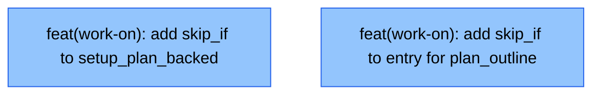

# work-on skip_if Integration

## Status

Draft

## Scope Summary

Two targeted additions to `work-on.md` that use koto v0.8.3 `skip_if` to
auto-advance mechanically deterministic setup states. Eliminates two manual
`koto next` round-trips per plan-backed child workflow without changing any
existing transitions or behavior for non-plan-backed runs.

## Decomposition Strategy

**Horizontal.** Each issue modifies one independent state in `work-on.md` and
can be implemented and verified in isolation. No walking skeleton is needed
because the changes are additive annotations on existing states with stable
interfaces — no new end-to-end flow is created.

## Issue Outlines

### Issue 1: feat(work-on): add skip_if to setup_plan_backed for shared branch

- **Type**: Code
- **Complexity**: simple

**Goal**

Add `skip_if` to the `setup_plan_backed` state so that plan-backed children
running on a shared branch auto-advance to `analysis` without a manual
submission. When `SHARED_BRANCH` is set, the orchestrator already created the
branch and baseline; the setup state has no work to do.

**Acceptance Criteria**

- `setup_plan_backed` in `skills/work-on/koto-templates/work-on.md` has a
  `skip_if` block that fires when `vars.SHARED_BRANCH` is set, using the koto
  v0.8.3 `is_set: true` condition syntax.
- Injected evidence routes to `analysis` (matching the existing
  `status: completed` transition target).
- The mermaid diagram is regenerated via `koto template export`; both
  `work-on.mermaid.md` and `work-on-plan.mermaid.md` are up to date.
- A new eval scenario exists at
  `skills/work-on/evals/fixtures/scenarios/setup-shared-skip/` with a fixture
  that places the workflow in `setup_plan_backed` with `SHARED_BRANCH` set and
  asserts auto-advance to `analysis`.
- The new eval ID is added to `skills/work-on/evals/evals.json`.
- All existing evals pass.

**Dependencies**

None

---

### Issue 2: feat(work-on): add skip_if to entry for plan_outline source

- **Type**: Code
- **Complexity**: simple

**Goal**

Add `skip_if` to the `entry` state so that plan-backed children with
`ISSUE_SOURCE=plan_outline` auto-advance to `plan_context_injection` without
a manual `mode: plan_backed` submission. The `ISSUE_SOURCE` template variable
is already emitted by `plan-to-tasks.sh` for single-pr tasks (lines 499–507);
no script changes are needed.

**Acceptance Criteria**

- `entry` in `skills/work-on/koto-templates/work-on.md` has a `skip_if` block
  that fires when `vars.ISSUE_SOURCE` equals `plan_outline`, injecting
  `mode: plan_backed` as synthetic evidence to route to `plan_context_injection`.
- Issue-backed and free-form workflows are unaffected (no regression for
  `mode: issue_backed` and `mode: free_form` paths).
- The mermaid diagram is regenerated via `koto template export`; both
  `work-on.mermaid.md` and `work-on-plan.mermaid.md` reflect the change.
- A new eval scenario exists at
  `skills/work-on/evals/fixtures/scenarios/entry-plan-outline-skip/` with a
  fixture that places the workflow at `entry` with `vars.ISSUE_SOURCE=plan_outline`
  and asserts auto-advance to `plan_context_injection`.
- The new eval ID is added to `skills/work-on/evals/evals.json`.
- All existing evals pass.

**Dependencies**

None

---

## Dependency Graph

**Legend**: Green = done, Blue = ready, Yellow = blocked

## Implementation Sequence

**Wave 1** (both issues are independent — implement in either order):

1. Issue 1: `setup_plan_backed` skip_if
2. Issue 2: `entry` skip_if

Recommended order: Issue 1 first to validate the `skip_if` syntax and mermaid
regeneration workflow, then Issue 2 following the same pattern. Both are sequential
commits on the current branch (`docs/work-on-koto-unification`). No merge gate
exists between them.

After both issues are complete, run `/work-on` (or submit the existing PR) to
merge and close.
