# PLAN: Skill Quality Improvements

## Status

Draft

## Scope Summary

Improve all 8 shirabe skills based on a systematic review against skill-creator best
practices. Covers progressive disclosure, deduplication, description quality, reasoning
gaps, generality, and helper skill fixes.

## Decomposition Strategy

**Horizontal.** Each improvement is an independent edit targeting specific files. No
integration risk between issues. They can be worked in any order, though the
dependency graph below shows where one issue's output informs another.

## Issue Outlines

### Issue 1: refactor(explore): split phase-5-produce.md by artifact type

- **Complexity**: testable
- **Goal**: Break the 590-line phase-5-produce.md into per-artifact-type files so the agent only loads the relevant 30-50 lines per execution.
- **Dependencies**: None

**Acceptance criteria:**
- [ ] `phase-5-produce.md` replaced by a routing stub that reads the crystallize decision and points to the correct sub-file
- [ ] Separate files created: `phase-5-produce-prd.md`, `phase-5-produce-design.md`, `phase-5-produce-plan.md`, `phase-5-produce-no-artifact.md`, `phase-5-produce-deferred.md`
- [ ] Each sub-file is under 150 lines
- [ ] SKILL.md reference table updated

---

### Issue 2: docs(plan): add TOCs to oversized reference files

- **Complexity**: simple
- **Goal**: Add tables of contents to the 4 plan reference files that exceed 300 lines, so agents can navigate to relevant sections.
- **Dependencies**: None

**Acceptance criteria:**
- [ ] TOC added to `plan-doc-structure.md` (563 lines)
- [ ] TOC added to `phase-4-agent-generation.md` (427 lines)
- [ ] TOC added to `phase-3-decomposition.md` (380 lines)
- [ ] TOC added to `phase-7-creation.md` (355 lines)
- [ ] TOC added to `work-on/references/scripts/extract-context.sh` (352 lines)

---

### Issue 3: refactor(plan): split plan-doc-structure.md examples into separate file

- **Complexity**: simple
- **Goal**: Move the ~150 lines of examples from plan-doc-structure.md to a dedicated file, reducing the main spec to ~400 lines.
- **Dependencies**: <<ISSUE:2>>

**Acceptance criteria:**
- [ ] `references/quality/plan-doc-examples.md` created with multi-pr and roadmap examples
- [ ] `plan-doc-structure.md` references the examples file instead of inlining them
- [ ] `plan-doc-structure.md` is under 450 lines
- [ ] Phase 7 reference table updated to include examples file

---

### Issue 4: refactor(explore): remove duplicate sections from SKILL.md

- **Complexity**: simple
- **Goal**: Cut Lead Conventions (~22 lines), Convergence Patterns (~23 lines), and Handoff Artifact Formats (~18 lines) from explore SKILL.md -- they duplicate content in phase reference files.
- **Dependencies**: None

**Acceptance criteria:**
- [ ] "Lead Conventions" section removed from SKILL.md (content already in phase-1-scope.md)
- [ ] "Convergence Patterns" section removed from SKILL.md (content already in phase-3-converge.md)
- [ ] "Handoff Artifact Formats" section removed (second copy already in wip/ Artifact Naming section and phase-5-produce.md)
- [ ] SKILL.md is under 310 lines

---

### Issue 5: refactor(prd): extract PRD format spec to reference file

- **Complexity**: testable
- **Goal**: Move lines 26-148 (PRD structure, lifecycle, validation rules) from prd SKILL.md to a reference file loaded only during Phases 3/4 when the template is needed.
- **Dependencies**: None

**Acceptance criteria:**
- [ ] `references/prd-format.md` created with structure, lifecycle, and validation content
- [ ] SKILL.md replaced extracted content with one-liner pointer
- [ ] Reference table updated with "When to load: Phase 3 (drafting) and Phase 4 (validation)"
- [ ] SKILL.md is under 210 lines
- [ ] Duplicate Quality Guidance section (lines 150-186) removed -- it restates validation rules
- [ ] Duplicate downstream routing table removed (appears at both ~197 and ~307)

---

### Issue 6: refactor(design): move lifecycle and validation to reference file

- **Complexity**: simple
- **Goal**: Extract lifecycle details (lines 99-134) and validation rules (lines 136-150) from design SKILL.md to a reference file, and deduplicate the visibility detection that appears twice.
- **Dependencies**: None

**Acceptance criteria:**
- [ ] `references/lifecycle.md` created with lifecycle states, transition script reference, and label lifecycle guidance
- [ ] SKILL.md replaced extracted content with pointer
- [ ] Duplicate visibility/scope detection (appears at lines ~76-97 AND lines ~193-199) consolidated to one location
- [ ] Duplicate frontmatter coverage guidance (lines 33-38 vs lines 47-50) consolidated
- [ ] SKILL.md is under 280 lines

---

### Issue 7: refactor(plan): trim SKILL.md redundancy with phase files

- **Complexity**: simple
- **Goal**: Reduce duplication between plan SKILL.md and its phase files. Keep quick-reference summaries but add pointers instead of near-complete duplicates.
- **Dependencies**: None

**Acceptance criteria:**
- [ ] Handoff Validation section (lines ~206-219) trimmed to rule + pointer
- [ ] Complexity Classification table (lines ~90-94) marked as "(see phase-3 for full details)"
- [ ] Critical Requirements section (lines ~313-321) trimmed to 3 non-obvious items
- [ ] Passive voice fixed at line 139 ("The detected input_type is stored..." -> "Store the detected input_type...")

---

### Issue 8: refactor(work-on): remove redundant sections and fix duplication

- **Complexity**: simple
- **Goal**: Remove the Critical Requirements section (entirely redundant with phase files) and the duplicate writing-style reference in phase-6-pr.md.
- **Dependencies**: None

**Acceptance criteria:**
- [ ] Critical Requirements section (lines 107-112) removed from SKILL.md
- [ ] Duplicate writing-style reference in phase-6-pr.md removed (appears at both ~line 97 and ~line 145)
- [ ] Explicit final output expectation added to SKILL.md ("Output: PR URL and completion status")

---

### Issue 9: fix(design): align description with actual skill capabilities

- **Complexity**: simple
- **Goal**: The design skill description claims review/transition capabilities that the body doesn't deliver. Fix the description to match what exists.
- **Dependencies**: None

**Acceptance criteria:**
- [ ] Description no longer promises "reviewing, validating, or transitioning" unless those workflows exist in the body
- [ ] Negative triggers added: when NOT to use this skill (quick opinion without formal doc)
- [ ] Additional trigger phrases added: "how should we architect X", "what's the best approach for Y"

---

### Issue 10: feat: improve descriptions across all workflow skills

- **Complexity**: testable
- **Goal**: Improve trigger descriptions for all 5 workflow skills to reduce undertriggering. Add natural language trigger phrases, negative triggers for disambiguation, and highlight distinctive features.
- **Dependencies**: <<ISSUE:9>>

**Acceptance criteria:**
- [ ] explore: add "what should I do next?", "how do I start?", "I'm stuck" triggers
- [ ] prd: add disambiguation vs /design and /explore
- [ ] plan: add "decompose this", "what tasks do we need", "break this down" triggers
- [ ] work-on: add "build", "tackle", "pick up", "close issue" triggers; highlight milestone auto-selection
- [ ] writing-style: no change needed (already strong)
- [ ] private-content: reword from "Loaded on demand" to describe what restrictions it contains
- [ ] public-content: reword to mention "restrictions" framing

---

### Issue 11: docs: add "why" reasoning to bare rules across all skills

- **Complexity**: testable
- **Goal**: Add explanations to ~10 bare rules that bark commands without reasoning. LLMs internalize instructions better when they understand the motivation.
- **Dependencies**: None

**Acceptance criteria:**
- [ ] explore line ~184: add why visibility is immutable (public repos must never include private references)
- [ ] explore line ~72: remove internal "Feature 5" reference
- [ ] design line ~69: add why alternatives are required (prevents strawman options)
- [ ] design line ~262: add why no premature commitment matters (bias corrupts investigation)
- [ ] prd line ~273: add why jury validation is mandatory (authors miss their own ambiguity gaps)
- [ ] prd line ~280: add why feature branch matters (keeps drafts off main, allows easy abandonment)
- [ ] plan line ~176: add why visibility is immutable
- [ ] plan phase-4 line ~137: add why parallel agent launch matters (reduces wall-clock time)
- [ ] work-on line ~109: add why artifact pattern exists (enables crash-resilient resumability)

---

### Issue 12: refactor(work-on): extract Phase 6 Mermaid diagram logic to extension point

- **Complexity**: testable
- **Goal**: The 60 lines of Mermaid diagram manipulation in phase-6-pr.md step 6.1.5 are project-specific. Extract to a script or reference file that's only loaded when a design doc reference is detected.
- **Dependencies**: None

**Acceptance criteria:**
- [ ] Mermaid diagram update logic extracted from phase-6-pr.md lines ~22-83
- [ ] Either: extracted to `scripts/update-design-diagram.sh` script, OR moved to a reference file loaded conditionally
- [ ] phase-6-pr.md has a conditional check: "If the issue references a design doc, read/run the diagram update logic"
- [ ] phase-6-pr.md is shorter by ~50 lines

---

### Issue 13: refactor(work-on): make auto-skip labels configurable via extension

- **Complexity**: simple
- **Goal**: Phase 5 hardcodes label names for auto-skip logic. These should come from the project's label vocabulary or extension file instead.
- **Dependencies**: None

**Acceptance criteria:**
- [ ] phase-5-finalization.md auto-skip logic reads labels from CLAUDE.md `## Label Vocabulary` instead of hardcoding
- [ ] Fallback to reasonable defaults if no vocabulary is defined
- [ ] Hardcoded label list (`docs`, `documentation`, `config`, `chore`, etc.) removed or moved to default fallback

---

### Issue 14: refactor: extract project-specific label lifecycle to extension points

- **Complexity**: testable
- **Goal**: Label lifecycle handling (`needs-design`, `needs-prd`, `tracks-plan` labels) is hardcoded in design phase-6 and prd phase-4. Move to extension point pattern.
- **Dependencies**: None

**Acceptance criteria:**
- [ ] design phase-6-final-review.md: label-specific logic (lines ~148-184) replaced with "If your project defines label lifecycle hooks in the extension file, apply them here"
- [ ] prd phase-4-validate.md: `needs-prd` label removal (lines ~201-206) replaced with extension-based approach
- [ ] Base skills work without any label vocabulary defined (graceful degradation)
- [ ] Cross-skill dependency on `issue-staleness` in work-on phase-2 gets error handling for when skill isn't installed

---

### Issue 15: fix: improve helper skills (writing-style, private-content, public-content)

- **Complexity**: simple
- **Goal**: Fix self-contradiction in writing-style, add "why" framing to content governance skills, deduplicate private-content.
- **Dependencies**: None

**Acceptance criteria:**
- [ ] writing-style line 70: em dash replaced with colon (skill contradicts its own rule)
- [ ] writing-style: standardize cross-skill reference pattern (design line 22 uses different phrasing than other 3 skills)
- [ ] private-content: one-sentence "why" framing added after line 9
- [ ] private-content: "What's Allowed" section cut (duplicates per-artifact-type sections)
- [ ] private-content: "Can" prefix removed from Issues subsection lines
- [ ] public-content: one-sentence "why" framing added after line 9

---

### Issue 16: feat: add content governance loading to explore, plan, work-on

- **Complexity**: simple
- **Goal**: Only design and prd currently load private-content/public-content based on visibility. Explore, plan, and work-on also produce artifacts that should respect visibility rules.
- **Dependencies**: <<ISSUE:15>>

**Acceptance criteria:**
- [ ] explore SKILL.md: add conditional content governance loading based on visibility (same pattern as design/prd)
- [ ] plan SKILL.md: add conditional content governance loading
- [ ] work-on SKILL.md: add conditional content governance loading
- [ ] Pattern is consistent across all 5 workflow skills

---

### Issue 17: refactor: trim quality checklists in phase files

- **Complexity**: simple
- **Goal**: Phase files end with 5-8 checkbox checklists restating the phase's instructions. LLMs don't use checklists like humans. Trim to 2-3 critical items that catch actual failure modes.
- **Dependencies**: None

**Acceptance criteria:**
- [ ] Each phase file's quality checklist reduced to 2-3 items
- [ ] Kept items focus on failure modes, not restatements (e.g., "source doc status is valid" not "full source document read")
- [ ] "Next Phase: Proceed to Phase N" lines preserved (useful for flow)

---

### Issue 18: fix(plan): remove stale TOC entries from plan-doc-structure.md

- **Complexity**: simple
- **Goal**: When examples were extracted to plan-doc-examples.md (issue 3), two TOC entries were left pointing to headings that no longer exist in plan-doc-structure.md.
- **Dependencies**: None

**Acceptance criteria:**
- [ ] Remove line 17 from plan-doc-structure.md TOC: `- [Complete Example (multi-pr mode)]...` -- this heading was extracted to plan-doc-examples.md
- [ ] Remove line 18 from plan-doc-structure.md TOC: `- [Complete Example (roadmap mode)]...` -- same
- [ ] Verify remaining TOC entries all resolve to actual headings in the file

---

### Issue 19: fix(design): fix broken complexity assessment reference in phase-6

- **Complexity**: simple
- **Goal**: Phase 6 step 6.8.6 (phase-6-final-review.md line ~160) says "Run complexity assessment and routing from `references/decision-presentation.md`" but decision-presentation.md covers AskUserQuestion formatting, not the complexity assessment. The complexity table and routing logic are in design SKILL.md lines ~190-207.
- **Dependencies**: None

**Acceptance criteria:**
- [ ] phase-6-final-review.md line ~160: change reference from `references/decision-presentation.md` to point at the correct location (design SKILL.md "Output" section)
- [ ] If the complexity assessment is better as a standalone reference, extract it to `references/complexity-assessment.md` and reference that from both SKILL.md and phase-6

---

### Issue 20: fix(work-on): fix misleading staleness fallback comment

- **Complexity**: simple
- **Goal**: The fallback in phase-2-introspection.md (line ~18) has a comment saying "if issue is older than 7 days" but the code unconditionally returns `introspection_recommended: true` without checking age. Fix the comment to match the code.
- **Dependencies**: None

**Acceptance criteria:**
- [ ] Change comment from "Fallback: assume introspection recommended if issue is older than 7 days" to "Fallback: always recommend introspection when staleness script is unavailable"
- [ ] Alternatively, implement the actual age check using `gh issue view <N> --json createdAt` -- but the simpler comment fix is preferred since introspection for fresh issues exits quickly

---

### Issue 21: refactor(design): consolidate triple visibility/scope detection

- **Complexity**: simple
- **Goal**: Design SKILL.md still explains visibility/scope detection in 3 separate locations: Context-Aware Sections (line ~74), Repo Visibility section (lines ~111-115), and Context Resolution (lines ~136-141). Issue 6 consolidated one pair but left three occurrences. Reduce to one authoritative location with pointers from the other two.
- **Dependencies**: None

**Acceptance criteria:**
- [ ] One authoritative visibility/scope detection block (keep Context-Aware Sections since it's the most complete)
- [ ] Repo Visibility section reduced to "See Context-Aware Sections above. Load `skills/private-content/SKILL.md` or `skills/public-content/SKILL.md` accordingly."
- [ ] Context Resolution section reduced to "Detect visibility and scope as described in Context-Aware Sections above. For cross-repo issues, use `gh` commands."
- [ ] No repeated detection instructions across the three locations

---

### Issue 22: fix: standardize content governance loading across all 5 skills

- **Complexity**: simple
- **Goal**: The content governance loading pattern (detect visibility, load private-content or public-content) is inconsistent across skills. work-on is missing the path-based fallback. prd doesn't specify where to look for visibility. design uses "Load" instead of "Read".
- **Dependencies**: None

**Acceptance criteria:**
- [ ] work-on: add path-based fallback (`private/` -> Private, `public/` -> Public) and default-to-Private when visibility can't be determined -- matching the pattern in explore and plan
- [ ] prd: change "Before writing content, determine visibility" to explicitly reference CLAUDE.md `## Repo Visibility: Public|Private` with path fallback
- [ ] design line ~114: change "Load" to "Read" for consistency with other skills
- [ ] All 5 skills use the same pattern: check CLAUDE.md header, path fallback, default to Private, then load the appropriate content skill

---

### Issue 23: docs: add remaining "why" reasoning gaps found in review

- **Complexity**: simple
- **Goal**: The post-refactor review found additional bare rules that the first pass (issue 11) missed.
- **Dependencies**: None

**Acceptance criteria:**
- [ ] prd SKILL.md line ~33: "No directory movement based on status" -- add rationale (stable paths make cross-references durable and git blame readable)
- [ ] prd SKILL.md line ~64: "Default to Private if unknown" -- add rationale (restricting is easier to undo than oversharing)
- [ ] design lines ~100-104: file location directories -- add rationale (directory structure makes lifecycle state visible in file paths without opening files)
- [ ] plan phase-7 lines ~253-256: "Do NOT modify the design doc body" -- add rationale (implementation tracking lives in the PLAN artifact now, not the design doc)
- [ ] design phase-6 line ~153: parent doc update gated on label removal -- fix gate condition to check `spawned_from` existence instead, since a design can have a parent without the source issue having a label

---

### Issue 24: fix(plan): remove hardcoded go test command from ac-simple.md

- **Complexity**: simple
- **Goal**: `ac-simple.md` line 13 hardcodes `go test ./...` which is project-specific. Replace with a generic or templated test command.
- **Dependencies**: None

**Acceptance criteria:**
- [ ] Replace `go test ./...` with a generic placeholder like "Tests pass (run your project's test command)" or use a template variable like `{{TEST_COMMAND}}`
- [ ] Verify no other AC templates contain project-specific commands

---

### Issue 25: refactor(explore): evaluate crystallize framework summary

- **Complexity**: simple
- **Goal**: SKILL.md lines 58-78 contain a 20-line summary of the crystallize framework that gets superseded when Phase 4 loads the full framework from `references/quality/crystallize-framework.md`. Determine if this summary serves a purpose for the orchestrator's loop decision heuristic (lines ~218-228) or is dead weight.
- **Dependencies**: None

**Acceptance criteria:**
- [ ] If the summary is referenced by the loop decision logic: add a comment explaining that connection ("This summary informs the recommendation heuristic at Phase 3 exit")
- [ ] If the summary is NOT referenced: remove it and add a one-liner pointer ("See `references/quality/crystallize-framework.md` for the full artifact-type scoring framework, loaded during Phase 4")
- [ ] Also add negative triggers to the explore description: "Does NOT apply when the user already knows their artifact type" -- this was flagged but not implemented

---

### Issue 26: fix: minor cleanup across skills

- **Complexity**: simple
- **Goal**: Small fixes identified in the post-refactor review that don't warrant individual issues.
- **Dependencies**: None

**Acceptance criteria:**
- [ ] work-on `phase-6-design-diagram-update.md` line 1: rename from "# Phase 6: Design Document Diagram Update" to "# Design Document Diagram Update" -- it's a sub-step, not a full phase
- [ ] prd Output section (lines ~125-141): trim steps 1-4 since they duplicate Phase 3/4 execution logic; keep only the final artifact description and routing table
- [ ] prd phase-4-validate.md line ~204: change `needs-prd` fallback from "remove needs-prd" to "skip label removal" when no vocabulary is defined -- avoids coupling to a specific label convention
- [ ] design phase-6-final-review.md: phase 6 step 6.4 validation checklist (lines ~82-95) duplicates lifecycle.md validation rules -- replace with pointer to the extracted reference file
- [ ] design phase-6 quality checklist (lines ~175-180): add strawman check item (step 6.3 is a significant validation not represented)

---

## Dependency Graph

```mermaid
graph TD
    I1["1: split phase-5-produce"]
    I2["2: add TOCs"]
    I3["3: split plan-doc examples"]
    I4["4: explore dedup"]
    I5["5: prd extract format"]
    I6["6: design move lifecycle"]
    I7["7: plan trim redundancy"]
    I8["8: work-on remove redundancy"]
    I9["9: design fix description"]
    I10["10: improve all descriptions"]
    I11["11: add why reasoning"]
    I12["12: work-on extract Mermaid"]
    I13["13: work-on configurable labels"]
    I14["14: extract label lifecycle"]
    I15["15: fix helper skills"]
    I16["16: add content governance"]
    I17["17: trim checklists"]

    I2 --> I3
    I9 --> I10
    I15 --> I16
```

## Implementation Sequence

**Issues 1-17** (Round 1) are complete. **Issues 18-26** (Round 2) address findings from the post-refactor review.

**Round 2 has no internal dependencies.** All 9 issues can be worked in any order. Recommended priority:

1. **Bugs first** (18, 19, 20) -- broken references and misleading code
2. **Consistency** (21, 22) -- consolidate remaining redundancy and standardize patterns
3. **Polish** (23, 24, 25, 26) -- remaining "why" gaps, generality leaks, minor cleanup

| Track | Issues | Theme | Status |
|-------|--------|-------|--------|
| A | 1, 4, 5, 6, 7, 8 | Structural: split/extract/deduplicate | Done |
| B | 2 -> 3 | Progressive disclosure: TOCs and splits | Done |
| C | 9 -> 10, 11 | Description and reasoning improvements | Done |
| D | 12, 13, 14 | Generality: extract project-specific logic | Done |
| E | 15 -> 16 | Helper skills and content governance | Done |
| F | 17 | Quality checklist trimming | Done |
| G | 18, 19, 20 | Post-refactor bugs | Pending |
| H | 21, 22 | Post-refactor consistency | Pending |
| I | 23, 24, 25, 26 | Post-refactor polish | Pending |
