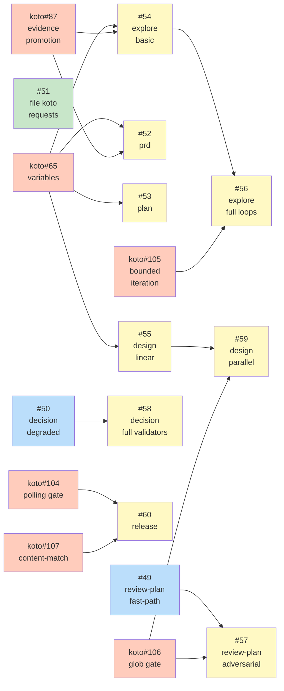

# ROADMAP: Koto Adoption

## Status

Active

## Theme

Convert shirabe skills from prose-based workflow management to koto-orchestrated
workflows. Skills define what to achieve; koto workflows define how to get there.
Coordinated sequencing matters because later conversions depend on koto features
that don't exist yet — the phasing aligns skill conversions with koto's feature
delivery.

## Features

### Feature 1: review-plan koto conversion (fast-path) — [#49](https://github.com/tsukumogami/shirabe/issues/49)
**Needs:** `needs-design` -- template design for the 7-state linear chain
**Dependencies:** None
**Status:** Not started

The review-plan fast-path is a linear chain (setup, scope gate, design fidelity,
AC discriminability, sequencing, verdict, optional loop-back). No fan-out, no
external commands. Converts with koto's current capabilities. Adversarial mode
deferred to Feature 9.

### Feature 2: decision skill koto conversion (without persistent validators) — [#50](https://github.com/tsukumogami/shirabe/issues/50)
**Needs:** `needs-design` -- template design for the conditional fast/full path split
**Dependencies:** None
**Status:** Not started

The decision skill's core flow has two conditional paths from the alternatives
state: fast-path (tier=standard) skips bakeoff/revision/examination, full-path
(tier=critical) runs all. Koto's `when` guards handle this. Persistent validators
(which span multiple states) are deferred to Feature 10. Disposable agents per
state is a workable degradation for now.

### Feature 3: File koto feature requests — ~~[#51](https://github.com/tsukumogami/shirabe/issues/51)~~
**Needs:** None
**Dependencies:** None
**Status:** Done

Filed: tsukumogami/koto#65, tsukumogami/koto#66, tsukumogami/koto#87,
tsukumogami/koto#104, tsukumogami/koto#105, tsukumogami/koto#106,
tsukumogami/koto#107, tsukumogami/koto#108.

### Feature 4: prd skill koto conversion — [#52](https://github.com/tsukumogami/shirabe/issues/52)
**Needs:** `needs-design` -- template design for the 5-phase flow with discover loop
**Dependencies:** Feature 3 (needs tsukumogami/koto#65 for variables, tsukumogami/koto#87 for evidence promotion)
**Status:** Not started

The 5-phase structure (setup, scope, discover, draft, validate) maps to koto
states. The discover-draft loop needs bounded iteration (tsukumogami/koto#105) for full
support but can use a fixed self-loop count initially. Fan-out for Phase 2
research agents stays outside koto.

### Feature 5: plan skill koto conversion — [#53](https://github.com/tsukumogami/shirabe/issues/53)
**Needs:** `needs-design` -- template design for 7-phase flow with execution mode gate
**Dependencies:** Feature 3 (needs tsukumogami/koto#65 for variables)
**Status:** Not started

The plan skill's 7 phases map to sequential koto states with a mode-selection
gate between Phase 3 and Phase 4. The execution mode (single-pr vs multi-pr)
drives different agent behavior in Phase 4. Fan-out for issue generation stays
outside koto.

### Feature 6: explore skill koto conversion (basic) — [#54](https://github.com/tsukumogami/shirabe/issues/54)
**Needs:** `needs-design` -- template design for the discover-converge loop
**Dependencies:** Feature 3 (needs tsukumogami/koto#65 for variables, tsukumogami/koto#87 for evidence promotion)
**Status:** Not started

Basic conversion with a fixed round count for the discover-converge loop.
Crystallize and produce phases are linear. Fan-out for research agents stays
outside koto. Full loop support (bounded iteration) deferred to Feature 8.

### Feature 7: design skill koto conversion (linear flow) — [#55](https://github.com/tsukumogami/shirabe/issues/55)
**Needs:** `needs-design` -- template design for the 6-phase decompose-decide-validate flow
**Dependencies:** Feature 3 (needs tsukumogami/koto#65 for variables)
**Status:** Not started

Linear conversion: phases 0-6 as sequential states. Decision execution (Phase 2)
fans out agents outside koto. Cross-validation (Phase 3) is mandatory — modeled
as a gate that can't be skipped. Parallel decision agents deferred to Feature 11.

### Feature 8: explore skill full loops — [#56](https://github.com/tsukumogami/shirabe/issues/56)
**Needs:** `needs-design` -- upgrade to use bounded iteration
**Dependencies:** Feature 6, tsukumogami/koto#105 (bounded iteration)
**Status:** Not started

Upgrade the basic explore template to use koto's bounded iteration primitive
for the discover-converge loop. Replaces the fixed round count with a proper
loop counter and overflow target.

### Feature 9: review-plan adversarial mode — [#57](https://github.com/tsukumogami/shirabe/issues/57)
**Needs:** `needs-design` -- parallel review categories template
**Dependencies:** Feature 1, tsukumogami/koto#106 (glob context-exists)
**Status:** Not started

The adversarial mode fans out 4 review categories with 3 validators each.
Needs glob-aware context-exists gate to wait for all validator outputs.

### Feature 10: decision skill full validators — [#58](https://github.com/tsukumogami/shirabe/issues/58)
**Needs:** `needs-spike` -- feasibility of cross-state agent persistence in koto
**Dependencies:** Feature 2
**Status:** Not started

The full decision skill's validators must retain conversation history across
bakeoff, revision, and examination states. Koto has no concept of persistent
agents spanning multiple states. This may need a koto architecture change or
a workaround pattern.

### Feature 11: design skill parallel decisions — [#59](https://github.com/tsukumogami/shirabe/issues/59)
**Needs:** `needs-design` -- concurrent decision agent tracking
**Dependencies:** Feature 7, tsukumogami/koto#106 (glob context-exists)
**Status:** Not started

Upgrade the linear design template to track parallel decision agents via
glob-aware context-exists gates. Each decision agent writes its report;
the gate waits for all reports before advancing to cross-validation.

### Feature 12: release skill koto conversion — [#60](https://github.com/tsukumogami/shirabe/issues/60)
**Needs:** `needs-design` -- template design for external-command-heavy workflow
**Dependencies:** Feature 3, tsukumogami/koto#104 (polling gate), tsukumogami/koto#107 (content-match gate)
**Status:** Not started

The release skill is the poorest koto fit: 15+ external commands (gh, git),
zero wip/ files, and heavy reliance on external state (draft releases, CI
status, tag existence). Needs polling gates for CI monitoring and content-match
gates for version validation. Converts last.

## Implementation Issues

### Milestone: [Koto Adoption](https://github.com/tsukumogami/shirabe/milestone/3)

| Issue | Phase | Dependencies | Label |
|-------|-------|-------------|-------|
| [#49: review-plan fast-path](https://github.com/tsukumogami/shirabe/issues/49) | 1 | None | `needs-design` |
| [#50: decision (degraded)](https://github.com/tsukumogami/shirabe/issues/50) | 1 | None | `needs-design` |
| ~~[#51: file koto requests](https://github.com/tsukumogami/shirabe/issues/51)~~ | 1 | None | Done |
| [#52: prd conversion](https://github.com/tsukumogami/shirabe/issues/52) | 2 | tsukumogami/koto#65, tsukumogami/koto#87 | `needs-design` |
| [#53: plan conversion](https://github.com/tsukumogami/shirabe/issues/53) | 2 | tsukumogami/koto#65 | `needs-design` |
| [#54: explore basic](https://github.com/tsukumogami/shirabe/issues/54) | 2 | tsukumogami/koto#65, tsukumogami/koto#87 | `needs-design` |
| [#55: design linear](https://github.com/tsukumogami/shirabe/issues/55) | 2 | tsukumogami/koto#65 | `needs-design` |
| [#56: explore full loops](https://github.com/tsukumogami/shirabe/issues/56) | 3 | #54, tsukumogami/koto#105 | `needs-design` |
| [#57: review-plan adversarial](https://github.com/tsukumogami/shirabe/issues/57) | 3 | #49, tsukumogami/koto#106 | `needs-design` |
| [#58: decision full validators](https://github.com/tsukumogami/shirabe/issues/58) | 3 | #50 | `needs-spike` |
| [#59: design parallel](https://github.com/tsukumogami/shirabe/issues/59) | 3 | #55, tsukumogami/koto#106 | `needs-design` |
| [#60: release conversion](https://github.com/tsukumogami/shirabe/issues/60) | 3 | tsukumogami/koto#104, tsukumogami/koto#107 | `needs-design` |

**Legend**: Green = done, Blue = ready, Yellow = blocked by koto features, Orange = koto feature (external)

## Sequencing Rationale

The ordering follows three principles:

**1. Convert what works today first.** Features 1-2 (review-plan fast-path,
decision without validators) use koto's current capabilities. They validate
the conversion pattern and surface integration issues before committing to
harder conversions.

**2. Koto features gate the middle tier.** Features 4-7 (prd, plan, explore
basic, design linear) need tsukumogami/koto#65 (variables) and tsukumogami/koto#87 (evidence promotion).
These are the highest-value conversions (the most-used skills) but can't start
until the koto features ship. Feature 3 (filing the requests) is already done.

**3. Advanced modes come last.** Features 8-12 need new koto primitives
(bounded iteration, glob gates, polling gates) or solve hard problems (cross-state
agent persistence). These build on the basic conversions and deliver incremental
improvements rather than foundational capability.

Hard dependencies:
- Features 4-7 are blocked by tsukumogami/koto#65 and tsukumogami/koto#87
- Features 8, 9, 11 are blocked by tsukumogami/koto#105 or tsukumogami/koto#106
- Feature 12 is blocked by tsukumogami/koto#104 and tsukumogami/koto#107
- Features 1-2 have no koto dependencies

Parallel opportunities:
- Features 1 and 2 can proceed in parallel (no shared dependencies)
- Features 4, 5, 6, 7 can proceed in parallel once tsukumogami/koto#65/#87 ship
- Features 8, 9, 11 can proceed in parallel once tsukumogami/koto#105/#106 ship

## Progress

- Feature 3 (#51, koto feature requests): **Done** — all 8 issues filed
- Features 1-2 (#49, #50): **Ready** — no koto dependencies
- Features 4-12: **Blocked** — waiting on koto features
