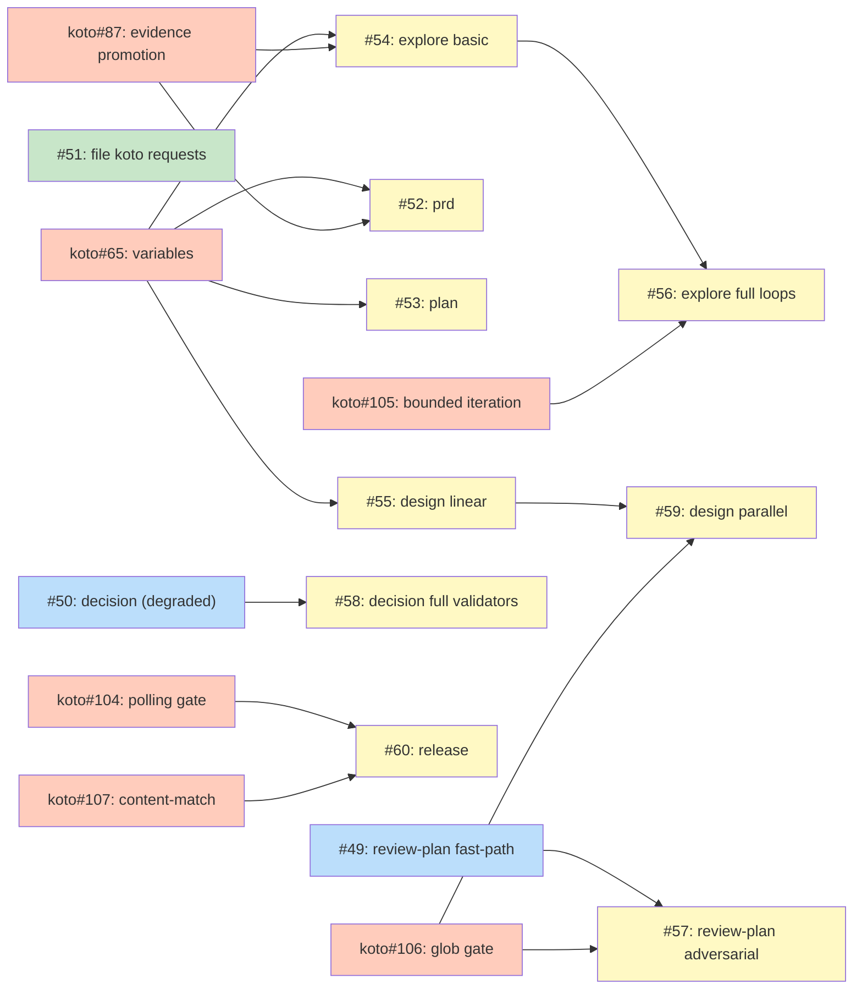

# ROADMAP: Koto Adoption

## Status

Done

**Closed out as superseded -- not a clean "all features shipped"
completion.** This roadmap is retained for audit trail only. It is no
longer a live plan -- do not pick work from it without re-validating
against the current koto-orchestration approach first. The roadmap
schema has no dedicated "Superseded" or "Dropped" state, so `Done` is
used as the terminal status; most of the conversions below never
shipped and are recorded here for history.

It has been overtaken on three fronts:

- **Its scope is frozen at a smaller world.** The scope names "all 7
  non-koto shirabe skills." `skills/` now holds roughly nineteen skills;
  the seven-skill framing predates `strategy`, `charter`, `scope`,
  `brief`, `comp`, `execute`, and `inflight`.
- **The conversion pattern it set out to validate is already proven.**
  Features 1-2 existed to de-risk koto conversion "using koto today."
  That risk is retired: `skills/work-on/koto-templates/` and
  `skills/execute/koto-templates/` both ship working koto templates, so
  the pattern is demonstrated outside this roadmap's frame.
- **Its dependency state is stale.** Two of the koto features that
  gated the middle group have since shipped: koto#65 (variables) and
  koto#107 (content-match) are closed. That unblocks Feature 5 (plan)
  and Feature 7 (design linear), whose only koto dependency was koto#65
  -- both are now ready rather than blocked. Feature 4 (prd) and
  Feature 6 (explore) additionally need koto#87 (evidence promotion),
  which is still open, so they remain blocked. The koto primitives for
  the advanced modes (bounded iteration, glob gates, polling gates)
  remain unshipped.

If this line of work is revived, do it against the current skill
catalog and the current koto capability set rather than the tables
below, which reflect the state as of the roadmap's last update.

## Theme

Convert shirabe skills from prose-based workflow management to koto-orchestrated
workflows. Skills define what to achieve; koto workflows define how to get there.
Coordinated sequencing matters because later conversions depend on koto features
that don't exist yet — the phasing aligns skill conversions with koto's feature
delivery.

## Features

### Feature 1: review-plan koto conversion (fast-path) — [#49](https://github.com/tsukumogami/shirabe/issues/49)
**Needs:** `needs-design` -- template design for the 7-state linear chain
**Dependencies:** None
**Status:** Not started

The review-plan fast-path is a linear chain (setup, scope gate, design fidelity,
AC discriminability, sequencing, verdict, optional loop-back). No fan-out, no
external commands. Converts with koto's current capabilities. Adversarial mode
deferred to Feature 9.

### Feature 2: decision skill koto conversion (without persistent validators) — [#50](https://github.com/tsukumogami/shirabe/issues/50)
**Needs:** `needs-design` -- template design for the conditional fast/full path split
**Dependencies:** None
**Status:** Not started

The decision skill's core flow has two conditional paths from the alternatives
state: the fast-path (standard mode) skips bakeoff/revision/examination, the
full-path (critical mode) runs all. Koto's `when` guards handle this. Persistent validators
(which span multiple states) are deferred to Feature 10. Disposable agents per
state is a workable degradation for now.

### Feature 3: File koto feature requests — ~~[#51](https://github.com/tsukumogami/shirabe/issues/51)~~
**Needs:** None
**Dependencies:** None
**Status:** Done

Filed: tsukumogami/koto#65, tsukumogami/koto#66, tsukumogami/koto#87,
tsukumogami/koto#104, tsukumogami/koto#105, tsukumogami/koto#106,
tsukumogami/koto#107, tsukumogami/koto#108.

### Feature 4: prd skill koto conversion — [#52](https://github.com/tsukumogami/shirabe/issues/52)
**Needs:** `needs-design` -- template design for the 5-phase flow with discover loop
**Dependencies:** Feature 3 (needs tsukumogami/koto#65 for variables, tsukumogami/koto#87 for evidence promotion)
**Status:** Not started

The 5-phase structure (setup, scope, discover, draft, validate) maps to koto
states. The discover-draft loop needs bounded iteration (tsukumogami/koto#105) for full
support but can use a fixed self-loop count initially. Fan-out for Phase 2
research agents stays outside koto.

### Feature 5: plan skill koto conversion — [#53](https://github.com/tsukumogami/shirabe/issues/53)
**Needs:** `needs-design` -- template design for 7-phase flow with execution mode gate
**Dependencies:** Feature 3 (needs tsukumogami/koto#65 for variables)
**Status:** Not started

The plan skill's 7 phases map to sequential koto states with a mode-selection
gate between Phase 3 and Phase 4. The execution mode (single-pr vs multi-pr)
drives different agent behavior in Phase 4. Fan-out for issue generation stays
outside koto.

### Feature 6: explore skill koto conversion (basic) — [#54](https://github.com/tsukumogami/shirabe/issues/54)
**Needs:** `needs-design` -- template design for the discover-converge loop
**Dependencies:** Feature 3 (needs tsukumogami/koto#65 for variables, tsukumogami/koto#87 for evidence promotion)
**Status:** Not started

Basic conversion with a fixed round count for the discover-converge loop.
Crystallize and produce phases are linear. Fan-out for research agents stays
outside koto. Full loop support (bounded iteration) deferred to Feature 8.

### Feature 7: design skill koto conversion (linear flow) — [#55](https://github.com/tsukumogami/shirabe/issues/55)
**Needs:** `needs-design` -- template design for the 6-phase decompose-decide-validate flow
**Dependencies:** Feature 3 (needs tsukumogami/koto#65 for variables)
**Status:** Not started

Linear conversion: phases 0-6 as sequential states. Decision execution (Phase 2)
fans out agents outside koto. Cross-validation (Phase 3) is mandatory — modeled
as a gate that can't be skipped. Parallel decision agents deferred to Feature 11.

### Feature 8: explore skill full loops — [#56](https://github.com/tsukumogami/shirabe/issues/56)
**Needs:** `needs-design` -- upgrade to use bounded iteration
**Dependencies:** Feature 6, tsukumogami/koto#105 (bounded iteration)
**Status:** Not started

Upgrade the basic explore template to use koto's bounded iteration primitive
for the discover-converge loop. Replaces the fixed round count with a proper
loop counter and overflow target.

### Feature 9: review-plan adversarial mode — [#57](https://github.com/tsukumogami/shirabe/issues/57)
**Needs:** `needs-design` -- parallel review categories template
**Dependencies:** Feature 1, tsukumogami/koto#106 (glob context-exists)
**Status:** Not started

The adversarial mode fans out 4 review categories with 3 validators each.
Needs glob-aware context-exists gate to wait for all validator outputs.

### Feature 10: decision skill full validators — [#58](https://github.com/tsukumogami/shirabe/issues/58)
**Needs:** `needs-spike` -- feasibility of cross-state agent persistence in koto
**Dependencies:** Feature 2
**Status:** Not started

The full decision skill's validators must retain conversation history across
bakeoff, revision, and examination states. Koto has no concept of persistent
agents spanning multiple states. This may need a koto architecture change or
a workaround pattern.

### Feature 11: design skill parallel decisions — [#59](https://github.com/tsukumogami/shirabe/issues/59)
**Needs:** `needs-design` -- concurrent decision agent tracking
**Dependencies:** Feature 7, tsukumogami/koto#106 (glob context-exists)
**Status:** Not started

Upgrade the linear design template to track parallel decision agents via
glob-aware context-exists gates. Each decision agent writes its report;
the gate waits for all reports before advancing to cross-validation.

### Feature 12: release skill koto conversion — [#60](https://github.com/tsukumogami/shirabe/issues/60)
**Needs:** `needs-design` -- template design for external-command-heavy workflow
**Dependencies:** Feature 3, tsukumogami/koto#104 (polling gate), tsukumogami/koto#107 (content-match gate)
**Status:** Not started

The release skill is the poorest koto fit: 15+ external commands (gh, git),
zero wip/ files, and heavy reliance on external state (draft releases, CI
status, tag existence). Needs polling gates for CI monitoring and content-match
gates for version validation. Converts last.

## Sequencing Rationale

The ordering follows three principles:

**1. Convert what works today first.** Features 1-2 (review-plan fast-path,
decision without validators) use koto's current capabilities. They validate
the conversion pattern and surface integration issues before committing to
harder conversions.

**2. Koto features gate the middle group.** Features 4-7 (prd, plan, explore
basic, design linear) need tsukumogami/koto#65 (variables) and tsukumogami/koto#87 (evidence promotion).
These are the highest-value conversions (the most-used skills) but can't start
until the koto features ship. Feature 3 (filing the requests) is already done.

**3. Advanced modes come last.** Features 8-12 need new koto primitives
(bounded iteration, glob gates, polling gates) or solve hard problems (cross-state
agent persistence). These build on the basic conversions and deliver incremental
improvements rather than foundational capability.

Hard dependencies:
- Features 4-7 are blocked by tsukumogami/koto#65 and tsukumogami/koto#87
- Features 8, 9, 11 are blocked by tsukumogami/koto#105 or tsukumogami/koto#106
- Feature 12 is blocked by tsukumogami/koto#104 and tsukumogami/koto#107
- Features 1-2 have no koto dependencies

Parallel opportunities:
- Features 1 and 2 can proceed in parallel (no shared dependencies)
- Features 4, 5, 6, 7 can proceed in parallel once tsukumogami/koto#65/#87 ship
- Features 8, 9, 11 can proceed in parallel once tsukumogami/koto#105/#106 ship

## Progress

Historical, as of this roadmap's supersession (see Status):

- Feature 3 (#51, koto feature requests): **Done** -- all 8 issues filed.
- Features 1-2 (#49, #50): **Ready** -- no koto dependencies; the
  conversion pattern they de-risk is already proven by the shipped
  work-on and execute koto templates.
- Features 5 and 7 (#53, #55): **Ready** -- their only koto dependency,
  koto#65, has shipped.
- Features 4 and 6 (#52, #54): **Blocked** -- still need koto#87.
- Features 8-12: **Blocked** -- waiting on unshipped koto primitives
  (koto#104 / #105 / #106) or an unresolved spike.

## Implementation Issues

### Milestone: [Koto Adoption](https://github.com/tsukumogami/shirabe/milestone/3)

| Feature | Issues | Dependencies | Status |
|---------|--------|--------------|--------|
| Feature 1: review-plan fast-path | [#49](https://github.com/tsukumogami/shirabe/issues/49) | None | needs-design |
| _Phase 1. Adds a degraded-mode review-plan that runs against koto's current capabilities, validating the conversion pattern before harder conversions._ | | | |
| Feature 2: decision (degraded) | [#50](https://github.com/tsukumogami/shirabe/issues/50) | None | needs-design |
| _Phase 1. Adds a degraded /decision conversion using koto today, validating the pattern alongside Feature 1._ | | | |
| ~~Feature 3: file koto requests~~ | ~~[#51](https://github.com/tsukumogami/shirabe/issues/51)~~ | ~~None~~ | ~~Done~~ |
| ~~_Phase 1. Filed the koto feature requests the rest of the conversions depend on._~~ | | | |
| Feature 4: prd conversion | [#52](https://github.com/tsukumogami/shirabe/issues/52) | tsukumogami/koto#65, tsukumogami/koto#87 | needs-design |
| _Phase 2. Converts the /prd skill to koto. Needs koto#65 (variables) and koto#87 (evidence promotion) to ship first._ | | | |
| Feature 5: plan conversion | [#53](https://github.com/tsukumogami/shirabe/issues/53) | tsukumogami/koto#65 | needs-design |
| _Phase 2. Converts the /plan skill to koto, gated on koto#65._ | | | |
| Feature 6: explore basic | [#54](https://github.com/tsukumogami/shirabe/issues/54) | tsukumogami/koto#65, tsukumogami/koto#87 | needs-design |
| _Phase 2. Basic /explore conversion -- linear pipeline only, no loops. Gated on koto#65 and koto#87._ | | | |
| Feature 7: design linear | [#55](https://github.com/tsukumogami/shirabe/issues/55) | tsukumogami/koto#65 | needs-design |
| _Phase 2. Linear /design conversion, gated on koto#65. Parallel /design lands later as Feature 11._ | | | |
| Feature 8: explore full loops | [#56](https://github.com/tsukumogami/shirabe/issues/56) | Feature 6: explore basic, tsukumogami/koto#105 | needs-design |
| _Phase 3. Adds the loop variant to /explore on top of Feature 6, gated on koto#105 (bounded iteration)._ | | | |
| Feature 9: review-plan adversarial | [#57](https://github.com/tsukumogami/shirabe/issues/57) | Feature 1: review-plan fast-path, tsukumogami/koto#106 | needs-design |
| _Phase 3. Adversarial variant on top of Feature 1, gated on koto#106 (glob gate)._ | | | |
| Feature 10: decision full validators | [#58](https://github.com/tsukumogami/shirabe/issues/58) | Feature 2: decision (degraded) | needs-spike |
| _Phase 3. Full-validator /decision on top of Feature 2. Carries the spike for validator integration._ | | | |
| Feature 11: design parallel | [#59](https://github.com/tsukumogami/shirabe/issues/59) | Feature 7: design linear, tsukumogami/koto#106 | needs-design |
| _Phase 3. Adds parallel-track support to /design on top of Feature 7, gated on koto#106._ | | | |
| Feature 12: release conversion | [#60](https://github.com/tsukumogami/shirabe/issues/60) | tsukumogami/koto#104, tsukumogami/koto#107 | needs-design |
| _Phase 3. The poorest koto fit -- 15+ external commands and heavy external state. Gated on koto#104 (polling) and koto#107 (content-match). Converts last._ | | | |

## Dependency Graph

**Legend**: Green = done, Blue = ready, Yellow = blocked, Orange = koto

(Blocked nodes wait on an unshipped koto feature; koto nodes are the
external koto issues that gate them. The classes reflect the state as of
this roadmap's last update -- see Status for what has shipped since.)
