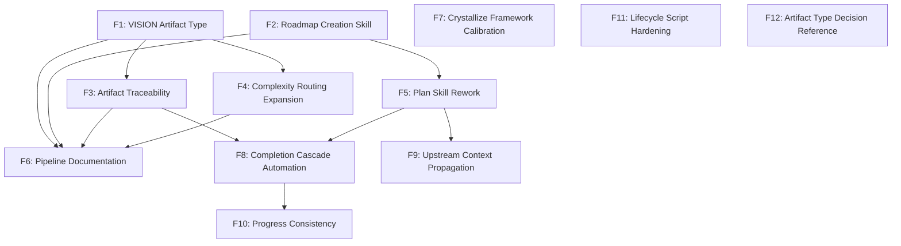

# ROADMAP: Strategic Pipeline Completion

## Status

Done

**Closed out as superseded -- not a clean "all features shipped"
completion.** This roadmap is retained for audit trail only. It is no
longer a live plan -- do not pick work from it without re-validating
against the current pipeline first. The roadmap schema has no dedicated
"Superseded" or "Dropped" state (that lifecycle gap is itself one of the
open items this roadmap named, Feature 11), so `Done` is used as the
terminal status; the paragraphs below record what actually shipped
versus what was absorbed elsewhere or left open.

It has been overtaken by the shirabe pipeline's own evolution. When this
roadmap was written the pipeline ran VISION -> Roadmap -> PRD -> Design
-> Plan and the open work was "finish the Stage 1 inception layer." That
pipeline has since been extended well past what this roadmap set out to
complete. The current chain is VISION -> STRATEGY -> ROADMAP -> BRIEF ->
PRD -> DESIGN -> PLAN (documented in `CLAUDE.md`), and the skills that
realize it already ship under `skills/` -- including `strategy`,
`charter` (the strategic-chain parent), `scope` (the tactical-chain
parent), `brief`, `comp`, `execute`, and `inflight`, none of which
existed in this roadmap's model. The two parent skills (`charter`,
`scope`) and the STRATEGY and BRIEF artifact types are the substantive
additions that this roadmap's three-diamond model never anticipated.

Reconciliation with reality:

- Features 1-6 shipped as planned (the VISION and Roadmap skills, the
  traceability chain, complexity routing, the plan rework, and the
  pipeline reference doc all exist under `skills/` and `references/`).
- The cross-cutting work Features 1-6 seeded also landed: the completion
  cascade (Feature 8) and lifecycle-script hardening (Feature 11) shipped
  through the /work-on cascade and the transition-script consolidation.
  Their "In Progress" / "Not Started" rows in the tables below therefore
  understate reality and should be read as historical, not current.
- One item never got built and still has standalone value if the need
  recurs: **Feature 12 (Artifact Type Decision Reference,
  `references/artifact-type-signals.md`)** -- the shared observable-signal
  reference that /plan, /explore, and /triage could each consume instead
  of carrying their own ad-hoc artifact-type logic. This file does not
  exist. Feature 7 (crystallize calibration) is also still open but
  lower-value. Everything else here is either shipped or absorbed into
  the current pipeline.

## Theme

The artifact-centric workflow redesign (Features 1-7 in the private plugin)
built a solid pipeline from discovery through delivery. But it starts at
the PRD level -- it assumes you already know what project you're building.
There's no structured path from "I have a project idea" to "I have
requirements I can design against."

This roadmap fills that gap and closes cross-cutting issues that emerged
during the pipeline mapping. The work follows a three-diamond model where
the pipeline groups naturally into Explore/Crystallize, Specify/Scope, and
Implement/Ship. Each diamond is a diverge-converge pair. Five named
transitions connect them: Advance, Recycle, Skip, Hold, Kill.

### Pipeline Model

```
Diamond 1: EXPLORE / CRYSTALLIZE
  /explore (diverge) -> crystallize (converge)
  
Diamond 2: SPECIFY / SCOPE  
  /prd, /design (diverge) -> /plan (converge)
  
Diamond 3: IMPLEMENT / SHIP
  /work-on, /implement (diverge) -> /release (converge)
```

Five complexity levels route work through the pipeline:

| Level | Entry Point | Diamonds Used |
|-------|------------|---------------|
| Trivial | /work-on (no issue) | Diamond 3 only |
| Simple | /work-on <issue> | Diamond 3 only |
| Medium | /design -> /plan | Diamonds 2-3 |
| Complex | /explore -> full pipeline | All three |
| Strategic | VISION -> Roadmap -> per-feature | All three, with branching |

## Cross-Cutting Decisions

**Each document type gets its own skill with a creation workflow.** Every
artifact type (VISION, Roadmap, etc.) should have a dedicated skill that
owns format spec, creation workflow, lifecycle management, and validation
-- all in one place. /explore hands off to these skills via auto-continue
(same pattern as /prd and /design). Skills also work standalone when
someone already knows what they want. This replaces the earlier approach
of reference-only skills with inline /explore production.

**Every skill includes a transition script for lifecycle management.**
Each skill's `scripts/transition-status.sh` validates preconditions,
updates status in frontmatter and body, and moves files between
directories based on status. The design doc skill established this
pattern; new skills follow it by convention.

**Draft artifacts must not merge to main.** Before any PR merges,
all artifacts it introduces must have their status validated: ROADMAPs
must be Active (not Draft), DESIGNs must be at least Planned, PLANs
must be Active or deleted. Each doc-type skill's transition script
should enforce this as a precondition — or CI should validate it.
This prevents the mistake of shipping a Draft roadmap to main.

**Completion cascades are a principle, not yet enforced.** When work on
an artifact completes, related artifacts need status updates (PLAN docs
deleted, DESIGNs to Current, ROADMAPs update progress). Each skill
should handle its own completion side. The enforcement mechanism is
TBD — currently manual.

## Features

### Feature 1: VISION Artifact Type

Add VISION as a supported artifact type in the crystallize framework.
VISION captures project thesis, audience, value proposition, org fit,
success criteria, and non-goals -- the pre-PRD layer that justifies a
project's existence.

**Dependencies:** None
**Status:** Done
**Downstream:** DESIGN-vision-artifact-type.md (Current)

Key decisions from exploration:
- Template: thesis, audience, value proposition, org fit, success criteria,
  non-goals, open questions, downstream artifacts
- Lifecycle: Draft -> Accepted -> Active -> Sunset (stays Active, never
  "completes")
- Naming: `VISION-<name>.md` in `docs/visions/`
- Frontmatter: status, thesis (summary), scope (org/project), upstream
- Gated to strategic scope; tactical scope is a hard anti-signal
- Dedicated /vision skill with creation workflow (per cross-cutting decision)
- /explore hands off via auto-continue; also works standalone
- Works at org-level and project-level via scope field
- Visibility controls content richness, not availability

Crystallize integration:
- Signal/anti-signal table with project-existence as the key discriminator
- Tiebreaker rules vs PRD, Roadmap, No Artifact, Rejection Record
- Disambiguation: when exploration surfaces both thesis and requirements,
  VISION comes first (strategic justification before requirements)

### Feature 2: Roadmap Creation Skill

Add a dedicated `/roadmap` creation skill for Roadmap artifacts (per
cross-cutting decision: each doc type gets its own skill). Currently the
roadmap skill is format-reference-only -- it defines structure and
lifecycle but doesn't guide creation. The new skill owns format spec,
creation workflow, lifecycle management, and validation, following the
same pattern as /prd, /design, and /vision.

**Dependencies:** None (independent of Feature 1)
**Status:** Done
**Downstream:** DESIGN-roadmap-creation-skill.md (Current)

/explore hands off to /roadmap via auto-continue. /roadmap also works
standalone. The private plugin's roadmap reference defines the format;
this feature wraps it in a full creation workflow.

### Feature 3: Artifact Traceability

Close the traceability chain from VISION to PR by adding `upstream`
frontmatter fields to Roadmap and Design Doc schemas, and establishing
cross-repo reference conventions.

**Dependencies:** Feature 1 (VISION type must exist for full chain)
**Status:** Done
**Downstream:** PRD-artifact-traceability.md (Done), DESIGN-artifact-traceability.md (Current)

Three changes delivered:
1. Added `upstream` to Roadmap frontmatter (optional, points to VISION)
2. Extended /roadmap and /prd creation workflows to set `upstream` at
   creation time via `--upstream` flag (Design Doc already had this)
3. Cross-repo reference convention: `owner/repo:path` documented in
   shared `references/cross-repo-references.md` (dropped `private:`
   prefix per research — redundant with visibility governance)

### Feature 4: Complexity Routing Expansion

Expand the /explore complexity routing table from 3 levels
(Simple/Medium/Complex) to 5 levels (adding Trivial and Strategic). Each
level maps to a specific command path through the pipeline.

**Dependencies:** Feature 1 (Strategic level needs VISION to route to)
**Status:** Done
**Downstream:** PRD-complexity-routing-expansion.md (Done), DESIGN-complexity-routing-expansion.md (Current)

Changes delivered:
- Expanded Complexity-Based Routing table to 5 levels with observable signals
- Added top-down detection algorithm with tiebreaker rules at all 4 boundaries
- Updated Artifact Type Routing Guide and Quick Decision Table for consistency
- Fixed Phase 4 stale type count (5 -> 10 supported types)

### Feature 5: Plan Skill Rework

Rework /plan to enrich roadmaps directly (no separate PLAN doc when input
is a roadmap) and establish consistent "planned" semantics across all
upstream artifact types. When /plan consumes a roadmap, it adds the issues
table and dependency graph into the roadmap itself, creates a milestone and
per-feature issues, and transitions the roadmap to Active. Also formalizes
the completion cascade: what happens to upstream artifacts when all planned
work finishes.

**Dependencies:** Feature 2 (the /roadmap skill must exist for /plan to
enrich)
**Status:** Done
**Downstream:** PRD-plan-skill-rework.md (Done), DESIGN-plan-skill-rework.md (Current)

### Feature 6: Pipeline Documentation

Document the three-diamond model, the five complexity levels, the full
transition graph, and the traceability chain as a reference document. This
gives the pipeline a conceptual home that individual skill docs can
reference.

**Dependencies:** Features 1-4 (documents the completed pipeline; F5 is
deferred and not a prerequisite for docs)
**Status:** Done
**Downstream:** PRD-pipeline-documentation.md (Done)

Delivered as `references/pipeline-model.md` -- a single reference document
covering the three-diamond model, five complexity levels, named transitions,
artifact lifecycle states, traceability chain, and skill routing table.

### Feature 7: Crystallize Framework Calibration

Recalibrate the crystallize framework's scoring to better handle work
where the answer is known but undocumented. Currently the framework biases
toward "what's unknown" (design docs, spikes) over "what's known but not
written down" (PRDs, VISIONs). It pushes users toward answering open
questions before capturing agreed-upon decisions, when the right order is
often the reverse: document what's settled, then investigate what's open.

**Dependencies:** None (can be done independently, but benefits from F4
routing improvements being in place)
**Status:** Not Started
**Downstream:** Needs PRD

Changes:
- Review crystallize signal/anti-signal tables for documentation-bias
- Add signals that detect "known but undocumented" scenarios
- Adjust scoring so PRD and VISION score higher when requirements or
  thesis are verbally agreed but not written down
- Consider adding a "document first" principle to the framework

### Feature 8: Completion Cascade Automation

Formalize the completion cascade (delete PLAN, move DESIGN to Current,
update PRD to Done, update ROADMAP progress) as a skill-driven step
instead of manual memory. Surfaced during F5 review: the cascade has
blocking design questions around milestone completion detection (who
triggers it after the last issue closes?), feature identification (how
does the cascade know which roadmap feature completed?), and the
"dropped" path (what status do abandoned PRDs, designs, and roadmap
features get?).

The cascade should also compress completed PRDs and design docs.
These artifacts accumulate implementation scaffolding (phases,
acceptance criteria, boilerplate) that's useful during active work but
becomes dead weight once the work ships. Compression preserves the
durable context -- decisions, trade-offs, rationale -- while removing
the parts that are now captured in code or git history.

**Dependencies:** Feature 5 (cascade needs roadmap enrichment to be in
place), Feature 3 (cascade reads upstream chain from frontmatter fields)
**Status:** In Progress
**Downstream:** DESIGN-work-on-koto-unification.md (Current)

Changes:
- Define the cascade trigger mechanism (per-issue vs milestone-level)
- Specify how to identify which roadmap feature completed
- Add "Dropped" handling for PRDs, designs, and roadmap features
- Compress completed PRDs and design docs as part of the cascade
- Implement as a skill step in /implement Phase 2 or /work-on finalization

### Feature 9: Upstream Context Propagation

Close the gap where /prd doesn't read upstream from plan issue context.
When /prd is invoked from a needs-prd plan issue, it should read the
`Roadmap:` line from the issue body to set the upstream field
automatically, instead of requiring `--upstream` to be passed manually.

**Dependencies:** Feature 5 (plan issues from roadmap mode must exist)
**Status:** Not Started
**Downstream:** Needs PRD

Changes:
- Add issue-context detection to /prd's Context Resolution
- Define how /prd knows it's in issue context (invocation mechanism)
- Read `Roadmap:` line from issue body as upstream path

### Feature 10: Progress Consistency

When a planned issue is closed, the upstream artifact's tracking section
should reflect it. For roadmaps: Progress section feature status. For
PLAN docs: Issues table strikethrough. The principle is documented but
not enforced; the enforcement mechanism (hook, /work-on completion step,
CI check) needs its own design.

**Dependencies:** Feature 8 (shares the milestone-detection problem)
**Status:** Not Started
**Downstream:** Needs PRD

Changes:
- Define the enforcement mechanism for progress propagation
- Implement per-issue progress updates on issue closure
- Handle partial completion (some issues done, others pending)

### Feature 11: Lifecycle Script Hardening

Three gaps surfaced during F5 review: PRDs have no transition script
(the only artifact type with 3+ states that lacks one), the design doc
transition script has no `validate_transition()` function (unlike vision
and roadmap scripts), and no artifact type has a "Dropped" lifecycle
state for abandoned work.

**Dependencies:** None (independent hardening)
**Status:** Not Started
**Downstream:** Needs PRD

Changes:
- Add `skills/prd/scripts/transition-status.sh` with Draft -> Accepted
  -> Done transitions and Open Questions precondition for acceptance
- Add `validate_transition()` to design doc transition script
- Consider "Dropped" state or convention for abandoned PRDs, designs,
  and roadmap features
- Consider extracting shared transition-script functions into a common
  library (three scripts share ~70% identical code)

### Feature 12: Artifact Type Decision Reference

Create a shared reference document (`references/artifact-type-signals.md`)
that defines observable signals for deciding what artifact type a piece of
work needs next. Multiple skills currently make this decision with ad-hoc
logic: /plan assigns needs-* labels in Phase 1, /explore scores artifact
types in its crystallize framework, /triage decides what an untriaged
issue needs. Each uses different heuristics for the same underlying
question.

A shared reference gives all skills a consistent decision pattern with
clear discriminators between "requirements need capturing" (PRD),
"approach needs deciding" (design doc), "feasibility needs testing"
(spike), and "single choice needs making" (decision record).

**Dependencies:** None (independent, but benefits from F4's signal-based
routing pattern)
**Status:** Not Started
**Downstream:** Needs PRD

Changes:
- Create `references/artifact-type-signals.md` with observable signals
  and discriminators for each artifact type
- Update /plan Phase 1 to reference the shared document for needs-* labels
- Update /explore crystallize framework to reference or delegate to it
- Update /triage to use the same decision pattern

## Sequencing Rationale

Features 1 and 2 are independent and can proceed in parallel. Both fill
Stage 1 gaps -- VISION for project inception, Roadmap creation for
multi-feature sequencing.

Feature 3 (Traceability) depends on Feature 1 because the full chain
requires VISION as the top node. The Roadmap and Design Doc schema changes
could ship earlier, but the cross-repo convention needs VISION to be
meaningful.

Feature 4 (Routing) depends on Feature 1 because the Strategic complexity
level routes to VISION. The Trivial level could ship independently.

Feature 5 (Plan Skill Rework) depends on Feature 2 because /plan needs
the /roadmap skill to exist before it can enrich roadmaps directly.
F2 is done; F5 is now unblocked. Scope was trimmed during review to
focus on roadmap enrichment only (R1-R3). Cascade, upstream propagation,
progress consistency, and lifecycle hardening became separate features.

Feature 6 (Docs) depends on Features 1-4 because it documents the
completed pipeline.

Feature 7 (Crystallize Calibration) is independent but benefits from F4's
routing improvements being in place.

Feature 8 (Completion Cascade) depends on F5 (roadmap enrichment must be
in place) and F3 (cascade reads upstream chain from frontmatter). Has
blocking design questions around milestone detection, feature
identification, and dropped-work handling surfaced during F5 review.

Feature 9 (Upstream Context Propagation) depends on F5 (plan issues from
roadmap mode must exist).

Feature 10 (Progress Consistency) depends on F8 (shares the
milestone-detection problem).

Feature 11 (Lifecycle Script Hardening) is independent. Can ship any
time.

Feature 12 (Artifact Type Decision Reference) is independent. Benefits
from F4's signal-based routing pattern. Once shipped, F5's /plan Phase 1,
F7's crystallize calibration, and /triage can all consume it.

```
Feature 1 (VISION) ----+---> Feature 3 (Traceability)
                       |
Feature 2 (Roadmap) ---+---> Feature 4 (Routing)
                       |
                       +---> Feature 5 (Plan Rework)
                       |         |
                       |         +---> Feature 8 (Cascade) ---> Feature 10 (Progress)
                       |         |
                       |         +---> Feature 9 (Upstream Propagation)
                       |
                       +---> Feature 6 (Docs)

Feature 7 (Crystallize Calibration) --- independent
Feature 11 (Lifecycle Hardening) --- independent
Feature 12 (Artifact Type Decision Reference) --- independent
```

## Progress

The per-feature lifecycle state and any downstream artifact references
live in the Features section above. The canonical Implementation
Issues table below carries the current Status for each feature; this
section is kept as the roadmap-format-required narrative slot for
ad-hoc progress notes and is currently empty.

## Implementation Issues

| Feature | Issues | Dependencies | Status |
|---------|--------|--------------|--------|
| Feature 1: VISION Artifact Type | None | None | Done |
| _DESIGN-vision-artifact-type.md (Current). Adds the VISION artifact type as the strategic root of the pipeline._ | | | |
| Feature 2: Roadmap Creation Skill | None | None | Done |
| _PRD-roadmap-skill.md (Done), DESIGN-roadmap-creation-skill.md (Current). Adds the /roadmap skill that sequences features into a coordinated initiative._ | | | |
| Feature 3: Artifact Traceability | None | Feature 1: VISION Artifact Type | Done |
| _PRD-artifact-traceability.md (Done), DESIGN-artifact-traceability.md (Current). Adds upstream frontmatter linking artifacts up the chain._ | | | |
| Feature 4: Complexity Routing Expansion | None | Feature 1: VISION Artifact Type | Done |
| _PRD-complexity-routing-expansion.md (Done), DESIGN-complexity-routing-expansion.md (Current). Adds the Strategic complexity level so a VISION can route work through the pipeline._ | | | |
| Feature 5: Plan Skill Rework | None | Feature 2: Roadmap Creation Skill | Done |
| _PRD-plan-skill-rework.md (Done), DESIGN-plan-skill-rework.md (Current). Reworks /plan so a roadmap can drive decomposition without a special re-entry mode._ | | | |
| Feature 6: Pipeline Documentation | None | Feature 1: VISION Artifact Type, Feature 2: Roadmap Creation Skill, Feature 3: Artifact Traceability, Feature 4: Complexity Routing Expansion | Done |
| _PRD-pipeline-documentation.md (Done). Documents the completed pipeline end-to-end._ | | | |
| Feature 7: Crystallize Framework Calibration | None | None | Not Started |
| _Independent calibration work that benefits from Feature 4 but does not require it._ | | | |
| Feature 8: Completion Cascade Automation | None | Feature 5: Plan Skill Rework | In Progress |
| _DESIGN-work-on-koto-unification.md (Current). Automates the completion cascade so the /plan output flows into /work-on cleanly._ | | | |
| Feature 9: Upstream Context Propagation | None | Feature 5: Plan Skill Rework | Not Started |
| _Propagates upstream context across the plan-to-implementation seam. Depends on the rewored /plan output shape._ | | | |
| Feature 10: Progress Consistency | None | Feature 8: Completion Cascade Automation | Not Started |
| _Shares the milestone-detection problem the cascade automation solves; lands after it._ | | | |
| Feature 11: Lifecycle Script Hardening | None | None | Not Started |
| _Hardens the lifecycle scripts independently of the rest of the roadmap._ | | | |
| Feature 12: Artifact Type Decision Reference | None | None | Not Started |
| _Reference work for the artifact-type decision. Benefits from Feature 4's signal-based routing but lands independently._ | | | |

## Dependency Graph



Features 7, 11, and 12 are independent (no upstream feature dependency)
and render as isolated nodes.
