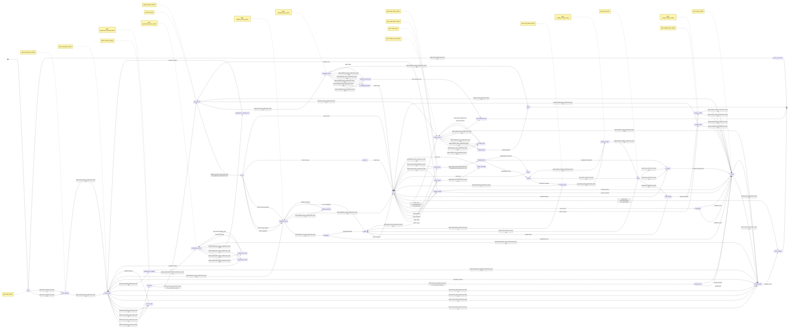

```mermaid
stateDiagram-v2
    direction LR
    [*] --> start
    ask_up --> wait : asked: sent
    classify_report --> verify : classification: done
    classify_report --> surface : classification: blocked
    classify_report --> rebrief : classification: needs_fix
    decision_apply --> record : change: reversal
    decision_apply --> record : change: deferral
    decision_apply --> pick_facts : change: none
    deferral_dispose --> dispatch_check : rewritten: rewritten
    dispatch --> record : dispatched: sent
    dispatch --> failure : dispatched: failed
    dispatch_check --> dispatch : gates.dispatch_check_verdict.exit_code: 40
    dispatch_check --> deferral_dispose : gates.dispatch_check_verdict.exit_code: 41
    dispatch_check --> record_find : gates.dispatch_check_verdict.exit_code: 42
    dispatch_check --> wait : gates.dispatch_check_verdict.exit_code: 43
    failure --> dispatch_check : move: redispatch
    failure --> wait : move: escalate
    land --> land_merge : gates.land_verdict.exit_code: 80
    land --> surface : gates.land_verdict.exit_code: 81
    land --> surface : gates.land_verdict.exit_code: 82
    land --> verify : gates.land_verdict.exit_code: 53
    land --> failure : gates.land_verdict.exit_code: 84
    land_merge --> merge_confirm : merge: attempted
    land_merge --> failure : merge: failed
    merge_confirm --> record : gates.merge_confirm_verdict.exit_code: 90
    merge_confirm --> record : gates.merge_confirm_verdict.exit_code: 91
    merged_facts --> record : gates.merged_facts_verdict.exit_code: 90
    merged_facts --> record : gates.merged_facts_verdict.exit_code: 91
    merged_facts --> wait : gates.merged_facts_verdict.exit_code: 92
    pick --> dispatch_check : choice: dispatch
    pick --> dispatch_check : choice: scope_ahead
    pick --> dispatch_check : choice: send_execution
    pick --> ask_up : choice: ask_up
    pick --> wait : choice: hold
    pick_facts --> pick : gates.pick_facts_verdict.exit_code: 30, gates.pick_input.exists: true
    pick_facts --> roadmap_close : gates.pick_facts_verdict.exit_code: 31
    pick_facts --> rotation_close : gates.pick_facts_verdict.exit_code: 32
    posture_ask --> record : merge: held
    posture_ask --> record : merge: reserved
    predecessor_close --> predecessor_step : gates.predecessor_close_verdict.exit_code: 120
    predecessor_close --> predecessor_step : gates.predecessor_close_verdict.exit_code: 122
    predecessor_close --> predecessor_done : gates.predecessor_close_verdict.exit_code: 90
    predecessor_close --> predecessor_handed_over : gates.predecessor_close_verdict.exit_code: 124
    predecessor_close --> record_conflict : gates.predecessor_close_verdict.exit_code: 125
    predecessor_done --> record_find : recheck: recheck
    predecessor_handed_over --> record_find : recheck: recheck
    predecessor_handoff --> predecessor_close : gates.predecessor_handoff_verdict.exit_code: 110
    predecessor_handoff --> record_conflict : gates.predecessor_handoff_verdict.exit_code: 111
    predecessor_step --> predecessor_close : step_result: done
    predecessor_step --> predecessor_close : step_result: handed_over
    quiet_check --> wait : gates.quiet_check_verdict.exit_code: 100
    quiet_check --> status_message : gates.quiet_check_verdict.exit_code: 101
    quiet_check --> failure : gates.quiet_check_verdict.exit_code: 102
    rebrief --> wait : sent: sent
    reconcile --> pick_facts : gates.reconcile_posture.exit_code: 25, reconciled: reported
    reconcile --> posture_ask : gates.reconcile_posture.exit_code: 26, reconciled: reported
    record --> pick_facts : gates.record_verdict.exit_code: 50
    record --> record_conflict : gates.record_verdict.exit_code: 52
    record --> record_conflict : gates.record_verdict.exit_code: 54
    record_conflict --> record_find : resolution: recheck
    record_conflict --> done_stopped : resolution: stop
    record_find --> reconcile : gates.record_find_verdict.exit_code: 10
    record_find --> record_open : gates.record_find_verdict.exit_code: 11
    record_find --> record_open : gates.record_find_verdict.exit_code: 12
    record_find --> record_open : gates.record_find_verdict.exit_code: 13
    record_find --> record_conflict : gates.record_find_verdict.exit_code: 14
    record_find --> record_conflict : gates.record_find_verdict.exit_code: 15
    record_find --> record_conflict : gates.record_find_verdict.exit_code: 16
    record_find --> record_conflict : gates.record_find_verdict.exit_code: 17
    record_find --> predecessor_handoff : gates.record_find_verdict.exit_code: 18
    record_open --> record_find : opened: opened
    report_facts --> classify_report : gates.report_facts_verdict.exit_code: 60, gates.report_input.exists: true
    report_facts --> wait : gates.report_facts_verdict.exit_code: 61
    report_facts --> wait : gates.report_facts_verdict.exit_code: 62
    roadmap_blocked --> wait : noted: noted
    roadmap_close --> roadmap_close_step : gates.roadmap_close_verdict.exit_code: 130
    roadmap_close --> roadmap_blocked : gates.roadmap_close_verdict.exit_code: 131
    roadmap_close --> roadmap_blocked : gates.roadmap_close_verdict.exit_code: 132
    roadmap_close --> roadmap_blocked : gates.roadmap_close_verdict.exit_code: 133
    roadmap_close --> roadmap_blocked : gates.roadmap_close_verdict.exit_code: 134
    roadmap_close --> done : gates.roadmap_close_verdict.exit_code: 135
    roadmap_close_step --> roadmap_close : step: closed
    roadmap_close_step --> done_handed_over : step: handed_over
    rotation_close --> rotation_step : gates.rotation_close_verdict.exit_code: 120
    rotation_close --> rotation_step : gates.rotation_close_verdict.exit_code: 121
    rotation_close --> rotation_step : gates.rotation_close_verdict.exit_code: 122
    rotation_close --> rotation_done : gates.rotation_close_verdict.exit_code: 90
    rotation_close --> done_handed_over : gates.rotation_close_verdict.exit_code: 124
    rotation_close --> record_conflict : gates.rotation_close_verdict.exit_code: 125
    rotation_done --> done : deleted: deleted
    rotation_step --> rotation_close : step_result: done
    rotation_step --> rotation_close : step_result: handed_over
    start --> start_posture : gates.start_verdict.exit_code: 20
    start --> start_posture : gates.start_verdict.exit_code: 21
    start --> done_not_active : gates.start_verdict.exit_code: 22
    start_posture --> record_find : gates.start_posture_verdict.exit_code: 25
    start_posture --> record_find : gates.start_posture_verdict.exit_code: 26
    status_message --> wait : sent: sent
    surface --> record : surfaced: merge_table
    surface --> wait : surfaced: blocker
    teardown --> record : teardown: done
    teardown --> record : teardown: kept
    verified_confirm --> land : gates.verified_confirm_verdict.exit_code: 50
    verified_confirm --> verify : gates.verified_confirm_verdict.exit_code: 53
    verify --> verify_board : predicted: recorded
    verify_board --> verified_confirm : gates.verify_board_verdict.exit_code: 70
    verify_board --> failure : gates.verify_board_verdict.exit_code: 71
    verify_board --> wait : gates.verify_board_verdict.exit_code: 72
    wait --> report_facts : event: report
    wait --> quiet_check : event: quiet
    wait --> decision_apply : event: decision
    wait --> decision_apply : event: deferral
    wait --> merged_facts : event: merged
    wait --> teardown : event: retire
    wait --> rotation_close : event: end, vars.DISCIPLINE: {"is_set":true}
    wait --> done_stopped : event: end, vars.DISCIPLINE: {"is_set":false}
    done --> [*]
    done_handed_over --> [*]
    done_not_active --> [*]
    done_stopped --> [*]
    note left of dispatch_check
        gate: dispatch_check_verdict
    end note
    note left of land
        gate: land_verdict
    end note
    note left of merge_confirm
        gate: merge_confirm_verdict
    end note
    note left of merged_facts
        gate: merged_facts_verdict
    end note
    note left of pick_facts
        gate: pick_facts_verdict
    end note
    note left of pick_facts
        gate: pick_input
    end note
    note left of predecessor_close
        gate: predecessor_close_verdict
    end note
    note left of predecessor_handoff
        gate: predecessor_handoff_verdict
    end note
    note left of quiet_check
        gate: quiet_check_verdict
    end note
    note left of reconcile
        gate: reconcile_posture
    end note
    note left of record
        gate: record_verdict
    end note
    note left of record_find
        gate: record_find_verdict
    end note
    note left of report_facts
        gate: report_facts_verdict
    end note
    note left of report_facts
        gate: report_input
    end note
    note left of roadmap_close
        gate: roadmap_close_verdict
    end note
    note left of rotation_close
        gate: rotation_close_verdict
    end note
    note left of start
        gate: start_verdict
    end note
    note left of start_posture
        gate: start_posture_verdict
    end note
    note left of verified_confirm
        gate: verified_confirm_verdict
    end note
    note left of verify_board
        gate: verify_board_verdict
    end note
```
