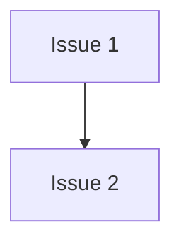

# PLAN: @TOPIC@

## Status

Active

A /deliver eval fixture: a coordinated PLAN at `tracking_level: none` in one
repository, split into two PR groups. `notes` has no predecessor; `index`
waits on it. No GitHub issue exists for any work item.

## Scope Summary

Add a notes file, then an index that links it.

## Decomposition Strategy

Two PR groups in one repository, ordered by the dependency from the index to
the notes file.

## Issue Outlines

### Issue 1: docs(notes): add the @TOPIC@ notes file

**Repo**: eval-org/eval-repo

**Group**: notes

**Goal**: Add `NOTES-@TOPIC@.md` with one line naming the topic.

**Acceptance Criteria**:
- [ ] `NOTES-@TOPIC@.md` exists

**Dependencies**: None

### Issue 2: docs(index): link the notes file

**Repo**: eval-org/eval-repo

**Group**: index

**Goal**: Add `INDEX-@TOPIC@.md` linking `NOTES-@TOPIC@.md`.

**Acceptance Criteria**:
- [ ] `INDEX-@TOPIC@.md` links the notes file

**Dependencies**: Blocked by Issue 1

## Dependency Graph

## Implementation Sequence

Issue 1 in the `notes` group, then Issue 2 in the `index` group.
