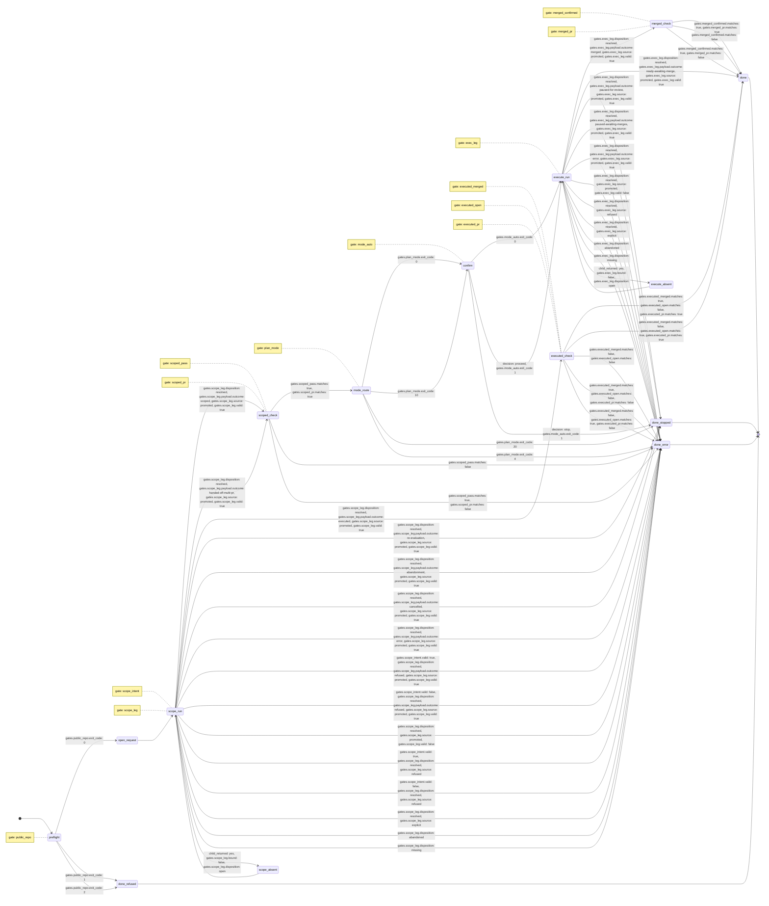

```mermaid
stateDiagram-v2
    direction LR
    [*] --> preflight
    confirm --> execute_run : gates.mode_auto.exit_code: 0
    confirm --> execute_run : decision: proceed, gates.mode_auto.exit_code: 1
    confirm --> done_stopped : decision: stop, gates.mode_auto.exit_code: 1
    execute_absent --> execute_run
    execute_run --> merged_check : gates.exec_leg.disposition: resolved, gates.exec_leg.payload.outcome: merged, gates.exec_leg.source: promoted, gates.exec_leg.valid: true
    execute_run --> done : gates.exec_leg.disposition: resolved, gates.exec_leg.payload.outcome: ready-awaiting-merge, gates.exec_leg.source: promoted, gates.exec_leg.valid: true
    execute_run --> done_stopped : gates.exec_leg.disposition: resolved, gates.exec_leg.payload.outcome: paused-for-review, gates.exec_leg.source: promoted, gates.exec_leg.valid: true
    execute_run --> done_stopped : gates.exec_leg.disposition: resolved, gates.exec_leg.payload.outcome: paused-awaiting-merges, gates.exec_leg.source: promoted, gates.exec_leg.valid: true
    execute_run --> done_error : gates.exec_leg.disposition: resolved, gates.exec_leg.payload.outcome: error, gates.exec_leg.source: promoted, gates.exec_leg.valid: true
    execute_run --> done_error : gates.exec_leg.disposition: resolved, gates.exec_leg.source: promoted, gates.exec_leg.valid: false
    execute_run --> done_error : gates.exec_leg.disposition: resolved, gates.exec_leg.source: refused
    execute_run --> done_error : gates.exec_leg.disposition: resolved, gates.exec_leg.source: explicit
    execute_run --> done_error : gates.exec_leg.disposition: abandoned
    execute_run --> done_error : gates.exec_leg.disposition: missing
    execute_run --> execute_absent : child_returned: yes, gates.exec_leg.bound: false, gates.exec_leg.disposition: open
    executed_check --> done : gates.executed_merged.matches: true, gates.executed_open.matches: false, gates.executed_pr.matches: true
    executed_check --> done : gates.executed_merged.matches: false, gates.executed_open.matches: true, gates.executed_pr.matches: true
    executed_check --> done_error : gates.executed_merged.matches: false, gates.executed_open.matches: false
    executed_check --> done_error : gates.executed_merged.matches: true, gates.executed_open.matches: false, gates.executed_pr.matches: false
    executed_check --> done_error : gates.executed_merged.matches: false, gates.executed_open.matches: true, gates.executed_pr.matches: false
    merged_check --> done : gates.merged_confirmed.matches: true, gates.merged_pr.matches: true
    merged_check --> done : gates.merged_confirmed.matches: false
    merged_check --> done : gates.merged_confirmed.matches: true, gates.merged_pr.matches: false
    mode_route --> confirm : gates.plan_mode.exit_code: 0
    mode_route --> confirm : gates.plan_mode.exit_code: 10
    mode_route --> done_stopped : gates.plan_mode.exit_code: 20
    mode_route --> done_error : gates.plan_mode.exit_code: 4
    open_request --> scope_run
    preflight --> open_request : gates.public_repo.exit_code: 0
    preflight --> done_refused : gates.public_repo.exit_code: 1
    preflight --> done_refused : gates.public_repo.exit_code: 2
    scope_absent --> scope_run
    scope_run --> scoped_check : gates.scope_leg.disposition: resolved, gates.scope_leg.payload.outcome: scoped, gates.scope_leg.source: promoted, gates.scope_leg.valid: true
    scope_run --> scoped_check : gates.scope_leg.disposition: resolved, gates.scope_leg.payload.outcome: handed-off-multi-pr, gates.scope_leg.source: promoted, gates.scope_leg.valid: true
    scope_run --> executed_check : gates.scope_leg.disposition: resolved, gates.scope_leg.payload.outcome: executed, gates.scope_leg.source: promoted, gates.scope_leg.valid: true
    scope_run --> done_stopped : gates.scope_leg.disposition: resolved, gates.scope_leg.payload.outcome: re-evaluation, gates.scope_leg.source: promoted, gates.scope_leg.valid: true
    scope_run --> done_stopped : gates.scope_leg.disposition: resolved, gates.scope_leg.payload.outcome: abandonment, gates.scope_leg.source: promoted, gates.scope_leg.valid: true
    scope_run --> done_stopped : gates.scope_leg.disposition: resolved, gates.scope_leg.payload.outcome: cancelled, gates.scope_leg.source: promoted, gates.scope_leg.valid: true
    scope_run --> done_error : gates.scope_leg.disposition: resolved, gates.scope_leg.payload.outcome: error, gates.scope_leg.source: promoted, gates.scope_leg.valid: true
    scope_run --> done_error : gates.scope_intent.valid: true, gates.scope_leg.disposition: resolved, gates.scope_leg.payload.outcome: refused, gates.scope_leg.source: promoted, gates.scope_leg.valid: true
    scope_run --> done_error : gates.scope_intent.valid: false, gates.scope_leg.disposition: resolved, gates.scope_leg.payload.outcome: refused, gates.scope_leg.source: promoted, gates.scope_leg.valid: true
    scope_run --> done_error : gates.scope_leg.disposition: resolved, gates.scope_leg.source: promoted, gates.scope_leg.valid: false
    scope_run --> done_error : gates.scope_intent.valid: true, gates.scope_leg.disposition: resolved, gates.scope_leg.source: refused
    scope_run --> done_error : gates.scope_intent.valid: false, gates.scope_leg.disposition: resolved, gates.scope_leg.source: refused
    scope_run --> done_error : gates.scope_leg.disposition: resolved, gates.scope_leg.source: explicit
    scope_run --> done_error : gates.scope_leg.disposition: abandoned
    scope_run --> done_error : gates.scope_leg.disposition: missing
    scope_run --> scope_absent : child_returned: yes, gates.scope_leg.bound: false, gates.scope_leg.disposition: open
    scoped_check --> mode_route : gates.scoped_pass.matches: true, gates.scoped_pr.matches: true
    scoped_check --> done_error : gates.scoped_pass.matches: false
    scoped_check --> done_error : gates.scoped_pass.matches: true, gates.scoped_pr.matches: false
    done --> [*]
    done_error --> [*]
    done_refused --> [*]
    done_stopped --> [*]
    note left of confirm
        gate: mode_auto
    end note
    note left of execute_run
        gate: exec_leg
    end note
    note left of executed_check
        gate: executed_merged
    end note
    note left of executed_check
        gate: executed_open
    end note
    note left of executed_check
        gate: executed_pr
    end note
    note left of merged_check
        gate: merged_confirmed
    end note
    note left of merged_check
        gate: merged_pr
    end note
    note left of mode_route
        gate: plan_mode
    end note
    note left of preflight
        gate: public_repo
    end note
    note left of scope_run
        gate: scope_intent
    end note
    note left of scope_run
        gate: scope_leg
    end note
    note left of scoped_check
        gate: scoped_pass
    end note
    note left of scoped_check
        gate: scoped_pr
    end note
```
