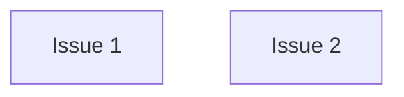

# PLAN: coord-multi-test

## Status

Active

An eval fixture: a coordinated PLAN at `tracking_level: none` whose two work
items sit in two repositories, each with `Group: default`, so each repository
is one PR node. Neither waits on the other.

## Scope Summary

Add a parser to the library repository and a status page to the application
repository.

## Decomposition Strategy

One PR node per repository; the two are independent.

## Issue Outlines

### Issue 1: feat(repo): add the parser

**Repo**: eval-org/eval-repo

**Group**: default

**Goal**: Add `parse()`.

**Acceptance Criteria**:
- [ ] `parse()` accepts the documented input

**Dependencies**: None

### Issue 2: feat(app): add the status page

**Repo**: eval-org/eval-app

**Group**: default

**Goal**: Add a status page.

**Acceptance Criteria**:
- [ ] the status page renders

**Dependencies**: None

## Dependency Graph

## Implementation Sequence

Issue 1 and Issue 2 in either order.
