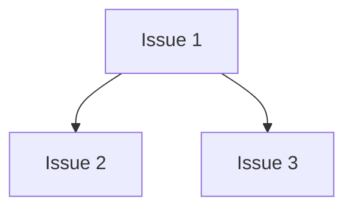

# PLAN: coord-outline-test

## Status

Active

An eval fixture: a coordinated PLAN at `tracking_level: none` whose work sits
in one repository, split into two PR groups. `core` has no predecessor; `cli`
waits on it. No GitHub issue exists for any work item.

## Scope Summary

Add a parser to the core library, then a CLI command that uses it.

## Decomposition Strategy

Two PR groups in one repository, ordered by the dependency from the CLI to the
parser.

## Issue Outlines

### Issue 1: feat(core): add the parser

**Repo**: eval-org/eval-repo

**Group**: core

**Goal**: Add `parse()` to the core library.

**Acceptance Criteria**:
- [ ] `parse()` accepts the documented input

**Dependencies**: None

### Issue 2: test(core): cover the parser

**Repo**: eval-org/eval-repo

**Group**: core

**Goal**: Cover `parse()` with table tests.

**Acceptance Criteria**:
- [ ] every documented input has a case

**Dependencies**: Blocked by Issue 1

### Issue 3: feat(cli): add the parse command

**Repo**: eval-org/eval-repo

**Group**: cli

**Goal**: Expose `parse()` as a CLI command.

**Acceptance Criteria**:
- [ ] `tool parse <file>` prints the parsed result

**Dependencies**: Blocked by Issue 1

## Dependency Graph

## Implementation Sequence

Issue 1 and Issue 2 in the `core` group, then Issue 3 in the `cli` group.
