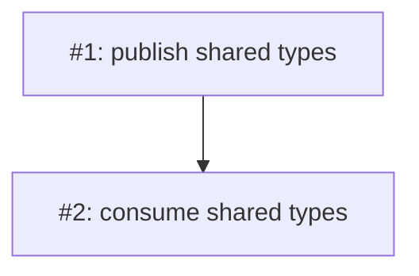

# PLAN: coordinated-test

## Status

Active

## Scope Summary

Minimal two-repo coordinated fixture for the coordinated-mode eval. Each issue
lands its own per-repo PR; cross-unit carry-forward flows through the
coordination PR's durable state, not a shared branch. The coordination PR merges
last.

## Implementation Issues

| Issue | Dependencies | Complexity |
|-------|--------------|------------|
| [#1: feat(lib): publish shared types](#issue-1) | None | testable |
| _In the library repo, publish the shared type definitions both repos consume._ | | |
| [#2: feat(app): consume shared types](#issue-2) | [#1](#issue-1) | testable |
| _In the app repo, depend on the published library types._ | | |

## Issue Outlines

### Issue 1: feat(lib): publish shared types

**Repo**: org/lib

**Goal**: Publish the shared type definitions in the library repo.

**Acceptance Criteria**:
- [ ] Types module is published
- [ ] CI green

**Dependencies**: None.

**Type**: code

---

### Issue 2: feat(app): consume shared types

**Repo**: org/app

**Goal**: Depend on the published library types in the app repo.

**Acceptance Criteria**:
- [ ] App imports the published types
- [ ] CI green

**Dependencies**: Blocked by Issue 1.

**Type**: code

## Dependency Graph

## Implementation Sequence

Open with #1 (library repo), then #2 (app repo). The coordination PR merges last,
gated on `shirabe validate --merge-gate --mode=ready`.
