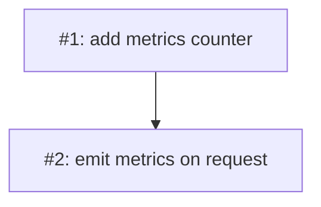

# PLAN: legacy-four-column-test

## Status

Active

## Scope Summary

Fixture exercising the historic four-column Implementation Issues table shape
(`Issue | Title | Dependencies | Complexity`) that FC05 detects and emits a
migration hint for. Used to assert backward-compatible parsing.

## Implementation Issues

| Issue | Title | Dependencies | Complexity |
|-------|-------|--------------|------------|
| [#1](#issue-1) | feat: add metrics counter | None | simple |
| [#2](#issue-2) | feat: emit metrics on request | [#1](#issue-1) | testable |

## Issue Outlines

### Issue 1: feat: add metrics counter

**Goal**: Add an in-memory metrics counter.

**Acceptance Criteria**:
- [ ] Counter increments
- [ ] CI green

**Dependencies**: None.

**Type**: code

---

### Issue 2: feat: emit metrics on request

**Goal**: Increment the counter on each request.

**Acceptance Criteria**:
- [ ] Counter increments per request
- [ ] CI green

**Dependencies**: Blocked by #1.

**Type**: code

## Dependency Graph

## Implementation Sequence

Open with #1, then #2 — one shared branch, one PR.
