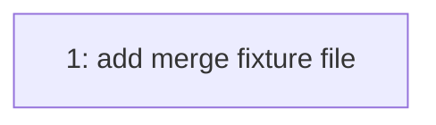

# PLAN: merge-test

## Status

Active

## Scope Summary

One-issue single-pr fixture for the merge-step eval scenarios. The scenarios
are about what happens after CI: the verdict, the merge call, the confirm
read, and the exit lines. The one child is deliberately trivial.

## Issue Outlines

### Issue 1: feat: add merge fixture file

**Complexity**: simple

**Goal**: Add `src/merge.go` with a single exported function.

**Acceptance Criteria**:
- [ ] `src/merge.go` exists
- [ ] CI green

**Dependencies**: None.

## Dependency Graph

