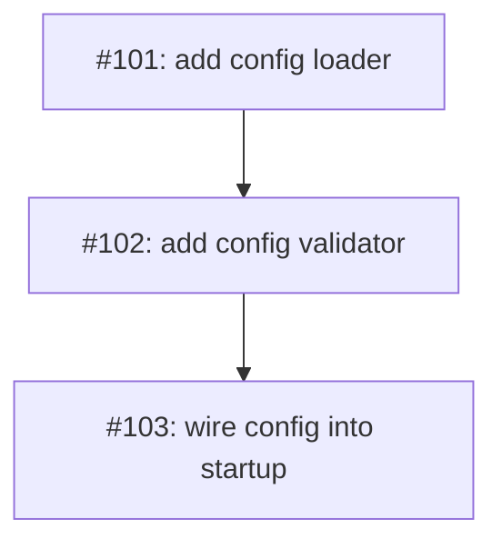

# PLAN: multi-pr-test

## Status

Active

## Scope Summary

Minimal 3-issue multi-pr fixture for the dispatcher eval: each issue ships its
own PR, run one at a time through `/work-on`, no shared branch.

## Implementation Issues

| Issue | Dependencies | Complexity |
|-------|--------------|------------|
| [#101: feat: add config loader](#issue-101) | None | simple |
| _Load configuration from disk into a typed struct._ | | |
| [#102: feat: add config validator](#issue-102) | [#101](#issue-101) | testable |
| _Validate the loaded configuration against the schema._ | | |
| [#103: feat: wire config into startup](#issue-103) | [#102](#issue-102) | testable |
| _Call the loader and validator during process startup._ | | |

## Issue Outlines

### Issue 101: feat: add config loader

**Goal**: Load configuration from disk into a typed struct.

**Acceptance Criteria**:
- [ ] Config loader reads the file
- [ ] CI green

**Dependencies**: None.

**Type**: code

---

### Issue 102: feat: add config validator

**Goal**: Validate the loaded configuration against the schema.

**Acceptance Criteria**:
- [ ] Invalid config is rejected
- [ ] CI green

**Dependencies**: Blocked by #101.

**Type**: code

---

### Issue 103: feat: wire config into startup

**Goal**: Call the loader and validator during process startup.

**Acceptance Criteria**:
- [ ] Startup loads and validates config
- [ ] CI green

**Dependencies**: Blocked by #102.

**Type**: code

## Dependency Graph

## Implementation Sequence

Open with #101, then #102, then #103 — each lands its own PR.
