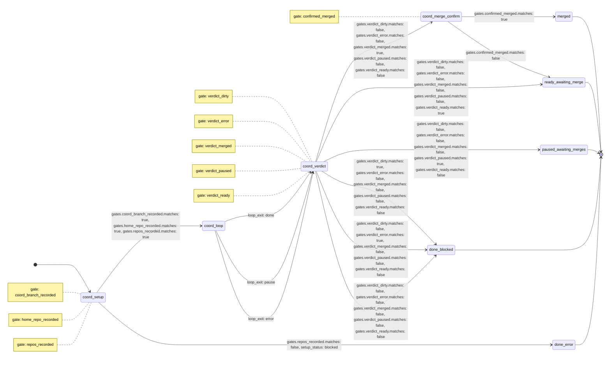

```mermaid
stateDiagram-v2
    direction LR
    [*] --> coord_setup
    coord_loop --> coord_verdict : loop_exit: done
    coord_loop --> coord_verdict : loop_exit: pause
    coord_loop --> coord_verdict : loop_exit: error
    coord_merge_confirm --> merged : gates.confirmed_merged.matches: true
    coord_merge_confirm --> ready_awaiting_merge : gates.confirmed_merged.matches: false
    coord_setup --> coord_loop : gates.coord_branch_recorded.matches: true, gates.home_repo_recorded.matches: true, gates.repos_recorded.matches: true
    coord_setup --> done_error : gates.repos_recorded.matches: false, setup_status: blocked
    coord_verdict --> coord_merge_confirm : gates.verdict_dirty.matches: false, gates.verdict_error.matches: false, gates.verdict_merged.matches: true, gates.verdict_paused.matches: false, gates.verdict_ready.matches: false
    coord_verdict --> ready_awaiting_merge : gates.verdict_dirty.matches: false, gates.verdict_error.matches: false, gates.verdict_merged.matches: false, gates.verdict_paused.matches: false, gates.verdict_ready.matches: true
    coord_verdict --> paused_awaiting_merges : gates.verdict_dirty.matches: false, gates.verdict_error.matches: false, gates.verdict_merged.matches: false, gates.verdict_paused.matches: true, gates.verdict_ready.matches: false
    coord_verdict --> done_blocked : gates.verdict_dirty.matches: true, gates.verdict_error.matches: false, gates.verdict_merged.matches: false, gates.verdict_paused.matches: false, gates.verdict_ready.matches: false
    coord_verdict --> done_blocked : gates.verdict_dirty.matches: false, gates.verdict_error.matches: true, gates.verdict_merged.matches: false, gates.verdict_paused.matches: false, gates.verdict_ready.matches: false
    coord_verdict --> done_blocked : gates.verdict_dirty.matches: false, gates.verdict_error.matches: false, gates.verdict_merged.matches: false, gates.verdict_paused.matches: false, gates.verdict_ready.matches: false
    done_blocked --> [*]
    done_error --> [*]
    merged --> [*]
    paused_awaiting_merges --> [*]
    ready_awaiting_merge --> [*]
    note left of coord_merge_confirm
        gate: confirmed_merged
    end note
    note left of coord_setup
        gate: coord_branch_recorded
    end note
    note left of coord_setup
        gate: home_repo_recorded
    end note
    note left of coord_setup
        gate: repos_recorded
    end note
    note left of coord_verdict
        gate: verdict_dirty
    end note
    note left of coord_verdict
        gate: verdict_error
    end note
    note left of coord_verdict
        gate: verdict_merged
    end note
    note left of coord_verdict
        gate: verdict_paused
    end note
    note left of coord_verdict
        gate: verdict_ready
    end note
```
