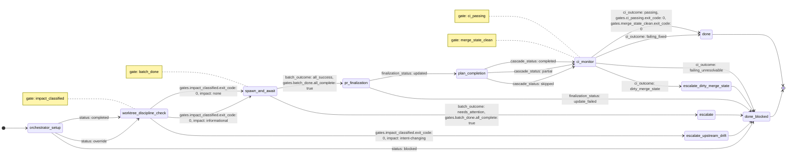

```mermaid
stateDiagram-v2
    direction LR
    [*] --> orchestrator_setup
    ci_monitor --> done : ci_outcome: passing, gates.ci_passing.exit_code: 0, gates.merge_state_clean.exit_code: 0
    ci_monitor --> done : ci_outcome: failing_fixed
    ci_monitor --> done_blocked : ci_outcome: failing_unresolvable
    ci_monitor --> escalate_dirty_merge_state : ci_outcome: dirty_merge_state
    escalate --> done_blocked
    escalate_dirty_merge_state --> done_blocked
    escalate_upstream_drift --> done_blocked
    orchestrator_setup --> worktree_discipline_check : status: completed
    orchestrator_setup --> worktree_discipline_check : status: override
    orchestrator_setup --> done_blocked : status: blocked
    plan_completion --> ci_monitor : cascade_status: completed
    plan_completion --> ci_monitor : cascade_status: partial
    plan_completion --> ci_monitor : cascade_status: skipped
    pr_finalization --> plan_completion : finalization_status: updated
    pr_finalization --> done_blocked : finalization_status: update_failed
    spawn_and_await --> pr_finalization : batch_outcome: all_success, gates.batch_done.all_complete: true
    spawn_and_await --> escalate : batch_outcome: needs_attention, gates.batch_done.all_complete: true
    worktree_discipline_check --> spawn_and_await : gates.impact_classified.exit_code: 0, impact: none
    worktree_discipline_check --> spawn_and_await : gates.impact_classified.exit_code: 0, impact: informational
    worktree_discipline_check --> escalate_upstream_drift : gates.impact_classified.exit_code: 0, impact: intent-changing
    done --> [*]
    done_blocked --> [*]
    note left of ci_monitor
        gate: ci_passing
    end note
    note left of ci_monitor
        gate: merge_state_clean
    end note
    note left of spawn_and_await
        gate: batch_done
    end note
    note left of worktree_discipline_check
        gate: impact_classified
    end note
```
