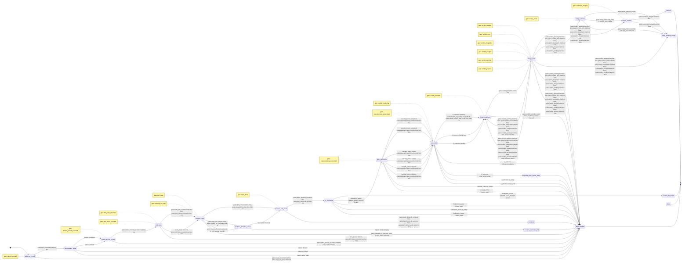

```mermaid
stateDiagram-v2
    direction LR
    [*] --> write_set_record
    ci_monitor --> merge_readiness : ci_outcome: passing, gates.owned_ci_passing.exit_code: 0, gates.owned_merge_state_clean.exit_code: 0
    ci_monitor --> merge_readiness : ci_outcome: failing_fixed
    ci_monitor --> merge_readiness : ci_outcome: pending
    ci_monitor --> done_blocked : ci_outcome: failing_unresolvable
    ci_monitor --> escalate_dirty_merge_state : ci_outcome: dirty_merge_state
    ci_monitor --> done_blocked : ci_outcome: pr_adopt
    ci_monitor --> done_blocked : ci_outcome: status_read
    drift_facts --> worktree_sync : gates.drift_facts_recorded.matches: true, gates.plan_intent_recorded.exists: true
    drift_facts --> worktree_sync : facts_status: override, gates.drift_facts_recorded.matches: false
    drift_facts --> done_blocked : facts_status: blocked, gates.drift_facts_recorded.matches: false
    escalate --> done_blocked
    escalate_dirty_merge_state --> done_blocked
    escalate_upstream_drift --> done_blocked
    merge_attempt --> ready_awaiting_merge : gates.merge_intent.exit_code: 1
    merge_attempt --> merge_confirm : gates.merge_intent.exit_code: 0, merge_exec: called
    merge_attempt --> ready_awaiting_merge : gates.merge_intent.exit_code: 0, merge_exec: refused
    merge_confirm --> merged : gates.confirmed_merged.matches: true
    merge_confirm --> ready_awaiting_merge : gates.confirmed_merged.matches: false
    merge_readiness --> merge_route : gates.verdict_recorded.exists: true
    merge_readiness --> done_blocked : gates.verdict_recorded.exists: false, readiness_status: blocked
    merge_route --> merge_confirm : gates.verdict_awaiting.matches: false, gates.verdict_error.matches: false, gates.verdict_mergeable.matches: false, gates.verdict_merged.matches: true, gates.verdict_pending.matches: false
    merge_route --> merge_attempt : gates.verdict_awaiting.matches: false, gates.verdict_error.matches: false, gates.verdict_mergeable.matches: true, gates.verdict_merged.matches: false, gates.verdict_pending.matches: false
    merge_route --> ready_awaiting_merge : gates.verdict_awaiting.matches: true, gates.verdict_error.matches: false, gates.verdict_mergeable.matches: false, gates.verdict_merged.matches: false, gates.verdict_pending.matches: false
    merge_route --> done_blocked : gates.verdict_awaiting.matches: false, gates.verdict_error.matches: true, gates.verdict_mergeable.matches: false, gates.verdict_merged.matches: false, gates.verdict_pending.matches: false
    merge_route --> merge_readiness : gates.verdict_awaiting.matches: false, gates.verdict_error.matches: false, gates.verdict_mergeable.matches: false, gates.verdict_merged.matches: false, gates.verdict_pending.matches: true, recheck: waited
    merge_route --> merge_readiness : gates.verdict_awaiting.matches: false, gates.verdict_error.matches: false, gates.verdict_mergeable.matches: false, gates.verdict_merged.matches: false, gates.verdict_pending.matches: false, gates.verdict_present.matches: false, recheck: waited
    merge_route --> done_blocked : gates.verdict_awaiting.matches: false, gates.verdict_error.matches: false, gates.verdict_mergeable.matches: false, gates.verdict_merged.matches: false, gates.verdict_pending.matches: false, gates.verdict_present.matches: true
    orchestrator_setup --> settled_branch_record : status: completed
    orchestrator_setup --> settled_branch_record : status: override
    orchestrator_setup --> done_blocked : status: blocked
    orchestrator_setup --> done_blocked : status: pr_adopt
    orchestrator_setup --> done_blocked : status: status_read
    plan_completion --> ci_monitor : cascade_status: completed, gates.expected_head_recorded.matches: true
    plan_completion --> ci_monitor : cascade_status: completed, gates.expected_head_recorded.matches: false
    plan_completion --> ci_monitor : cascade_status: partial, gates.expected_head_recorded.matches: true
    plan_completion --> ci_monitor : cascade_status: partial, gates.expected_head_recorded.matches: false
    plan_completion --> ci_monitor : cascade_status: skipped, gates.expected_head_recorded.matches: true
    plan_completion --> ci_monitor : cascade_status: skipped, gates.expected_head_recorded.matches: false
    plan_completion --> done_blocked : cascade_status: pr_adopt
    plan_completion --> done_blocked : cascade_status: status_read
    pr_finalization --> paused_for_review : finalization_status: updated, pause_decision: pause
    pr_finalization --> plan_completion : finalization_status: updated, pause_decision: finalize
    pr_finalization --> done_blocked : finalization_status: update_failed
    pr_finalization --> done_blocked : finalization_status: pr_adopt
    pr_finalization --> done_blocked : finalization_status: status_read
    settled_branch_record --> drift_facts : gates.settled_branch_recorded.matches: true
    settled_branch_record --> done_blocked : gates.settled_branch_recorded.matches: false, status: blocked
    spawn_and_await --> pr_finalization : gates.batch_done.all_complete: true, gates.batch_done.all_success: true
    spawn_and_await --> escalate : gates.batch_done.all_complete: true, gates.batch_done.all_success: false, gates.batch_done.needs_attention: true
    worktree_discipline_check --> spawn_and_await : impact: informational
    worktree_discipline_check --> escalate_upstream_drift : impact: intent-changing
    worktree_sync --> spawn_and_await : gates.drift_clear.matches: true, gates.rebased_on_main.exit_code: 0
    worktree_sync --> worktree_discipline_check : gates.drift_clear.matches: false, gates.rebased_on_main.exit_code: 0
    worktree_sync --> worktree_discipline_check : gates.rebased_on_main.exit_code: 1, sync_status: override
    worktree_sync --> done_blocked : gates.rebased_on_main.exit_code: 1, sync_status: blocked
    write_set_record --> orchestrator_setup : gates.repos_recorded.matches: true
    write_set_record --> done_blocked : gates.repos_recorded.matches: false, write_set_status: blocked
    done --> [*]
    done_blocked --> [*]
    merged --> [*]
    paused_for_review --> [*]
    ready_awaiting_merge --> [*]
    note left of ci_monitor
        gate: owned_ci_passing
    end note
    note left of ci_monitor
        gate: owned_merge_state_clean
    end note
    note left of drift_facts
        gate: drift_facts_recorded
    end note
    note left of drift_facts
        gate: plan_intent_recorded
    end note
    note left of merge_attempt
        gate: merge_intent
    end note
    note left of merge_confirm
        gate: confirmed_merged
    end note
    note left of merge_readiness
        gate: verdict_recorded
    end note
    note left of merge_route
        gate: verdict_awaiting
    end note
    note left of merge_route
        gate: verdict_error
    end note
    note left of merge_route
        gate: verdict_mergeable
    end note
    note left of merge_route
        gate: verdict_merged
    end note
    note left of merge_route
        gate: verdict_pending
    end note
    note left of merge_route
        gate: verdict_present
    end note
    note left of plan_completion
        gate: expected_head_recorded
    end note
    note left of settled_branch_record
        gate: settled_branch_recorded
    end note
    note left of spawn_and_await
        gate: batch_done
    end note
    note left of worktree_sync
        gate: drift_clear
    end note
    note left of worktree_sync
        gate: rebased_on_main
    end note
    note left of write_set_record
        gate: repos_recorded
    end note
```
