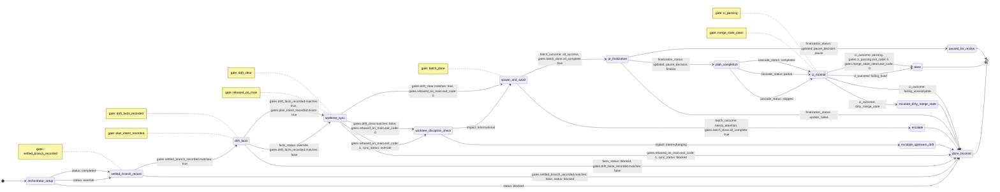

```mermaid
stateDiagram-v2
    direction LR
    [*] --> orchestrator_setup
    ci_monitor --> done : ci_outcome: passing, gates.ci_passing.exit_code: 0, gates.merge_state_clean.exit_code: 0
    ci_monitor --> done : ci_outcome: failing_fixed
    ci_monitor --> done_blocked : ci_outcome: failing_unresolvable
    ci_monitor --> escalate_dirty_merge_state : ci_outcome: dirty_merge_state
    drift_facts --> worktree_sync : gates.drift_facts_recorded.matches: true, gates.plan_intent_recorded.exists: true
    drift_facts --> worktree_sync : facts_status: override, gates.drift_facts_recorded.matches: false
    drift_facts --> done_blocked : facts_status: blocked, gates.drift_facts_recorded.matches: false
    escalate --> done_blocked
    escalate_dirty_merge_state --> done_blocked
    escalate_upstream_drift --> done_blocked
    orchestrator_setup --> settled_branch_record : status: completed
    orchestrator_setup --> settled_branch_record : status: override
    orchestrator_setup --> done_blocked : status: blocked
    plan_completion --> ci_monitor : cascade_status: completed
    plan_completion --> ci_monitor : cascade_status: partial
    plan_completion --> ci_monitor : cascade_status: skipped
    pr_finalization --> paused_for_review : finalization_status: updated, pause_decision: pause
    pr_finalization --> plan_completion : finalization_status: updated, pause_decision: finalize
    pr_finalization --> done_blocked : finalization_status: update_failed
    settled_branch_record --> drift_facts : gates.settled_branch_recorded.matches: true
    settled_branch_record --> done_blocked : gates.settled_branch_recorded.matches: false, status: blocked
    spawn_and_await --> pr_finalization : batch_outcome: all_success, gates.batch_done.all_complete: true
    spawn_and_await --> escalate : batch_outcome: needs_attention, gates.batch_done.all_complete: true
    worktree_discipline_check --> spawn_and_await : impact: informational
    worktree_discipline_check --> escalate_upstream_drift : impact: intent-changing
    worktree_sync --> spawn_and_await : gates.drift_clear.matches: true, gates.rebased_on_main.exit_code: 0
    worktree_sync --> worktree_discipline_check : gates.drift_clear.matches: false, gates.rebased_on_main.exit_code: 0
    worktree_sync --> worktree_discipline_check : gates.rebased_on_main.exit_code: 1, sync_status: override
    worktree_sync --> done_blocked : gates.rebased_on_main.exit_code: 1, sync_status: blocked
    done --> [*]
    done_blocked --> [*]
    paused_for_review --> [*]
    note left of ci_monitor
        gate: ci_passing
    end note
    note left of ci_monitor
        gate: merge_state_clean
    end note
    note left of drift_facts
        gate: drift_facts_recorded
    end note
    note left of drift_facts
        gate: plan_intent_recorded
    end note
    note left of settled_branch_record
        gate: settled_branch_recorded
    end note
    note left of spawn_and_await
        gate: batch_done
    end note
    note left of worktree_sync
        gate: drift_clear
    end note
    note left of worktree_sync
        gate: rebased_on_main
    end note
```
