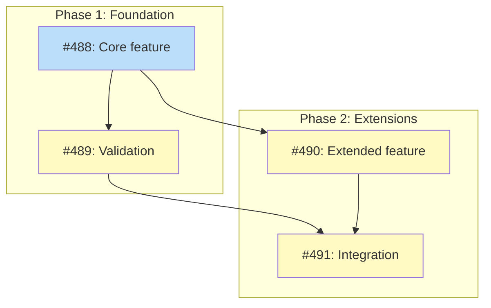
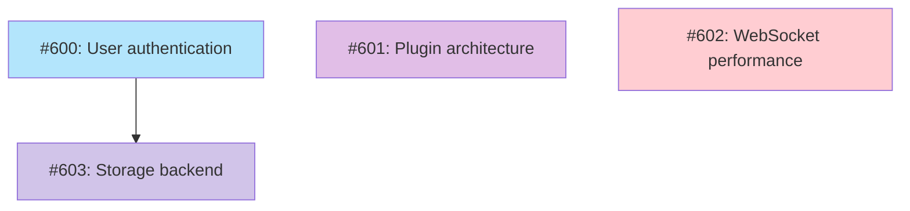

# PLAN Artifact Examples

Examples of PLAN doc format for different execution modes and input types.
See `plan-doc-structure.md` for the format specification.

## Table of Contents

- [Complete Example (multi-pr mode)](#complete-example-multi-pr-mode)
- [Example with Completed Issues](#example-with-completed-issues)
- [Inline Implementation (Single Issue)](#inline-implementation-single-issue)
- [Roadmap Example](#roadmap-example-multi-pr-feature-by-feature-planning)

## Complete Example (multi-pr mode)

```markdown
---
schema: plan/v1
status: Active
execution_mode: multi-pr
upstream: docs/designs/DESIGN-homebrew-builder.md
milestone: "Homebrew Builder"
issue_count: 4
---

# PLAN: Homebrew Builder

## Status

Active

## Scope Summary

Implement the Homebrew formula builder for tsuku, enabling recipe-based installation of macOS packages through Homebrew tap generation.

## Decomposition Strategy

**Horizontal decomposition.** The design describes 4 layered components (parser, validator, dependency resolver, builder) with clear interfaces between them. Each layer can be implemented and tested independently. Walking skeleton was not appropriate because the formula parser is a prerequisite for all other components -- there's no meaningful vertical slice that exercises the full pipeline without it.

## Issue Outlines

_(omitted in multi-pr mode -- see Implementation Issues below)_

## Implementation Issues

### Milestone: [M17: Homebrew Builder](https://github.com/org/repo/milestone/17)

| Issue | Dependencies | Complexity |
|-------|--------------|------------|
| [#488: Core feature implementation](https://github.com/org/repo/issues/488) | None | testable |
| _Establish the formula parser and builder registry that all downstream work depends on. Outputs a `Builder` interface and a `FormulaParser` that reads TOML recipe definitions._ | | |
| [#489: Validation support](https://github.com/org/repo/issues/489) | [#488](https://github.com/org/repo/issues/488) | testable |
| _With the parser in place, add schema validation that catches malformed recipes before they reach the builder. Reports errors with line numbers pointing back to the TOML source._ | | |
| [#490: Extended feature support](https://github.com/org/repo/issues/490) | [#488](https://github.com/org/repo/issues/488) | simple |
| _Add support for `depends_on` fields in recipes, enabling multi-tool formulas that install prerequisites automatically._ | | |
| [#491: Integration testing](https://github.com/org/repo/issues/491) | [#489](https://github.com/org/repo/issues/489), [#490](https://github.com/org/repo/issues/490) | critical |
| _End-to-end test harness that exercises the full pipeline: parse, validate, resolve dependencies, and run the builder in a sandbox. Covers both happy path and error cases from #489._ | | |

### Dependency Graph



**Legend**: Green = done, Blue = ready, Yellow = blocked, Purple = needs-design, Orange = tracks-design/tracks-plan

## Implementation Sequence

**Critical path:** Issue 488 -> Issue 489 -> Issue 491 (3 issues)

**Recommended order:**
1. Issue 488 -- foundation (parser + builder interface)
2. Issue 489 -- validation (requires parser)
3. Issue 490 -- dependency support (requires parser, independent of validation)
4. Issue 491 -- integration testing (requires both validation and dependencies)

**Parallelization:** After Issue 488, Issues 489 and 490 can proceed in parallel.
```

## Example with Completed Issues

After #488 and #489 are completed, the table shows strikethrough for done items and the diagram reflects status changes:

```markdown
| Issue | Dependencies | Complexity |
|-------|--------------|------------|
| ~~[#488: Core feature implementation](https://github.com/org/repo/issues/488)~~ | ~~None~~ | ~~testable~~ |
| ~~_Establish the formula parser and builder registry that all downstream work depends on. Outputs a `Builder` interface and a `FormulaParser` that reads TOML recipe definitions._~~ | | |
| ~~[#489: Validation support](https://github.com/org/repo/issues/489)~~ | ~~[#488](https://github.com/org/repo/issues/488)~~ | ~~testable~~ |
| ~~_With the parser in place, add schema validation that catches malformed recipes before they reach the builder. Reports errors with line numbers pointing back to the TOML source._~~ | | |
| [#490: Extended feature support](https://github.com/org/repo/issues/490) | [#488](https://github.com/org/repo/issues/488) | simple |
| _Add support for `depends_on` fields in recipes, enabling multi-tool formulas that install prerequisites automatically._ | | |
| [#491: Integration testing](https://github.com/org/repo/issues/491) | [#489](https://github.com/org/repo/issues/489), [#490](https://github.com/org/repo/issues/490) | critical |
| _End-to-end test harness that exercises the full pipeline: parse, validate, resolve dependencies, and run the builder in a sandbox. Covers both happy path and error cases from #489._ | | |
```

The dependency graph would show `class I488,I489 done` and `class I490,I491 ready`.

## Inline Implementation (Single Issue)

When a design is implemented directly via its upstream issue without spawning sub-issues through `/plan`, the Implementation Issues section uses a simplified format.

**When this applies:**
- Design addresses an existing issue (the "upstream issue")
- Implementation is simple enough to complete in one PR
- No need to break work into separate tracked issues
- Follows the Accepted -> Current path described in the `design-doc` skill

**Format differences from multi-issue designs:**
- Table contains a single row: the upstream issue
- All cells are struck through (issue is complete when design transitions to Current)
- No dependency graph (single issue has no dependencies to visualize)
- No milestone heading (optional -- include if the issue belongs to a milestone)
- Footer explains the inline pattern

**Example:**

```markdown
## Implementation Issues

| Issue | Dependencies | Complexity |
|-------|--------------|------------|
| ~~[#648: refactor: fix semantics](https://github.com/org/repo/issues/648)~~ | ~~None~~ | ~~testable~~ |

Implementation completed inline via the upstream issue.
```

## Roadmap Example (multi-pr, feature-by-feature planning)

When the source document is a roadmap, the PLAN artifact uses feature-by-feature planning. Each issue is a planning issue that produces an upstream artifact. The Mermaid diagram uses `needs-*` classes to show what type of artifact each feature requires.

```markdown
---
schema: plan/v1
status: Active
execution_mode: multi-pr
upstream: docs/roadmaps/ROADMAP-v2.md
milestone: "v2 Planning"
issue_count: 4
---

# PLAN: v2 Planning

## Status

Active

## Scope Summary

Plan the v2 release by producing upstream artifacts (PRDs, designs, spikes, decisions) for each roadmap feature.

## Decomposition Strategy

**Feature-by-feature planning.** Each roadmap feature becomes one planning issue that tracks the creation of its required upstream artifact. The per-feature `needs-*` label indicates what type of artifact each feature requires next.

## Issue Outlines

_(omitted in multi-pr mode -- see Implementation Issues below)_

## Implementation Issues

### Milestone: [v2 Planning](https://github.com/org/repo/milestone/22)

| Issue | Dependencies | Complexity |
|-------|--------------|------------|
| [#600: docs(prd): user authentication](https://github.com/org/repo/issues/600) | None | simple |
| _Define requirements for the user authentication feature. Produce a PRD that captures user stories, acceptance criteria, and non-functional requirements._ | | |
| [#601: docs(design): plugin architecture](https://github.com/org/repo/issues/601) | None | simple |
| _Design the plugin system that supports third-party extensions. Produce a design doc covering API surface, lifecycle hooks, and sandboxing._ | | |
| [#602: docs(spike): WebSocket performance](https://github.com/org/repo/issues/602) | None | simple |
| _Investigate WebSocket scaling limits under concurrent load. Produce a spike report with benchmarks and a recommendation for the production implementation._ | | |
| [#603: docs(decision): storage backend](https://github.com/org/repo/issues/603) | [#600](https://github.com/org/repo/issues/600) | simple |
| _Choose between SQLite and PostgreSQL for the user data store. Produce a decision record evaluating both options against the requirements from #600._ | | |

### Dependency Graph



**Legend**: Green = done, Blue = ready, Yellow = blocked, Purple = needs-design, Light blue = needs-prd, Red = needs-spike, Indigo = needs-decision, Orange = tracks-design/tracks-plan

## Implementation Sequence

**Critical path:** Issue 600 -> Issue 603 (2 issues)

**Recommended order:**
1. Issues 600, 601, 602 -- independent, can proceed in parallel
2. Issue 603 -- depends on authentication requirements from #600

**Parallelization:** 3 of 4 issues can start immediately.
```
