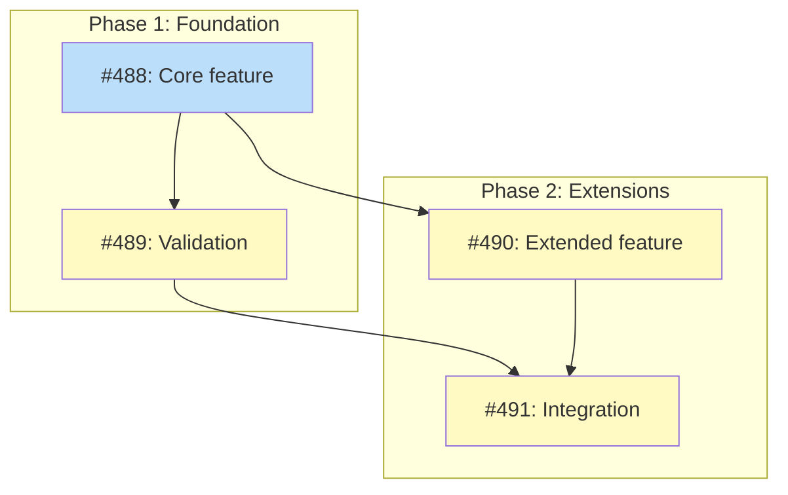
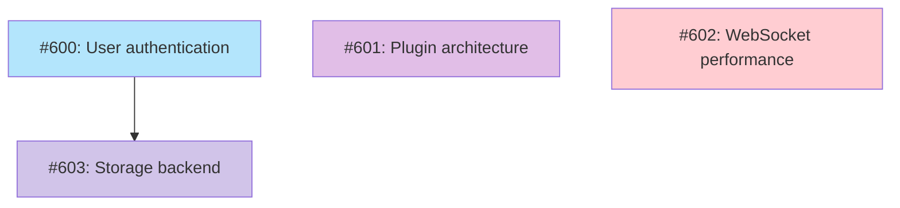

# PLAN Artifact Format Specification

Reference for constructing `PLAN-<topic>.md` artifacts. This format owns all implementation tracking: issue tables, Mermaid dependency graphs, decomposition strategy, sequencing, and issue outlines.

## Table of Contents

- [File Location](#file-location)
- [Frontmatter](#frontmatter)
- [Lifecycle](#lifecycle)
- [Required Sections](#required-sections)
- [Implementation Issues Table Format](#implementation-issues-table-format)
- [Issue Descriptions](#issue-descriptions)
- [Child Reference Row](#child-reference-row)
- [Strikethrough Rules](#strikethrough-rules)
- [Dependency Graph](#dependency-graph) (Mermaid syntax, status classes, node format)
- [Section Placement](#section-placement-legacy-context)
- [Complete Example (multi-pr mode)](#complete-example-multi-pr-mode)
- [Complete Example (roadmap mode)](#complete-example-roadmap-mode)

## File Location

PLAN artifacts live at `docs/plans/PLAN-<topic>.md`. When a PLAN reaches Done
status, move it to `docs/plans/done/PLAN-<topic>.md`.

## Frontmatter

```yaml
---
schema: plan/v1
status: Draft
execution_mode: single-pr  # single-pr | multi-pr
upstream: docs/designs/DESIGN-<topic>.md  # optional, path to source design/PRD
milestone: "<Milestone Name>"
issue_count: <N>
---
```

**Required fields:** `schema`, `status`, `execution_mode`, `milestone`, `issue_count`.

**Optional fields:** `upstream` -- path to the design doc, PRD, or roadmap that this plan decomposes.

The `milestone` field is always present (it names the logical work unit) but GitHub milestone creation only happens in multi-pr mode.

## Lifecycle

| Status | Meaning | Trigger |
|--------|---------|---------|
| Draft | Plan being written during /plan phases | /plan creates the PLAN artifact |
| Active | Implementation underway | multi-pr: GitHub issues created; single-pr: /implement-doc or /work-on starts |
| Done | Implementation complete, move to `docs/plans/done/` | multi-pr: all issues closed; single-pr: PR merged |

**Coordinated lifecycle with design docs:**

| Design doc | PLAN doc | Trigger |
|------------|----------|---------|
| Accepted | _(doesn't exist)_ | /design or /explore approval |
| Planned | Draft | /plan creates the PLAN artifact |
| Planned | Active | /plan finishes (issues created or /implement-doc starts) |
| Planned | _(updated per issue)_ | Issues implemented via /work-on |
| Current | Done | /complete-milestone (all issues closed) |

## Required Sections

Every PLAN artifact has these 7 sections, in order:

1. **Status** -- current lifecycle state
2. **Scope Summary** -- 1-2 sentence description of what this plan covers
3. **Decomposition Strategy** -- walking skeleton, horizontal, or feature-by-feature planning, with rationale
4. **Issue Outlines** -- brief description of each issue before full bodies exist (populated in single-pr mode)
5. **Implementation Issues** -- table with issue links, dependencies, complexity (populated in multi-pr mode)
6. **Dependency Graph** -- Mermaid diagram showing issue relationships
7. **Implementation Sequence** -- critical path and parallelization opportunities

### Execution Mode Differences

| Section | single-pr | multi-pr |
|---------|-----------|----------|
| Issue Outlines | Populated with structured outlines (goal, acceptance criteria, dependencies) | Empty or omitted |
| Implementation Issues | Empty or omitted (no GitHub issues to link) | Populated with issue table |

In single-pr mode, Phase 4 agents produce structured outlines that become sub-sections under Issue Outlines. These give /implement-doc the decomposition it needs without creating GitHub artifacts. The PLAN doc stays at Draft and transitions to Active when /implement-doc or /work-on starts.

In multi-pr mode, Phase 4 agents write full issue body files. Phase 7 creates GitHub issues and milestones, populates the Implementation Issues table with links, and transitions the PLAN doc to Active.

### Decomposition Strategies

Three decomposition strategies are available:

| Strategy | When Used | Issue Type |
|----------|-----------|------------|
| Walking skeleton | New feature with end-to-end flow | Code implementation issues |
| Horizontal | Refactoring, documentation, loosely coupled components | Code implementation issues |
| Feature-by-feature planning | Roadmap input (`input_type: roadmap`) | Planning issues (artifact production) |

**Feature-by-feature planning** maps each roadmap feature 1:1 to a planning issue. The issues track artifact creation (PRDs, designs, spikes, decisions) rather than code implementation. All planning issues are `simple` complexity. Each issue carries a `needs_label` indicating what upstream artifact the feature requires (needs-prd, needs-design, needs-spike, or needs-decision).

The strategy section in the PLAN doc should explain the mapping:

```markdown
## Decomposition Strategy

**Feature-by-feature planning.** Each roadmap feature becomes one planning issue that tracks
the creation of its required upstream artifact. The per-feature `needs-*` label indicates
what type of artifact each feature requires next.
```

## Implementation Issues Table Format

| Column | Content |
|--------|---------|
| Issue | Link with title: `[#N: <title>](<url>)` |
| Dependencies | `None` or comma-separated links: `[#X](<url>), [#Y](<url>)` |
| Complexity | Validation complexity: `simple`, `testable`, or `critical` |

**Template:**

```markdown
| Issue | Dependencies | Complexity |
|-------|--------------|------------|
| [#N: <title>](<url>) | None | simple |
| _<description>_ | | |
| [#M: <title>](<url>) | [#N](<url>) | testable |
| _<description>_ | | |
| [#P: <title>](<url>) | [#M](<url>), [#N](<url>) | critical |
| _<description>_ | | |
```

**Key points:**
- Issue column combines number and title in the link text: `[#N: <title>](<url>)`
- Dependencies column uses **clickable issue links**, not plain text like `#N`
- Link to milestone in heading for context

**Legacy format (still accepted by CI):**

Older design docs may use a separate Title column: `| Issue | Title | Dependencies | Complexity |`. Both formats are valid.

### Milestone Heading

In multi-pr mode, the Implementation Issues section includes a milestone heading:

```markdown
## Implementation Issues

### Milestone: [<Name>](<milestone-url>)

| Issue | Dependencies | Complexity |
|-------|--------------|------------|
...
```

## Issue Descriptions

Each issue row gets a 1-3 sentence description placed immediately after it. When an issue is marked as done, both the issue row and its description row are struck through (using `~~text~~` markdown syntax). This preserves the narrative context while visually indicating completion.

**Purpose:** Reading the descriptions top-to-bottom gives a sequential understanding of what the project builds and in what order. Each description builds on the previous one.

**Format:**

```markdown
| [#N: <title>](<url>) | None | testable |
| _<1-3 sentences explaining what this issue delivers and how it connects to the rest of the work. Don't repeat the title.>_ | | |
| [#M: <title>](<url>) | [#N](<url>) | testable |
| _<1-3 sentences. Reference what #N established and explain what this issue adds on top of it.>_ | | |
```

Description rows use italics (`_..._`) in the first cell with empty remaining cells.

**Writing guidelines:**
- Don't repeat the issue title -- explain what the issue delivers
- Be concrete: mention specific files, patterns, or interfaces
- Each description should build on the previous ones -- a reader going top-to-bottom should get the full build sequence
- Keep to 1-3 sentences; this isn't the full issue spec

### Description Row Requirements

Every issue row must have a description row immediately after it (or after the child reference row, if one is present).

Description rows use italics in the first cell with empty remaining cells: `| _text_ | | |`

## Child Reference Row

When a needs-design issue spawns a child design (via `/explore`), a child reference row is inserted between the issue row and its description row. This links readers to the child design doc without importing its implementation details into the parent.

**Format:**

```markdown
| [#N: <title>](<url>) | None | simple |
| ^_Child: [DESIGN-<name>.md](<relative-path>)_ | | | |
| _<description text>_ | | |
```

The `^` prefix distinguishes child reference rows from description rows. Only issues with a tracking label (`tracks-design` or `tracks-plan`) and correspondingly the `tracksDesign` or `tracksPlan` Mermaid class may have a child reference row. This invariant is bidirectional: tracking-class nodes must have a child reference row, and nodes without a tracking class must not have one. Projects may enforce this in CI.

**Strikethrough:** When the issue completes, strike through all three rows -- the issue row, the child reference row, and the description row:

```markdown
| ~~[#N: <title>](<url>)~~ | ~~None~~ | ~~simple~~ |
| ~~^_Child: [DESIGN-<name>.md](<relative-path>)_~~ | | | |
| ~~_<description text>_~~ | | |
```

## Strikethrough Rules

When an issue is completed (marked `done`), strike through all rows associated with it:

1. **Issue row:** `| ~~[#N: title](url)~~ | ~~deps~~ | ~~complexity~~ |`
2. **Child reference row** (if present): `| ~~^_Child: [DESIGN-name.md](path)_~~ | | | |`
3. **Description row:** `| ~~_description text_~~ | | |`

All row types (when present) must be struck through together. If the issue row is struck through, the child reference row and description row must also be struck through.

## Dependency Graph

### Mermaid Syntax Rules (Critical)

These rules prevent common Mermaid rendering failures:

**1. Use `graph`, not `flowchart`:**
```
graph TD    # Correct
flowchart TD  # Wrong - less portable
```

**2. Direction:**
- `LR` (left-right): Preferred for simple diagrams with few sequential levels
- `TD` (top-down): Use when dependencies span 5+ sequential levels (horizontal becomes unreadable)

**3. Subgraphs for phases (optional):**
```
subgraph Phase1["Phase 1: Name"]
    I488["#488: Title"]
    I489["#489: Title"]
end
```

**4. Edges MUST be outside subgraphs:**
```
# Wrong - edges inside subgraph (will not render)
subgraph Phase1
    A --> B
end

# Correct - edges after all subgraphs
subgraph Phase1
    A["..."]
    B["..."]
end
A --> B
```

**5. Class definitions at the end:**
```
graph TD
    # ... nodes and edges ...

    classDef done fill:#c8e6c9
    classDef ready fill:#bbdefb
    classDef blocked fill:#fff9c4
    classDef needsDesign fill:#e1bee7
    classDef needsPrd fill:#b3e5fc
    classDef needsSpike fill:#ffcdd2
    classDef needsDecision fill:#d1c4e9
    classDef tracksDesign fill:#FFE0B2,stroke:#F57C00,color:#000
    classDef tracksPlan fill:#FFE0B2,stroke:#F57C00,color:#000

    class I488 ready
    class I489,I490 blocked
```

### Status Classes (fixed, never change)

| Status | Class | Fill Color | Meaning |
|--------|-------|------------|---------|
| done | `done` | `#c8e6c9` (light green) | Issue is closed |
| ready | `ready` | `#bbdefb` (light blue) | Open, no blocking dependencies |
| blocked | `blocked` | `#fff9c4` (light yellow) | Open, has open blockers |
| needs-design | `needsDesign` | `#e1bee7` (light purple) | Future work, not yet designed |
| needs-prd | `needsPrd` | `#b3e5fc` (light blue) | Future work, needs requirements definition |
| needs-spike | `needsSpike` | `#ffcdd2` (light red) | Future work, needs feasibility investigation |
| needs-decision | `needsDecision` | `#d1c4e9` (light indigo) | Future work, needs architectural choice |
| tracks-design | `tracksDesign` | `#FFE0B2` (light orange), stroke `#F57C00` | Has spawned a child design in progress |
| tracks-plan | `tracksPlan` | `#FFE0B2` (light orange), stroke `#F57C00` | PLAN created, implementation underway |

### Node Format

- Node ID: `I<issue-number>` (e.g., `I417`)
- Node label: `#<N>: <short-title>` (max 40 characters)
- Quotes around labels: Always use `["..."]`

**Node Label Rules:**
- Maximum 40 characters total
- Truncate at last word boundary, add `...` if too long
- Replace `[` `]` with `(` `)`, remove backticks
- Example: `I417["#417: Add structured logging..."]`

### Class Assignment

Use `class` directive (not inline `:::`):
```
# Wrong - inline syntax less maintainable
I488:::ready --> I489:::blocked

# Correct - class directive at end
I488 --> I489
class I488 ready
class I489 blocked
```

Group multiple nodes with same status:
```
class I489,I490,I491 blocked
```

### Initial Status (when /plan creates)

- Issues with no dependencies: `ready`
- Issues with dependencies: `blocked`
- Future work issues needing upstream artifacts: `needsDesign`, `needsPrd`, `needsSpike`, or `needsDecision`
- Issues with accepted child designs: `tracksDesign` or `tracksPlan`
- No issues start as `done`

### Status Updates (when /work-on completes an issue)

- Completed issue changes to `done`
- Downstream issues recalculated: if all blockers are done, change to `ready`

### Table Row Updates (when issue completes)

When an issue is marked as done:
1. Strike through the issue row: `| ~~[#N: title](url)~~ | ~~deps~~ | ~~complexity~~ |`
2. Strike through the child reference row (if present): `| ~~^_Child: [DESIGN-name.md](path)_~~ | | | |`
3. Strike through the description row: `| ~~_description text_~~ | | |`

The description remains readable (just with strikethrough styling) to preserve the build narrative. See "Strikethrough Rules" above for full details.

### Legend

Include a legend line after the diagram:

```markdown
**Legend**: Green = done, Blue = ready, Yellow = blocked, Purple = needs-design, Orange = tracks-design/tracks-plan
```

### Child Reference Row Invariant

`tracksDesign` and `tracksPlan` nodes must have a corresponding child reference row in the Implementation Issues table. Nodes without a tracking class must not have a child reference row.

## Section Placement (Legacy Context)

In design docs that predate the PLAN artifact, the Implementation Issues section was inserted directly into the design doc body, immediately after Status. In the PLAN artifact, this content lives in its own document, so placement is governed by the Required Sections order above.

## Complete Example (multi-pr mode)

```markdown
---
schema: plan/v1
status: Active
execution_mode: multi-pr
upstream: docs/designs/DESIGN-homebrew-builder.md
milestone: "Homebrew Builder"
issue_count: 4
---

# PLAN: Homebrew Builder

## Status

Active

## Scope Summary

Implement the Homebrew formula builder for tsuku, enabling recipe-based installation of macOS packages through Homebrew tap generation.

## Decomposition Strategy

**Horizontal decomposition.** The design describes 4 layered components (parser, validator, dependency resolver, builder) with clear interfaces between them. Each layer can be implemented and tested independently. Walking skeleton was not appropriate because the formula parser is a prerequisite for all other components -- there's no meaningful vertical slice that exercises the full pipeline without it.

## Issue Outlines

_(omitted in multi-pr mode -- see Implementation Issues below)_

## Implementation Issues

### Milestone: [M17: Homebrew Builder](https://github.com/org/repo/milestone/17)

| Issue | Dependencies | Complexity |
|-------|--------------|------------|
| [#488: Core feature implementation](https://github.com/org/repo/issues/488) | None | testable |
| _Establish the formula parser and builder registry that all downstream work depends on. Outputs a `Builder` interface and a `FormulaParser` that reads TOML recipe definitions._ | | |
| [#489: Validation support](https://github.com/org/repo/issues/489) | [#488](https://github.com/org/repo/issues/488) | testable |
| _With the parser in place, add schema validation that catches malformed recipes before they reach the builder. Reports errors with line numbers pointing back to the TOML source._ | | |
| [#490: Extended feature support](https://github.com/org/repo/issues/490) | [#488](https://github.com/org/repo/issues/488) | simple |
| _Add support for `depends_on` fields in recipes, enabling multi-tool formulas that install prerequisites automatically._ | | |
| [#491: Integration testing](https://github.com/org/repo/issues/491) | [#489](https://github.com/org/repo/issues/489), [#490](https://github.com/org/repo/issues/490) | critical |
| _End-to-end test harness that exercises the full pipeline: parse, validate, resolve dependencies, and run the builder in a sandbox. Covers both happy path and error cases from #489._ | | |

### Dependency Graph



**Legend**: Green = done, Blue = ready, Yellow = blocked, Purple = needs-design, Orange = tracks-design/tracks-plan

## Implementation Sequence

**Critical path:** Issue 488 -> Issue 489 -> Issue 491 (3 issues)

**Recommended order:**
1. Issue 488 -- foundation (parser + builder interface)
2. Issue 489 -- validation (requires parser)
3. Issue 490 -- dependency support (requires parser, independent of validation)
4. Issue 491 -- integration testing (requires both validation and dependencies)

**Parallelization:** After Issue 488, Issues 489 and 490 can proceed in parallel.
```

## Example with Completed Issues

After #488 and #489 are completed, the table shows strikethrough for done items and the diagram reflects status changes:

```markdown
| Issue | Dependencies | Complexity |
|-------|--------------|------------|
| ~~[#488: Core feature implementation](https://github.com/org/repo/issues/488)~~ | ~~None~~ | ~~testable~~ |
| ~~_Establish the formula parser and builder registry that all downstream work depends on. Outputs a `Builder` interface and a `FormulaParser` that reads TOML recipe definitions._~~ | | |
| ~~[#489: Validation support](https://github.com/org/repo/issues/489)~~ | ~~[#488](https://github.com/org/repo/issues/488)~~ | ~~testable~~ |
| ~~_With the parser in place, add schema validation that catches malformed recipes before they reach the builder. Reports errors with line numbers pointing back to the TOML source._~~ | | |
| [#490: Extended feature support](https://github.com/org/repo/issues/490) | [#488](https://github.com/org/repo/issues/488) | simple |
| _Add support for `depends_on` fields in recipes, enabling multi-tool formulas that install prerequisites automatically._ | | |
| [#491: Integration testing](https://github.com/org/repo/issues/491) | [#489](https://github.com/org/repo/issues/489), [#490](https://github.com/org/repo/issues/490) | critical |
| _End-to-end test harness that exercises the full pipeline: parse, validate, resolve dependencies, and run the builder in a sandbox. Covers both happy path and error cases from #489._ | | |
```

The dependency graph would show `class I488,I489 done` and `class I490,I491 ready`.

## Inline Implementation (Single Issue)

When a design is implemented directly via its upstream issue without spawning sub-issues through `/plan`, the Implementation Issues section uses a simplified format.

**When this applies:**
- Design addresses an existing issue (the "upstream issue")
- Implementation is simple enough to complete in one PR
- No need to break work into separate tracked issues
- Follows the Accepted -> Current path described in the `design-doc` skill

**Format differences from multi-issue designs:**
- Table contains a single row: the upstream issue
- All cells are struck through (issue is complete when design transitions to Current)
- No dependency graph (single issue has no dependencies to visualize)
- No milestone heading (optional -- include if the issue belongs to a milestone)
- Footer explains the inline pattern

**Example:**

```markdown
## Implementation Issues

| Issue | Dependencies | Complexity |
|-------|--------------|------------|
| ~~[#648: refactor: fix semantics](https://github.com/org/repo/issues/648)~~ | ~~None~~ | ~~testable~~ |

Implementation completed inline via the upstream issue.
```

## Roadmap Example (multi-pr, feature-by-feature planning)

When the source document is a roadmap, the PLAN artifact uses feature-by-feature planning. Each issue is a planning issue that produces an upstream artifact. The Mermaid diagram uses `needs-*` classes to show what type of artifact each feature requires.

```markdown
---
schema: plan/v1
status: Active
execution_mode: multi-pr
upstream: docs/roadmaps/ROADMAP-v2.md
milestone: "v2 Planning"
issue_count: 4
---

# PLAN: v2 Planning

## Status

Active

## Scope Summary

Plan the v2 release by producing upstream artifacts (PRDs, designs, spikes, decisions) for each roadmap feature.

## Decomposition Strategy

**Feature-by-feature planning.** Each roadmap feature becomes one planning issue that tracks the creation of its required upstream artifact. The per-feature `needs-*` label indicates what type of artifact each feature requires next.

## Issue Outlines

_(omitted in multi-pr mode -- see Implementation Issues below)_

## Implementation Issues

### Milestone: [v2 Planning](https://github.com/org/repo/milestone/22)

| Issue | Dependencies | Complexity |
|-------|--------------|------------|
| [#600: docs(prd): user authentication](https://github.com/org/repo/issues/600) | None | simple |
| _Define requirements for the user authentication feature. Produce a PRD that captures user stories, acceptance criteria, and non-functional requirements._ | | |
| [#601: docs(design): plugin architecture](https://github.com/org/repo/issues/601) | None | simple |
| _Design the plugin system that supports third-party extensions. Produce a design doc covering API surface, lifecycle hooks, and sandboxing._ | | |
| [#602: docs(spike): WebSocket performance](https://github.com/org/repo/issues/602) | None | simple |
| _Investigate WebSocket scaling limits under concurrent load. Produce a spike report with benchmarks and a recommendation for the production implementation._ | | |
| [#603: docs(decision): storage backend](https://github.com/org/repo/issues/603) | [#600](https://github.com/org/repo/issues/600) | simple |
| _Choose between SQLite and PostgreSQL for the user data store. Produce a decision record evaluating both options against the requirements from #600._ | | |

### Dependency Graph



**Legend**: Green = done, Blue = ready, Yellow = blocked, Purple = needs-design, Light blue = needs-prd, Red = needs-spike, Indigo = needs-decision, Orange = tracks-design/tracks-plan

## Implementation Sequence

**Critical path:** Issue 600 -> Issue 603 (2 issues)

**Recommended order:**
1. Issues 600, 601, 602 -- independent, can proceed in parallel
2. Issue 603 -- depends on authentication requirements from #600

**Parallelization:** 3 of 4 issues can start immediately.
```
