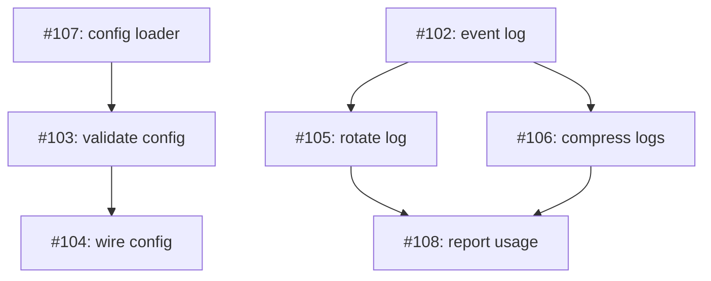

# PLAN: mixed dependencies

## Status

Active

Multi-pr: seven issues, each its own PR. Two can start at once; the rest wait
on a chain or a diamond.

## Scope Summary

An eval fixture whose dependency graph has two roots, a chain and a diamond, so
the startable list /scope prints on a multi-pr exit is exactly the two roots in
PLAN order.

## Decomposition Strategy

**Horizontal by layer.** The two roots are independent foundations; the chain
builds on the first and the diamond on the second.

## Implementation Issues

| Issue | Dependencies | Complexity |
|-------|--------------|------------|
| [#107: feat: add the config loader](#issue-107) | None | simple |
| _Load configuration from disk into a typed struct._ | | |
| [#103: feat: validate the loaded config](#issue-103) | [#107](#issue-107) | testable |
| _Reject configuration that fails the schema._ | | |
| [#104: feat: wire config into startup](#issue-104) | [#103](#issue-103) | testable |
| _Call the loader and validator during startup._ | | |
| [#102: feat: add the event log](#issue-102) | None | simple |
| _Append structured events to a local log._ | | |
| [#105: feat: rotate the event log](#issue-105) | [#102](#issue-102) | testable |
| _Rotate the log by size._ | | |
| [#106: feat: compress rotated logs](#issue-106) | [#102](#issue-102) | testable |
| _Compress each rotated file._ | | |
| [#108: feat: report log usage](#issue-108) | [#105](#issue-105), [#106](#issue-106) | testable |
| _Report the space the logs take._ | | |

## Dependency Graph

## Implementation Sequence

**Critical path:** #102 -> #105 -> #108.

**Parallelization:** #107 and #102 start together; #105 and #106 run in
parallel once #102 lands.
