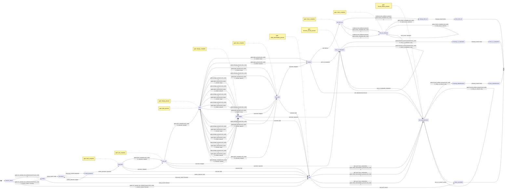

```mermaid
stateDiagram-v2
    direction LR
    [*] --> branch_check
    branch_check --> setup : gates.on_named_non_default_branch.exit_code: 0
    branch_check --> setup : gates.on_named_non_default_branch.exit_code: 1, branch_status: override
    branch_check --> bail : gates.on_named_non_default_branch.exit_code: 1, branch_status: blocked
    bail --> exit_abandonment : bail_ack: force_materialize, gates.child_intermediate_present.exit_code: 0
    bail --> exit_abandonment : bail_ack: force_materialize, gates.child_intermediate_present.exit_code: 1
    bail --> exit_abandonment : bail_ack: force_materialize, gates.child_intermediate_present.exit_code: 2
    bail --> done_cancelled : bail_ack: cancel
    chain_proposal --> hop_brief : author_decision: proceed
    chain_proposal --> discovery : author_decision: adjust
    chain_proposal --> bail : author_decision: bail
    cleanup_abandonment --> done_abandonment : cleanup_result: done
    cleanup_full_run --> done_full_run : cleanup_result: done
    cleanup_re_evaluation --> done_re_evaluation : cleanup_result: done
    discovery --> chain_proposal : discovery_result: proposed
    discovery --> bail : discovery_result: blocked
    exit_abandonment --> cleanup_abandonment : gates.forced_artifact_present.exit_code: 0, retry_or_cancel: retry
    exit_abandonment --> exit_abandonment : gates.forced_artifact_present.exit_code: 1, retry_or_cancel: retry
    exit_abandonment --> done_cancelled : retry_or_cancel: cancel
    exit_full_run --> cleanup_full_run : evidence.exit_artifacts: present, gates.chain_complete.exit_code: 0
    exit_full_run --> full_run_blocked : evidence.exit_artifacts: present, gates.chain_complete.exit_code: 1
    exit_full_run --> full_run_blocked : evidence.exit_artifacts: present, gates.chain_complete.exit_code: 2
    exit_re_evaluation --> cleanup_re_evaluation : gates.decision_record_present.exit_code: 0, retry_or_abandon: retry
    exit_re_evaluation --> exit_re_evaluation : gates.decision_record_present.exit_code: 1, retry_or_abandon: retry
    exit_re_evaluation --> exit_abandonment : retry_or_abandon: abandon
    finalize --> exit_full_run : exit: full-run
    finalize --> exit_re_evaluation : exit: re-evaluation
    finalize --> exit_abandonment : exit: abandonment-forced
    fold --> finalize : gates.plan_present.exit_code: 0, verdict: keep
    fold --> finalize : gates.plan_present.exit_code: 0, verdict: absorb
    fold --> hop_plan : gates.design_present.exit_code: 0, gates.plan_present.exit_code: 1, verdict: keep
    fold --> hop_plan : gates.design_present.exit_code: 0, gates.plan_present.exit_code: 1, verdict: absorb
    fold --> hop_design : gates.design_present.exit_code: 1, gates.plan_present.exit_code: 1, verdict: keep
    fold --> hop_design : gates.design_present.exit_code: 1, gates.plan_present.exit_code: 1, verdict: absorb
    fold --> hop_design : gates.design_present.exit_code: 2, gates.plan_present.exit_code: 1, verdict: keep
    fold --> hop_design : gates.design_present.exit_code: 2, gates.plan_present.exit_code: 1, verdict: absorb
    fold --> hop_plan : gates.design_present.exit_code: 0, gates.plan_present.exit_code: 2, verdict: keep
    fold --> hop_plan : gates.design_present.exit_code: 0, gates.plan_present.exit_code: 2, verdict: absorb
    fold --> hop_design : gates.design_present.exit_code: 1, gates.plan_present.exit_code: 2, verdict: keep
    fold --> hop_design : gates.design_present.exit_code: 1, gates.plan_present.exit_code: 2, verdict: absorb
    fold --> hop_design : gates.design_present.exit_code: 2, gates.plan_present.exit_code: 2, verdict: keep
    fold --> hop_design : gates.design_present.exit_code: 2, gates.plan_present.exit_code: 2, verdict: absorb
    full_run_blocked --> cleanup_full_run : gates.chain_complete.exit_code: 0, next_move: recheck
    full_run_blocked --> full_run_blocked : gates.chain_complete.exit_code: 1, next_move: recheck
    full_run_blocked --> full_run_blocked : gates.chain_complete.exit_code: 2, next_move: recheck
    full_run_blocked --> exit_abandonment : next_move: abandon
    hop_brief --> hop_prd : gates.brief_complete.exit_code: 0, outcome: landed
    hop_brief --> hop_prd : outcome: skipped
    hop_brief --> bail : outcome: bail
    hop_design --> fold : gates.design_complete.exit_code: 0, outcome: landed
    hop_design --> hop_plan : outcome: skipped
    hop_design --> exit_re_evaluation : outcome: rejected
    hop_design --> bail : outcome: bail
    hop_plan --> fold : gates.plan_complete.exit_code: 0, outcome: landed
    hop_plan --> finalize : outcome: skipped
    hop_plan --> bail : outcome: bail
    hop_prd --> fold : gates.prd_complete.exit_code: 0, outcome: landed
    hop_prd --> hop_design : outcome: skipped
    hop_prd --> exit_re_evaluation : outcome: rejected
    hop_prd --> bail : outcome: bail
    setup --> discovery : setup_result: ready
    setup --> bail : setup_result: blocked
    done_abandonment --> [*]
    done_cancelled --> [*]
    done_full_run --> [*]
    done_re_evaluation --> [*]
    note left of bail
        gate: child_intermediate_present
    end note
    note left of exit_abandonment
        gate: forced_artifact_present
    end note
    note left of exit_full_run
        gate: chain_complete
    end note
    note left of exit_re_evaluation
        gate: decision_record_present
    end note
    note left of fold
        gate: design_present
    end note
    note left of fold
        gate: plan_present
    end note
    note left of full_run_blocked
        gate: chain_complete
    end note
    note left of hop_brief
        gate: brief_complete
    end note
    note left of hop_design
        gate: design_complete
    end note
    note left of hop_plan
        gate: plan_complete
    end note
    note left of hop_prd
        gate: prd_complete
    end note
```
