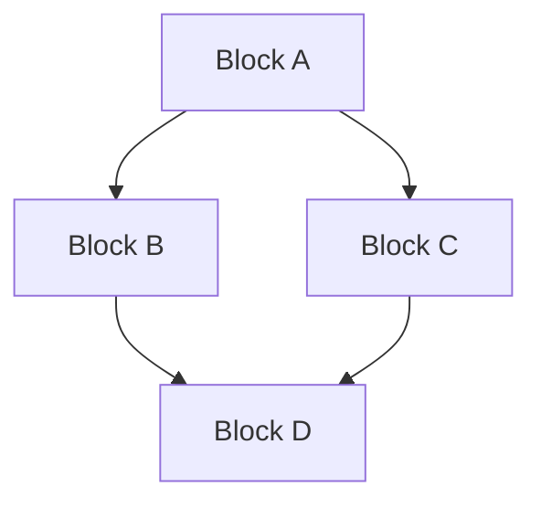

# Phase 3: Structural Fill

Replace the Phase 2 stubs with the structural sections: Building Blocks,
Coordination Dependencies, Non-Goals, and Downstream Artifacts. Phase 3 is
where the strategy's decomposition becomes legible to downstream artifact
authors.

## Goal

Complete the STRATEGY draft so it passes the format reference's required-sections
check with real content (not placeholders). By the end of Phase 3 the draft
should be jury-ready: every required section has prose, the Building Blocks
decomposition satisfies the granularity rubric, and Downstream Artifacts
records the downstream graph at draft-time best knowledge.

## Resume Check

If `docs/strategies/STRATEGY-<topic>.md` exists with `status: Draft` and the
Building Blocks section contains real content (not the Phase 2 placeholder),
Phase 3 already ran in part. Re-read it and continue from the first
still-stubbed section.

## 3.1 Load Inputs

Read all available context:

- The current draft at `docs/strategies/STRATEGY-<topic>.md`
- `wip/strategy_<topic>_discover.md` (the Building Blocks sketch lives here)
- `skills/strategy/references/strategy-format.md` (especially the Building
  Blocks granularity rubric and the per-section quality guidance)

## 3.2 Draft Building Blocks

Building Blocks decompose the bet into 5-8 coordinated workstreams. Each
block leads with a name (a `###` heading) plus a description paragraph;
expansion below the lead is free.

**Required content properties:**

- Each block has a `###` heading naming it. The heading text becomes the
  block's stable identifier — downstream DESIGNs reference blocks by name.
- Each block has a description paragraph immediately under the heading.
  The paragraph names what the block is, what work it represents, and how
  it fits the bet.
- Below the lead pair, expansion is free: bullets, sub-paragraphs,
  examples, sub-headings — author's choice. The format reference's
  granularity rubric checks the lead pair, not the expansion shape.

**Granularity rubric** (from the format reference, applied by the Phase 4
altitude reviewer):

- **Count.** 5-8 blocks is typical. Fewer than 3 risks under-decomposition;
  more than 10 risks roadmap-disguise.
- **Downstream-artifact ratio.** Each block should map to 1-2 plausible
  downstream design docs at minimum. Blocks with no plausible design
  follow-up are framing statements, not blocks.
- **Scope coherence.** Single-product blocks are the norm. Cross-product
  blocks (spanning 2 repos) are permitted but should be exceptional
  (under 20% of total). Blocks spanning 3+ repos signal two strategies
  in one document.

Note that the numeric defaults are revisable through the format reference
file; check `strategy-format.md` for the current values rather than
relying on this prose. Phase 4 reads the rubric live.

**Common failure modes:**

- All blocks decompose into the same downstream design (the strategy is
  actually one block, not five).
- Block headings name capabilities rather than workstreams ("Database",
  "API", "UI") — blocks should name what work happens, not what
  components exist.
- Block descriptions repeat the bet rather than naming the block's
  contribution to the bet.

## 3.3 Draft Coordination Dependencies

Coordination Dependencies documents how the Building Blocks depend on
each other and on external work. The section combines required prose with
an author-chosen visual.

**Required content properties:**

- Prose describing dependency directions. Which blocks must land before
  which? Which blocks can ship in parallel? Which depend on work outside
  the strategy's scope (an upstream PRD that must accept first, a
  cross-repo capability that must ship)?
- A visual showing the dependency graph. The format reference allows
  either ASCII (layered diagram) or Mermaid (`graph` directive).
  Authors pick whichever is more readable for their graph shape.

**ASCII visual example shape:**

```
Layer 1 (foundation):     [Block A]
                              |
                              v
Layer 2 (build on A):  [Block B] [Block C]
                              |       |
                              v       v
Layer 3 (integration):       [Block D]
```

**Mermaid visual example shape:**



The prose carries the layered semantics regardless of the visual choice;
the visual is a navigation aid. Phase 4's structural reviewer accepts
either, and does not check Mermaid syntax beyond fence presence.

**External dependencies:** If the strategy depends on work outside its own
Building Blocks (an upstream artifact that must accept, a cross-repo
capability), name the dependency in prose. The visual may include it as a
greyed-out / dashed node, or omit it — author's choice.

## 3.4 Draft Non-Goals

Non-Goals records what the strategy deliberately does not pursue. Each
non-goal explains WHY the strategy excludes it, tying back to the bet.

**Required content properties:**

- 3-8 non-goals is typical.
- Each non-goal is a one-line statement followed by a one-sentence
  rationale tying back to the bet. "We do not <X> because <Y>" is the
  canonical shape.
- Non-goals are about identity, not just scope exclusions. "We don't
  support Windows" is a scope exclusion; "We don't pursue Windows
  support because the bet's audience is Unix-first" is a non-goal.
- Non-goals that fail to tie back to the bet should either be reframed
  with a bet-aligned rationale or dropped.

**What not to include:**

- "Out of scope for this PR" or other PR-level exclusions. STRATEGY
  Non-Goals are durable; they outlive any single PR.
- Sequenced exclusions ("not in Phase 1, maybe in Phase 2"). That's a
  ROADMAP shape, not a STRATEGY shape.

## 3.5 Draft Downstream Artifacts

Downstream Artifacts lists the downstream documents flowing from this
strategy. The shape mirrors VISION's Downstream pattern: typed link list
with one-sentence purpose per entry.

**Required content properties:**

- Each entry is a markdown link to a durable repo path.
- Each entry has a one-sentence description of the artifact's purpose
  and its tie to a Building Block.
- Entries are grouped by artifact type (ROADMAP, DESIGN, PRD) when
  helpful, or listed flat when the strategy has few downstream artifacts.

**Durability rule:** every link MUST point to a durable path. Specifically:

- No `wip/...` paths. wip/ artifacts are non-durable per the workspace's
  wip-hygiene rule; references to wip/ paths become dangling pointers
  the moment the cleanup phase runs.
- No private-repo paths from a public-visibility STRATEGY.
- Paths to artifacts that don't exist yet are acceptable if the artifact
  is planned (forthcoming work). Annotate them as "(planned)" or
  similar in the description.

Phase 4's structural reviewer checks durability per entry.

**Format example:**

```markdown
## Downstream Artifacts

Forthcoming work flowing from this strategy:

- **`docs/roadmaps/ROADMAP-<name>.md`** (planned) — sequences the
  Building Blocks across releases.
- **`docs/designs/DESIGN-<name>.md`** (planned) — picks up Building
  Block B and decomposes implementation.
- ...
```

## 3.6 Re-read the Full Draft

After all four structural sections are filled, re-read the full draft as
a whole. Check that:

- The Defensibility Thesis's load-bearing claims map onto the Building
  Blocks. If a claim has no corresponding block, either the claim isn't
  load-bearing or the strategy is missing a block.
- The Coordination Dependencies prose references the block names from
  Building Blocks (not generic placeholders).
- Non-Goals rationales reference the bet, not just scope language.
- Downstream Artifacts entries name plausible work, not aspirational
  hopes.

Apply edits inline. If a structural inconsistency surfaces a deeper issue
with the bet, loop back to Phase 2 to revise the Defensibility Thesis
before continuing.

## 3.7 Present and Iterate

Tell the user the structural sections are complete:

> The STRATEGY draft is fully written at `docs/strategies/STRATEGY-<topic>.md`.
> Phase 4 (jury review) is next. Skim it now and flag any structural
> concerns before the jury runs.

Surface thematic questions about the structural choices:

- Building Blocks count (close to the rubric edge?)
- Cross-product blocks (any that span repos?)
- Coordination Dependencies external dependencies (any unexpected
  blockers surface?)
- Downstream Artifacts gaps (any block with no plausible downstream?)

For minor edits, apply directly. For major restructuring, loop back to
Phase 2 (if the bet itself needs revision) or stay in Phase 3 (if the
decomposition just needs adjustment).

## 3.8 Commit

Commit the structural fill:

```
docs(strategy): fill STRATEGY structural sections for <topic>
```

Update `wip/strategy_<topic>_context.md`'s `## Phase` line to `3`.

## Quality Checklist

Before proceeding:
- [ ] Building Blocks has 5-8 entries (or rationale documented for being outside the range)
- [ ] Each Building Block has a `###` heading and a description paragraph
- [ ] Coordination Dependencies has prose AND a visual (ASCII or Mermaid)
- [ ] Non-Goals entries each tie back to the bet
- [ ] Downstream Artifacts links are durable repo paths (no `wip/...`)
- [ ] No Phase 2 placeholder text remains in any required section

## Artifact State

After this phase:
- Complete STRATEGY draft at `docs/strategies/STRATEGY-<topic>.md` with `status: Draft`
- All eight required sections filled with real content
- Ready for Phase 4 jury review

## Next Phase

Proceed to Phase 4: Validate (`phase-4-validate.md`)
