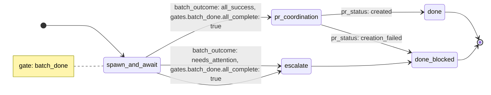

```mermaid
stateDiagram-v2
    direction LR
    [*] --> spawn_and_await
    escalate --> done_blocked
    pr_coordination --> done : pr_status: created
    pr_coordination --> done_blocked : pr_status: creation_failed
    spawn_and_await --> pr_coordination : batch_outcome: all_success, gates.batch_done.all_complete: true
    spawn_and_await --> escalate : batch_outcome: needs_attention, gates.batch_done.all_complete: true
    spawn_and_await --> escalate
    done --> [*]
    done_blocked --> [*]
    note left of spawn_and_await
        gate: batch_done
    end note
```
