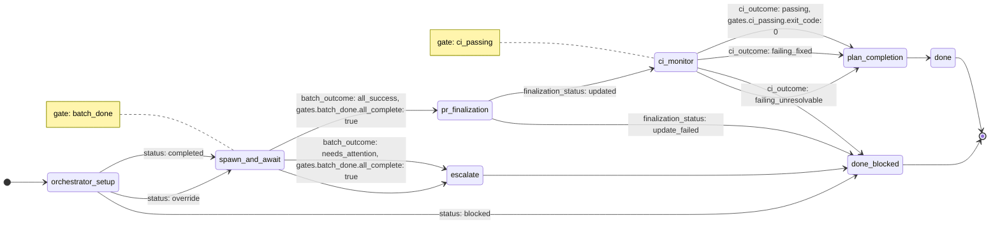

```mermaid
stateDiagram-v2
    direction LR
    [*] --> orchestrator_setup
    ci_monitor --> plan_completion : ci_outcome: passing, gates.ci_passing.exit_code: 0
    ci_monitor --> plan_completion : ci_outcome: failing_fixed
    ci_monitor --> done_blocked : ci_outcome: failing_unresolvable
    ci_monitor --> plan_completion
    escalate --> done_blocked
    orchestrator_setup --> spawn_and_await : status: completed
    orchestrator_setup --> spawn_and_await : status: override
    orchestrator_setup --> done_blocked : status: blocked
    plan_completion --> done
    pr_finalization --> ci_monitor : finalization_status: updated
    pr_finalization --> done_blocked : finalization_status: update_failed
    spawn_and_await --> pr_finalization : batch_outcome: all_success, gates.batch_done.all_complete: true
    spawn_and_await --> escalate : batch_outcome: needs_attention, gates.batch_done.all_complete: true
    spawn_and_await --> escalate
    done --> [*]
    done_blocked --> [*]
    note left of ci_monitor
        gate: ci_passing
    end note
    note left of spawn_and_await
        gate: batch_done
    end note
```
