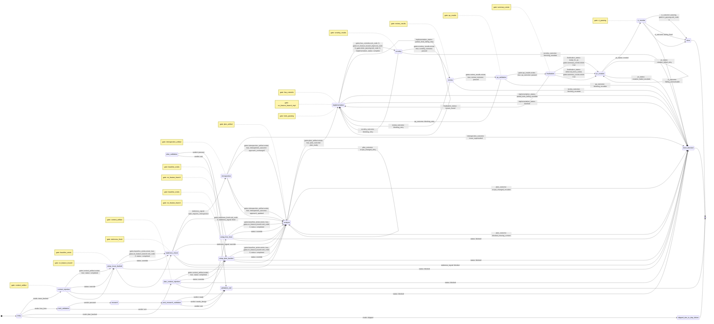

```mermaid
stateDiagram-v2
    direction LR
    [*] --> entry
    analysis --> implementation : gates.plan_artifact.exists: true, plan_outcome: plan_ready
    analysis --> analysis : plan_outcome: scope_changed_retry
    analysis --> done_blocked : plan_outcome: scope_changed_escalate
    analysis --> done_blocked : plan_outcome: blocked_missing_context
    ci_monitor --> done : ci_outcome: passing, gates.ci_passing.exit_code: 0
    ci_monitor --> done : ci_outcome: failing_fixed
    ci_monitor --> done_blocked : ci_outcome: failing_unresolvable
    ci_monitor --> done
    context_injection --> setup_issue_backed : gates.context_artifact.exists: true, status: completed
    context_injection --> setup_issue_backed : status: override
    context_injection --> done_blocked : status: blocked
    context_injection --> setup_issue_backed
    entry --> context_injection : mode: issue_backed
    entry --> task_validation : mode: free_form
    entry --> plan_context_injection : mode: plan_backed
    entry --> skipped_due_to_dep_failure : mode: skipped
    finalization --> implementation : finalization_status: issues_found
    finalization --> pr_creation : finalization_status: ready_for_pr, gates.summary_exists.exists: true
    finalization --> pr_creation : finalization_status: deferred_items_noted, gates.summary_exists.exists: true
    finalization --> pr_creation
    implementation --> scrutiny : gates.has_commits.exit_code: 0, gates.on_feature_branch_impl.exit_code: 0, gates.tests_passing.exit_code: 0, implementation_status: complete
    implementation --> implementation : implementation_status: partial_tests_failing_retry
    implementation --> done_blocked : implementation_status: partial_tests_failing_escalate
    implementation --> done_blocked : implementation_status: blocked
    introspection --> done_blocked : introspection_outcome: issue_superseded
    introspection --> analysis : gates.introspection_artifact.exists: true, introspection_outcome: approach_unchanged
    introspection --> analysis : gates.introspection_artifact.exists: true, introspection_outcome: approach_updated
    introspection --> analysis
    plan_context_injection --> setup_plan_backed : gates.context_artifact.exists: true, status: completed
    plan_context_injection --> setup_plan_backed : status: override
    plan_context_injection --> done_blocked : status: blocked
    plan_context_injection --> setup_plan_backed
    plan_validation --> setup_plan_backed : verdict: proceed
    plan_validation --> validation_exit : verdict: exit
    post_research_validation --> setup_free_form : verdict: ready
    post_research_validation --> validation_exit : verdict: needs_design
    post_research_validation --> validation_exit : verdict: exit
    pr_creation --> ci_monitor : pr_status: created
    pr_creation --> pr_creation : pr_status: creation_failed_retry
    pr_creation --> done_blocked : pr_status: creation_failed_escalate
    qa_validation --> finalization : gates.qa_results.exists: true, qa_outcome: passed
    qa_validation --> implementation : qa_outcome: blocking_retry
    qa_validation --> done_blocked : qa_outcome: blocking_escalate
    research --> post_research_validation
    review --> qa_validation : gates.review_results.exists: true, review_outcome: passed
    review --> implementation : review_outcome: blocking_retry
    review --> done_blocked : review_outcome: blocking_escalate
    scrutiny --> review : gates.scrutiny_results.exists: true, scrutiny_outcome: passed
    scrutiny --> implementation : scrutiny_outcome: blocking_retry
    scrutiny --> done_blocked : scrutiny_outcome: blocking_escalate
    setup_free_form --> analysis : gates.baseline_exists.exists: true, gates.on_feature_branch.exit_code: 0, status: completed
    setup_free_form --> analysis : status: override
    setup_free_form --> done_blocked : status: blocked
    setup_free_form --> analysis
    setup_issue_backed --> staleness_check : gates.baseline_exists.exists: true, gates.on_feature_branch.exit_code: 0, status: completed
    setup_issue_backed --> staleness_check : status: override
    setup_issue_backed --> done_blocked : status: blocked
    setup_issue_backed --> staleness_check
    setup_plan_backed --> analysis : gates.baseline_exists.exists: true, gates.on_feature_branch.exit_code: 0, status: completed
    setup_plan_backed --> analysis : status: override
    setup_plan_backed --> done_blocked : status: blocked
    setup_plan_backed --> analysis
    staleness_check --> introspection : staleness_signal: stale_requires_introspection
    staleness_check --> analysis : gates.staleness_fresh.exit_code: 0, staleness_signal: fresh
    staleness_check --> analysis : staleness_signal: override
    staleness_check --> done_blocked : staleness_signal: blocked
    staleness_check --> analysis
    task_validation --> research : verdict: proceed
    task_validation --> validation_exit : verdict: exit
    done --> [*]
    done_blocked --> [*]
    skipped_due_to_dep_failure --> [*]
    validation_exit --> [*]
    note left of analysis
        gate: plan_artifact
    end note
    note left of ci_monitor
        gate: ci_passing
    end note
    note left of context_injection
        gate: context_artifact
    end note
    note left of finalization
        gate: summary_exists
    end note
    note left of implementation
        gate: has_commits
    end note
    note left of implementation
        gate: on_feature_branch_impl
    end note
    note left of implementation
        gate: tests_passing
    end note
    note left of introspection
        gate: introspection_artifact
    end note
    note left of plan_context_injection
        gate: context_artifact
    end note
    note left of qa_validation
        gate: qa_results
    end note
    note left of review
        gate: review_results
    end note
    note left of scrutiny
        gate: scrutiny_results
    end note
    note left of setup_free_form
        gate: baseline_exists
    end note
    note left of setup_free_form
        gate: on_feature_branch
    end note
    note left of setup_issue_backed
        gate: baseline_exists
    end note
    note left of setup_issue_backed
        gate: on_feature_branch
    end note
    note left of setup_plan_backed
        gate: baseline_exists
    end note
    note left of setup_plan_backed
        gate: on_feature_branch
    end note
    note left of staleness_check
        gate: staleness_fresh
    end note
```
