# Dependency Graph: shirabe-child-dispatch-contract

## Graph Shape

```
Issue 1 (Phase A — contract section)
   |
   +-- Issue 2 (Phase A — Binding Notes rework)
   +-- Issue 3 (Phase A — state-schema annotation)
   +-- Issue 4 (Phase B — parent Team Shape cross-references)
   +-- Issue 5 (Phase B — /scope Phase 2 cross-reference)
   +-- Issue 6 (Phase B — /charter Phase 2 cross-references)
   +-- Issue 7 (Phase C — /brief)
   +-- Issue 8 (Phase C — /prd)
   +-- Issue 9 (Phase C — /design)
   +-- Issue 10 (Phase C — /plan)
   +-- Issue 11 (Phase C — /vision)
   +-- Issue 12 (Phase C — /strategy)
   +-- Issue 13 (Phase C — /roadmap)
```

## Rationale

**Issue 1 is the singular fan-out root.** Every other issue depends on it because Issue 1 lands the cross-reference target (`## Dispatch Contract` section) that all downstream cross-references point at. Without Issue 1, Issues 2-13 would reference a section that does not exist.

**Phase A's three issues (1, 2, 3) are internal to the pattern reference / state schema.** Issues 2 and 3 depend on Issue 1 because both reference the Dispatch Contract section. Issues 2 and 3 are mutually independent of each other.

**Phase B's three issues (4, 5, 6) cross-reference Phase A's contract section.** All three depend only on Issue 1. They are mutually independent of each other and independent of Phase C.

**Phase C's seven issues (7-13) are mutually independent.** Each child's two-file edit (team.yaml + SKILL.md prose) is self-contained. They all depend on Issue 1 because the contract section names the `skills/*/team.yaml` glob marker — without it, the team.yaml files have no contract surface to bind against. They are independent of Phase B (B is parent edits; C is child edits; the two don't intersect).

**Phase B and Phase C are mutually independent given Phase A.** Parent edits and child edits touch disjoint files.

## Critical Path

Issue 1 → any other issue (depth 2). The plan has a shallow graph: one root, twelve leaves.

## Parallelization Opportunities

In a multi-agent implementation: Issues 2-13 can land in parallel after Issue 1. In single-pr mode, they land as sequential commits on a single branch, but the order of commits 2-13 is arbitrary.

## Mermaid Diagram (for PLAN doc)

```mermaid
graph TD
    I1["#1 contract section"]
    I2["#2 Binding Notes"]
    I3["#3 state-schema"]
    I4["#4 parent Team Shape"]
    I5["#5 /scope Phase 2"]
    I6["#6 /charter Phase 2"]
    I7["#7 /brief team.yaml"]
    I8["#8 /prd team.yaml"]
    I9["#9 /design team.yaml"]
    I10["#10 /plan team.yaml"]
    I11["#11 /vision team.yaml"]
    I12["#12 /strategy team.yaml"]
    I13["#13 /roadmap team.yaml"]

    I1 --> I2
    I1 --> I3
    I1 --> I4
    I1 --> I5
    I1 --> I6
    I1 --> I7
    I1 --> I8
    I1 --> I9
    I1 --> I10
    I1 --> I11
    I1 --> I12
    I1 --> I13
```


